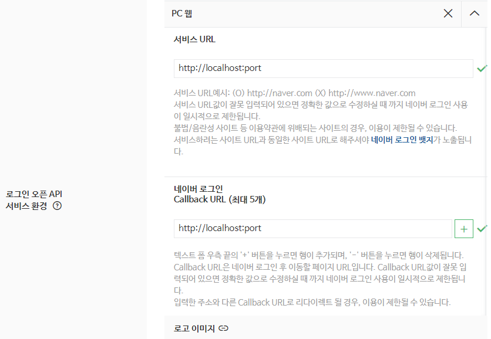

# 네이버 간편 로그인

카카오 간편 로그인에 이어 네이버 간편 로그인에 대해 알아보겠습니다.

<a href="https://developers.naver.com/apps/#/register" target="_blank">네이버 개발자 센터</a>로 가서 애플리케이션 등록을 해줍니다.

등록을 한 애플리케이션의 Client ID 를 env 혹은 다른곳에 저장해줍니다.

그 다음 서비스 URL 과 Callback URL 도 작성해줍시다.



<br/> <br/>

이제 코드를 작성해봅시다.

```js
// index.html
<head>
  ...
  <script
    type="text/javascript"
    src="https://static.nid.naver.com/js/naveridlogin_js_sdk_2.0.0.js"
    charset="utf-8"
  ></script>
  ...
</head>
```

```vue
// Component
<template>
  <div id="naverIdLogin" style="display: none"></div>
</template>

<script setup>
const naver = () => {
  const naverLogin = new window.naver.LoginWithNaverId({
    clientId: process.env.NAVER_CLIENT,
    callbackUrl: process.env.REDIRECT,
    isPopup: false,
    loginButton: {},
    callbackHandle: true,
  });

  naverLogin.init();
};

onMounted(() => {
  setTimeout(() => {
    naver();
  });
});
</script>
```

::: tip

window.naver 에서 타입스크립트 에러가 난다면 다음과 같이 작성해주세요.

```ts
// global.d.ts
export {};

declare global {
  ...
  interface Window {
    naver: any;
  }
}

```

:::

네이버 로그인 버튼을 만들 곳에 `id="naverIdLogin"` 으로 만들어줍니다.

커스텀을 따로 하지 않을것이면 `style="display:none"` 은 없애셔도 됩니다.

::: info

커스텀을 위해 네이버 로그인 버튼을 만들었다면 다음과 예시와 같이 코드를 작성해주세요.

```vue
<template>
  <q-btn @click="naverLogin">
    <q-icon name="img:/icons/kakao.svg" />
  </q-btn>
</template>

<script setup>
const naverLogin = () => {
  document.getElementById("naverIdLogin_loginButton")?.click();
};
</script>
```

:::

로그인 버튼을 누르면 다음과 같이 callback URL로 response가 옵니다.

```
http://localhost:9000/#access_token=accessToken&state=state&token_type=bearer&expires_in=3600
```

이 callback URL의 access_token 으로 백엔드 서버와 조율을 하여 로그인 기능을 이어나가면 됩니다.

```js
// access_token 만 추출하기
new URLSearchParams(location.href.split("#")[1]).get("access_token");
```
