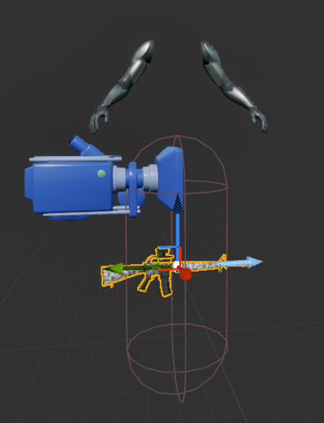

# 캠프 1일차

## 캠프 OT

### 출석관리

0시간 ~ 5시간 59분 - 결석처리
6시간 ~ 11시간 59분 - 지각/조퇴/외출
12시간 이상 - 출석

지각/조퇴/외출 3회 시 결석 처리
본인 부주의로 인한 미입실/미퇴실은 인증 불가

hrd.net 어플의 QR코드 인증으로 입실 및 퇴실 처리

QR에서 문제가 생긴다면 `출결 기록하기` 페이지를 들어가 관리 가능

#### 필수 증빙 자료

카메라를 켜 본인 얼굴이 보이게 한 ZEP 캡처 이미지와 QR 오류 녹화본이나 이미지 제출

개강 후 14일간 수강 신청 정정이 가능
14일 후에는 훈련자 확정이 되며 이후 중도하차 시 내일배움카드 유효기간 만료까지(최대 5년) KDT 교육과정 신청 불가

#### 제적 기준

총 결석 일수가 전체 소정 훈련 일수 20%를 초과, 결석 일수가 단위기간 내 50% 이상일때
훈련을 수강하지 않았음에도 불구하고 거짓 기타 부정한 방법으로 출석
훈련생을 대신하여 출석 확인 행위를 한 수강생

### 훈련장려금 및 훈련참여지원수당

훈련 기관이 단위기간별로 고용센터에 신청하며, 필요 서류는 별도 안내 후 진행
마지막 훈련장려금은 HRD-net 수강평 등록 완료시 신청 가능
단위기간 소정 훈련일수의 80% 이상 수강 시 지급 (내일배움카드 연계 계좌)
실업급여 수급 기간에는 훈련장려금 미지급

### 훈련 장비 지원

노트북(대여) / 웹캠&마이크(지급) / 외 장비를 내일배움캠프 119를 통해 문의

- 정부 자산이어서 훼손 시 본인이 부담해야함

### 학습 공간 대여

- 사전 승인 필요
- 온라인 카드 결제 한정
- 1개월 기준 인당 5만원 지원
- 직접 결제하는 것이 아닌 캠프 매니저분들께 결제 부탁하는 형태

### 공가 인정 사유

- 질병/입원(본인, 자녀)
  - 일반 건강검진, 라식수술 인정 불가
  - 진단서나 소견서 내 기재된 진료일만 인정 가능
- 취업, 훈련 관련 시험
  - 훈련과정과 관련된 자격시험만 가능
  - 대학교 시험 불가
- 입사시험(면접)
  - 서류 합격 안내문, 면접 통지서 불가
  - 반드시 기업의 직인이 포함되어 있어야함
  - 싸인 포함 확인서는 담당자나 대표의 명함까지 함께 첨부 필요

### 자부담금

환불 기간과 기준

- 수강 철회 기간: 7.9 14:00까지
  - 전액 환불되며 7.9 12:00까지 하차 면담 완료 후 14:00까지 구글폼으로 신청
- 훈련 진행 중 & 훈련 기관 사유: 7월 9일 이후부터 수료 전까지
  - 이미 진행된 훈련 일수를 제외하고 일할 계산하여 환불

늦은 합류로 인한 자부담금 할인X
훈련 종료 이후에는 환불X

### 캠프 규칙

- ZEP에 항상 접속하고 카메라 켜고 학습
- 주 60시간을 밀도 있게 학습
- 팀을 우선 순위로 하며 다른 팀과도 도움 나눔
- 매너있게 소통
- 함께하는 팀원과 스스로에게 최선
- 프로필 얼굴이 있는 모습 변경
- 타 수강생과 나를 비교하지 않기
- 질문을 두려워하지 않기
- 절대 포기하지 않기

### 수료 이후

무제한 / 무기한 / 무료 코칭 및 서포트
커리어톤 / 스파르타 커리어 / 바로 인턴 / 꿀알바 모집 / 취업 축하금 등 각종 지원

### 커리큘럼

- 1-2주
  - Unreal Blueprint
- 3-6주
  - 프로그래밍 C++ 문법
- 7-14주
  - Unreal Engine 입문
- 15-21주
  - Unreal Engine 숙련
- 22-24주
  - Unreal Engine 심화
- 25-35주
  - 실전 프로젝트

매 챕터마다 개인/팀 프로젝트가 있으며 조는 챕터마다 변경

## Unreal Blueprint 라이브 세션 기록

파일명과 경로는 잘 구분해서 만들어야한다.

레벨의 이름이 L\_ 로 시작하는 것처럼 나중에 찾기 편하게 네이밍을 해두어야한다.

프로젝트 세팅 -> Maps & Modes 에서 Editor Startup Map은 에디터를 처음 실행했을때 나오는 맵이고 Game Default Map은 실제 게임을 실행했을때 처음 나오는 맵(배급사,로고 등)이다. Game Default Map에는 어떤것을 넣을지 정해져있지는 않다.

Default Game Mode는 레벨마다 게임모드를 세팅하지 않았을때 GameModeBase가 된다.

Game Instance Class 는 중간역할을 해준다.

뷰포트에서 왼쪽클릭 + wasd 와 오른쪽클릭 + wasd 의 차이는 왼쪽클릭은 화면이 고정되어있는 상태이고 오른쪽클릭에서는 시야전환이 가능하다.
카메라 속도 조절은 마우스 왼or오 클릭하고 휠을 돌리면 된다.
아웃라이너에서 액터를 누르고 F를 누르면 해당 액터의 위치에 포커스가 잡힌다.
아웃라인은 배치되어있는 액터들을 의미한다.
콘텐츠 드로어는 왼쪽하단이나 ctrl+space 로 열 수 있다.
아웃풋 로그는 Alt+`(백틱) 으로 열 수 있다.

Alt + 1/2/3/4 는 꼭 외우기

ctrl+d 로 복제 가능

이외 내용들은 튜터님 화면 따라하기만 했는데 에디터를 처음써봐서 따라가기만해도 벅찼다.

여기까지 어찌저찌 잘 따라하긴 했다.
