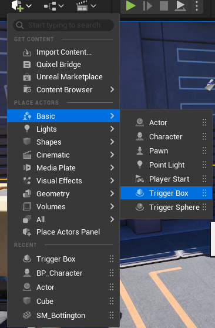
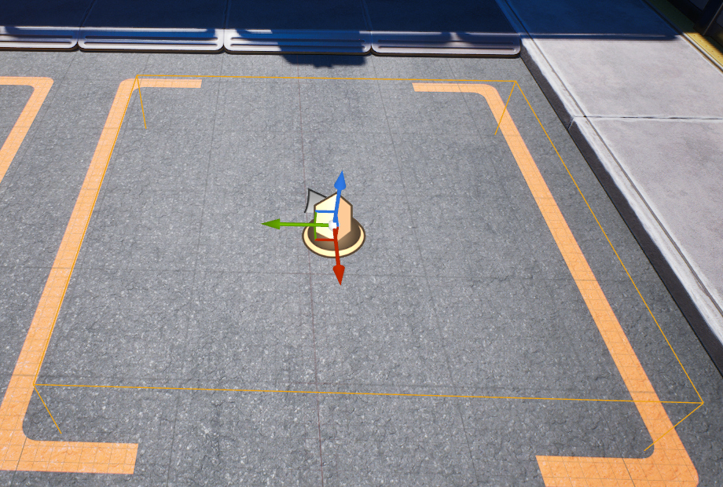
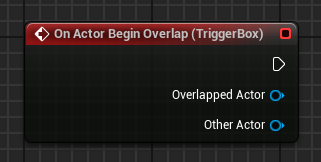
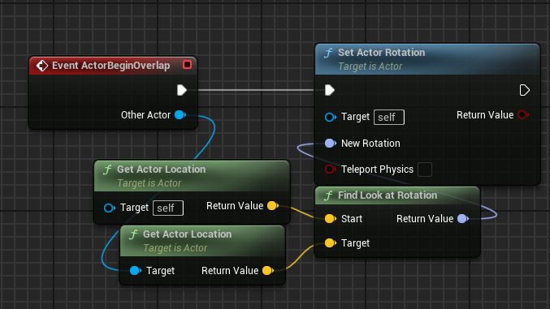
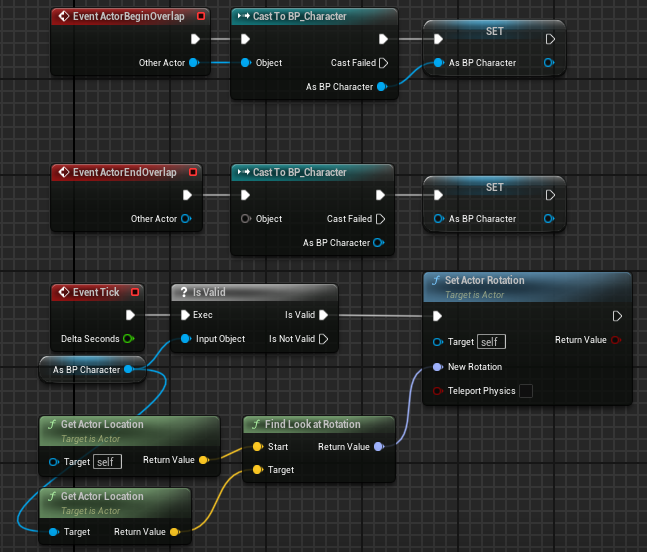
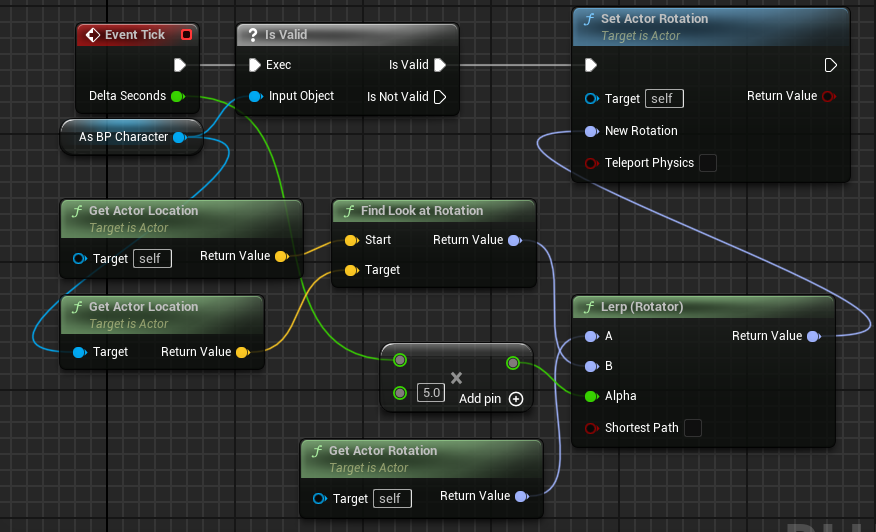
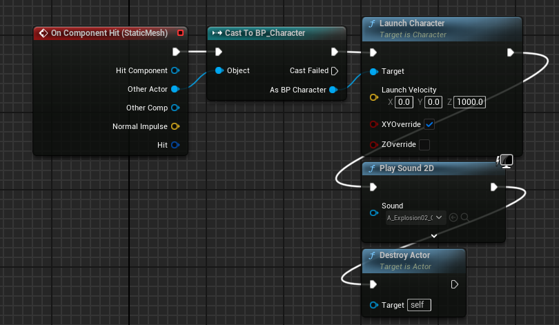

# 캠프 6일차

## Unreal 게임개발종합반 VOD

### 오버랩

액터와 캐릭터간의 충돌에는 ActorBeginOverlap 이벤트와 ActorEndOverlap 이벤트가 있다.



액터 배치 → Basic → 트리거 박스를 레벨에 배치해준다.



트리거 박스의 노란색 영역에 들어갔을때, 오버랩 이벤트가 발생하게 한다.

이제 레벨 블루프린트에 들어가 우클릭을 하면 `Create a Reference to TriggerBox` 가 상단에 생긴 것을 확인할 수 있다.
트리거박스가 레벨에 잘 배치되었다는 것이다.

`Add on Actor Begin Overlap` 으로 트리거박스에 대한 오버랩 이벤트를 추가해준다.



여기서 `Other Actor`는 충돌이 일어난 대상을 의미한다.

`Get Display Name` 을 통해 충돌이 일어난 대상의 이름을 알 수 있다.

### 블루프린트 클래스에서도 동일하게

블루프린트(Actor)를 만들어주고, `Box Collision` 컴포넌트를 만들어준다.

이벤트 그래프에서, 레벨 블루프린트에서 작성한 것처럼 이벤트를 만들어준다.

그럼 레벨 블루프린트와 동일한 결과를 얻을 수 있다.

### 액터의 회전

액터의 영역에 플레이어가 들어갔을때, 플레이어가 바라보는 방향으로 액터를 회전시키는 기능 구현이다.

블루프린트(Pawn)을 만들어주고, `Sphere Collision` 컴포넌트를 만들어준다.


2가지 생성 방법

1. 만들어진 Sphere 를 포커스하고 블루프린트에서 우클릭 → begin overlap 을 검색하면 `Add Event For Sphere` → `Add On Component Begin Overlap` 가 있다.

2. 아무 컴포넌트를 포커스 하지 않은 채 우클릭 → `Add Event` → `Add On Component Begin Overlap` 을 하면 해당 액터에 전체적인 부분에 대한 오버랩 이벤트를 추가할 수 있다.



Other Actor는 플레이어이다. `Get Actor Location` 으로 플레이어의 현재 위치와, 액터의 현재 위치를 구하고 `Find Look at Rotation` 으로 액터가 플레이어를 바라보는 회전값을 구할 수 있다. 이 값을 `Set Actor Rotation` 에 넘겨주어 액터를 회전시킬 수 있다.
하지만 위의 노드처럼만 하면 영역에 들어온 액터가 무엇인지 정확히 알 수가 없다.
캐릭터가 가지고 있는 어떠한 값들을 사용하기 위해 Cast To 노드를 사용한다.
그래서 Cast To BP_Character 노드의 출력 오브젝트를 Get Actor Location으로 연결하면 영역에 들어온 캐릭터에 대한 값들을 불러올 수 있다.
출력값을 변수로 승격해서 변수로서 사용도 가능하다.



액터의 영역에 플레이어가 들어오면 변수값에 캐릭터 정보를 저장하고, 영역에서 나가면 캐릭터 정보가 사라진다.
EventTick에서 IsValid를 통해 캐릭터 정보값이 있는지 검증부터 하고 아까처럼 Get Actor Location을 통해 액터가 나를 바라보게 회전시킬 수 있다.



액터가 플레이어에게 회전할때 휙휙 돌기때문에 `Lerp(Rotation)`을 통해 부드럽게 전환을 하게 해줄 수 있다.

### 충돌

Static Mesh 컴포넌트를 클릭하고 `On Component Hit` 이벤트를 이용해 액터와 부딪혔을때의 이벤트를 만들 수 있다.
플레이어가 액터와 부딪혔을때 플레이어가 날아가는 것을 구현해보자.



Launch Character는 캐릭터를 좌표값으로 날려버리는 이벤트이다.
캐릭터가 기본적으로 움직임에서 가지고 있던 값과 Launch Velocity의 값을 계산을 해서 캐릭터를 날리는데, XYOverride나 ZOverride를 체크하면 캐릭터의 값은 무시하고 Launch Velocity에 있는 값만큼만 날아간다.

`Spawn Emitter at Location` 혹은 `Spawn System at Location` 을 통해서 이펙트를 추가할 수 있다.
둘의 차이는 `Spawn Emitter at Location` 는 옛날 Cascade 파티클용 Legacy여서 옛날 버전의 애셋을 사용할때 이용되고, `Spawn System at Location` 은 최신 시스템인 나이아가라 시스템을 이용한다. 이걸 이용해 충돌했을때의 이펙트를 추가해줄 수 있다.

:::tip Cascade, Niagara

Cascade (레거시 파티클 시스템)

- 역사: 언리얼 엔진 3부터 쓰이던 오래된 파티클 시스템
- 방식: 모듈 기반으로 파티클을 생성·제어 (Emitter 단위)
- 장점: 단순하고 빠르게 기본적인 이펙트를 만들 수 있음
- 단점: 확장성 부족, GPU 연산 지원 제한, 복잡한 효과 구현 어려움
- 현황: UE5에서는 사실상 더 이상 권장되지 않고, 유지보수 모드

Niagara (최신 파티클 시스템)

- 역사: UE4.20 이후 도입, UE5에서 표준
- 방식: 노드 그래프 기반, 데이터 흐름을 직접 제어 가능
- 장점:
  - GPU 연산 지원 → 대규모 파티클 처리 가능
  - 모듈화/재사용성 뛰어남
  - 파라미터를 블루프린트/시퀀서에서 쉽게 제어 가능
  - 복잡한 시뮬레이션(물리, 벡터 필드 등) 구현 가능
  - 현황: 앞으로 모든 신규 프로젝트는 Niagara 사용이 권장됨

:::

### 숙제

1. 자동문

- `회전`과 `오버랩`을 활용해 자동문 만들기

2. 다가오는 객체와 부딪히면 객체가 파괴 + 캐릭터가 밀려나기

- `이동`과 `충돌`을 활용해 캐릭터를 날려버릴 수 있는 움직이는 액터 만들기

## Git 기초 특강

### Git

`Git`은 코드(파일)의 세이브 포인트를 만들어 주는 프로그램이다.

언제든 예전 상태로 되돌릴 수 있고, 누가 언제 무엇을 바꿨는지 기록이 남으며 여러 명이 같이 작업해도 안전하게 합칠 수 있다.

세이브 포인트 하나를 `커밋(commit)` 이라고 부른다.

### Github

Git은 내 컴퓨터에 저장을 해주는 프로그램이고, Github는 저장 기록을 인터넷에 올려두는 사이트이다.

| 구분 | Git                    | GitHub                         |
| ---- | ---------------------- | ------------------------------ |
| 정체 | 버전 관리 **프로그램** | 저장소를 올려두는 **웹사이트** |
| 위치 | 내 컴퓨터              | 인터넷                         |
| 역할 | 커밋(저장) 만들기      | 커밋을 올려 공유·백업·협업     |

### Install

[깃허브 다운로드](https://git-scm.com/downloads)

자신의 운영체제에 맞게 설치한다.

```bash
git --version # 버전 확인, 버전이 나오면 설치 성공

git config --global user.name "Kim" # 깃에서 사용할 닉네임
git config --global user.email "kim@gmail.com" # 깃에서 사용할 이메일
# --global은 컴퓨터 전체에 적용 이라는 의미이다. 한 번만 해두면 된다.

git config --list # 잘 등록되었는지 확인
```

### 필수 개념 3가지

Git은 파일을 3개의 공간으로 나눠서 다룬다.

| 공간              | 설명                                   | 다음으로 보내는 명령 |
| ----------------- | -------------------------------------- | -------------------- |
| **작업 디렉토리** | 내가 파일을 만들고 고치는 곳           | `git add`            |
| **스테이징 영역** | 저장할 변경을 모아두는 장바구니        | `git commit`         |
| **저장소 (.git)** | 커밋(세이브 포인트)이 영구히 쌓이는 곳 | (저장 완료!)         |

### 저장소 만들기

```bash
mkdir git-practice # 폴더 생성
cd git-practice # 폴더 안으로 들어가기

git init # 해당 폴더에 위치에 Git 저장소 만들기
# → Initialized empty Git repository in .../git-practice/.git/ 해당 메시지가 나온다.
# → git init은 해당 폴더 안에 숨겨진 .git 폴더를 만든다. 폴더 하나당 한 번만 하면 되고 모든 세이브 포인트가 저장된다.
```

### 커밋(저장)하기

```bash
# 파일을 하나 아무거나 만들고
git status # → Untracked files: 파일이름

git add 파일이름 # → git add . 을 하면 전체가 add 된다.

git commit -m "메시지" # → 몇 개의 파일이 insertion 되고, modified 되었으며 deleted 되었는지 로그가 나온다.

# 파일을 수정하고 git status를 하면 수정된 파일이 나온다.
```

### 기록 보기

```bash
git log # --oneline 을 하면 커밋ID와 메시지만 출력해서 볼 수 있다.

# 세이브 포인트들을 최신순으로 로그를 통해 확인 가능하다.
```

### 깃허브에 올리기

[깃허브](https://github.com)에 가입하거나 로그인 한 뒤 우측 상단에 New repository 를 눌러 새로운 저장소를 만든다.

```bash
git remote add origin https://github.com/내아이디/git-practice.git # 원격 저장소 연결 (한번만)

git branch -M main # main 브랜치로 브랜치 변경
git push -u origin main # main 브랜치에 전송

# 깃허브 저장소에서 새로고침을 하면 내가 올린 작업물을 확인 가능하다.
```

### 자주 쓰는 명령어

```bash
# 준비 (처음 한 번)
git config --global user.name "이름"
git config --global user.email "이메일"

# 저장소 시작 (폴더당 한 번)
git init

# 매일 반복하는 흐름
git status                 # 지금 상태 확인
git add <파일>              # 장바구니에 담기 (git add . 는 전부 담기)
git commit -m "메시지"      # 저장(커밋)하기
git log --oneline          # 기록 보기

# GitHub와 주고받기
git push                   # 인터넷에 올리기
git pull                   # 인터넷에서 내려받기
```

이외에도 git branch, switch, checkout, diff, fetch, reset, revert, stash, merge, rebase 등이 있다.
