# 캠프 2주차 주말

## VOD 숙제

### 자동문 만들기

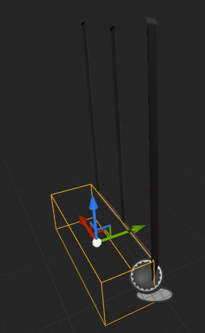

문 블루프린트에 `Box Collision` 컴포넌트로 캐릭터가 문 앞에 다가왔을때 트리거될 영역을 만들어준다.

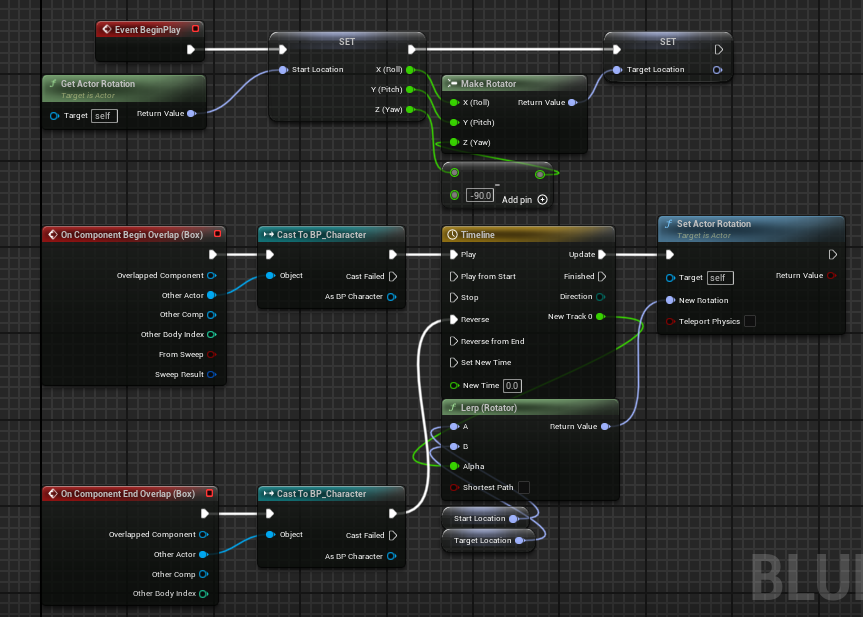

시작시에 현재 위치 값을 담을 StartLocation 과 얼만큼 이동할지에 대한 TargetLocation 을 설정해준다.

BP_Character가 Box Collision 영역에 들어갈 때 Timeline + Lerp(Rotator) 를 이용해 문을 회전시켜주고, 영역에서 벗어날때 Reverse를 통해 문을 닫아준다.

### 다가오는 객체와 부딪히면 객체가 파괴 + 캐릭터가 밀려나기

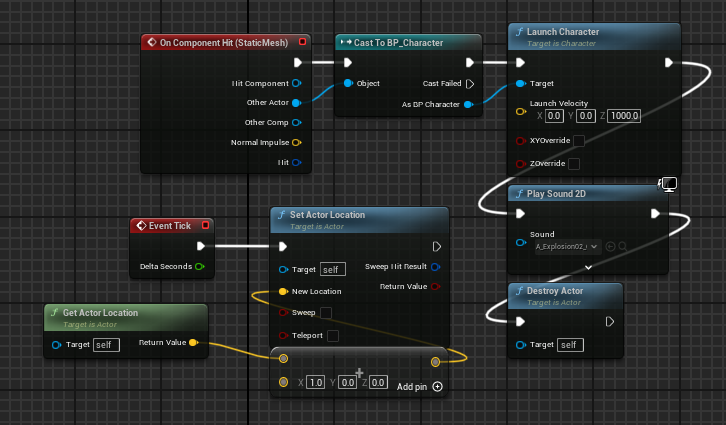

`Event Tick`으로 액터의 위치를 이동시켜준다.

`On Component Hit` 이벤트를 이용해 플레이어가 액터에 닿으면 Launch Character로 캐릭터를 날리고 Destroy Actor로 액터를 없앤다.

## Collision(콜리전)

`Collision` 이란 충돌, 부딪침 이란 뜻이다.
액터가 서로 부딪히고, 캐릭터가 벽을 만나서 막히거나, 겹치거나 하는 등의 물리적 상호작용을 이용해 다양한 이벤트를 구현할 수 있다.
이러한 물리적 교차와 충돌을 결정해주는 핵심 시스템이 `콜리전` 이다.

### Collision Channel(콜리전 채널)

언리얼 엔진의 콜리전 시스템은 크게 `Object Channels`과 `Trace Channels`를 기반으로 동작한다.
각 채널은 Overlap, Block, Ignore 중 하나로 설정돼, 서로 마주쳤을 때 어떻게 반응할지를 정한다.

- Object Channels 예시: WorldStatic, WorldDynamic, Pawn, Vehicle 등
- Trace Channels 예시 : Visibility, Camera 등 RayCast 용도로 쓰이는 채널

#### 프로젝트 세팅에서 확인

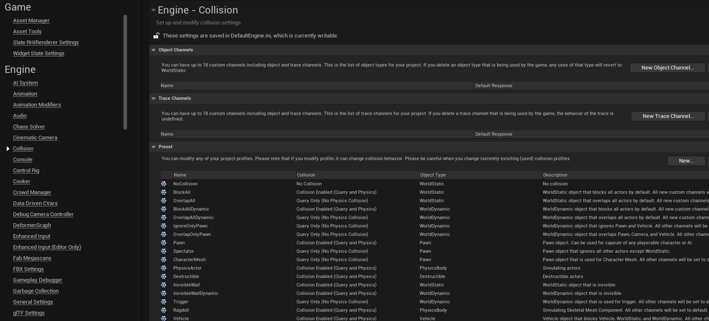

Edit → Project Settings → Engine → Collision 섹션에서 Object Channels / Trace Channels
기본 제공되는 채널들이 있다. 원하는 채널을 새로 추가 가능하여 커스텀 콜리전을 이용할 수 있다.

액터의 Physics → Simulate Physics 를 체크하면 중력의 영향을 받게할 수 있다.

### Player Collision

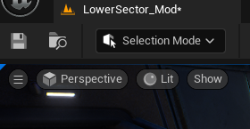

언리얼 엔진 좌측 상단에 뷰포트 표시 모드를 Player Collision 으로 바꾸면 레벨의 액터별 Collision 영역을 확인할 수 있다.

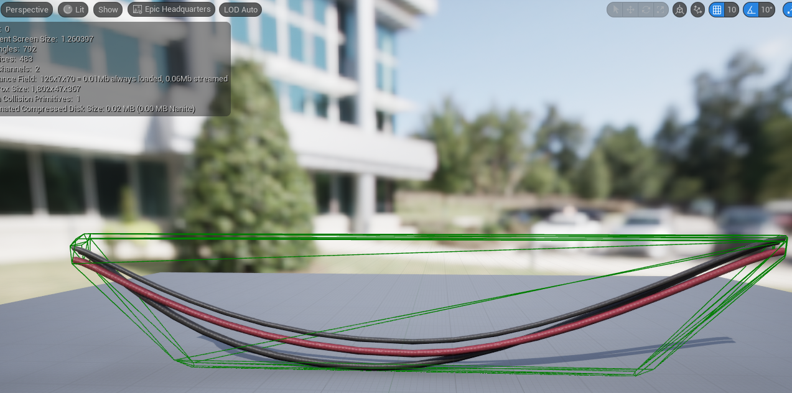

상단의 Show를 눌러 Simple Collision 을 선택하면 액터가 가지고 있는 Collision 영역을 확인할 수 있다.
이미지처럼 되어있는건 복잡한 Collision 대신 성능을 위해 단순하게 그려져있는 것이다.

### Auto Convex Collision

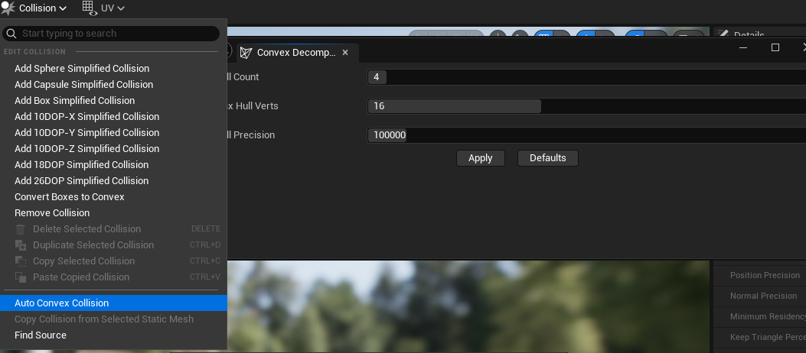

기존의 Collision 을 없애고, 상단 패널 Collision → **Auto Convex Collision** 을 선택한 뒤 나오는 패널에서 Apply 를 누르면 언리얼 엔진이 해당 스태틱 메시를 읽어 적절한 복잡도로 콜리전을 자동으로 생산해준다.
옵션을 조절해 더욱 복잡도를 높여 콜리전의 영역을 섬세하게 생산할 수 있다. 하지만 그만큼 성능 최적화에 안좋은 영향을 미친다.

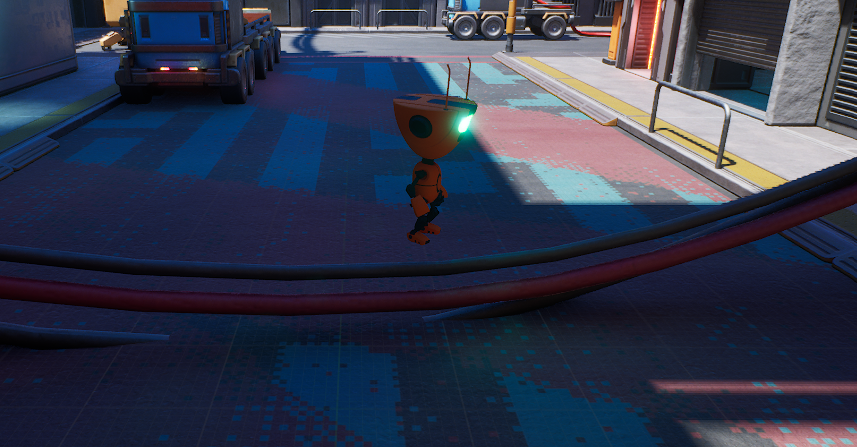

자동으로 생성된 Collision 영역에 올라갈 수 있다.

### Hull & Verts

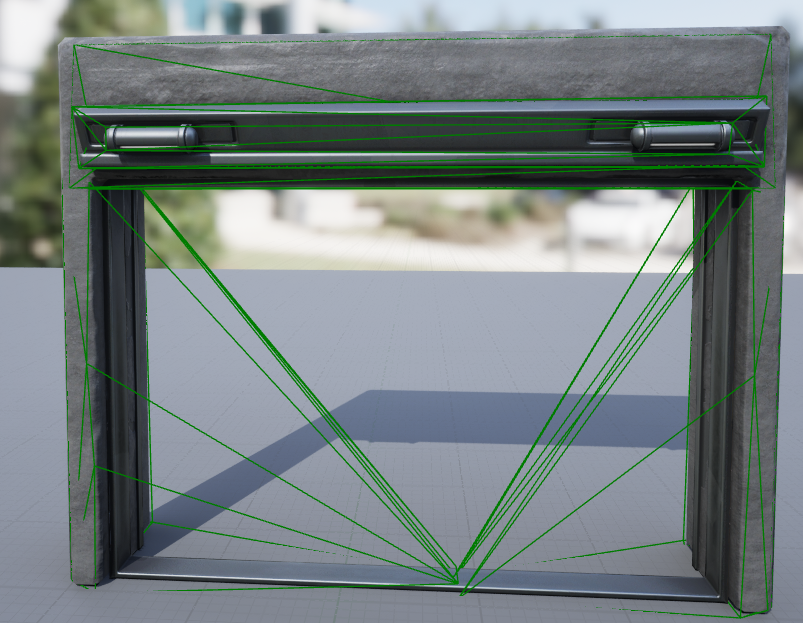

적은 정밀도로는 메시의 형태를 정확하게 읽어내질 못한다.
Auto Convex Collision 패널에서 Hull Count 를 늘려줘야 정밀도가 높아져 메시의 형태를 더욱 잘 읽어 Collision 을 잘 생성해줄 수 있다.

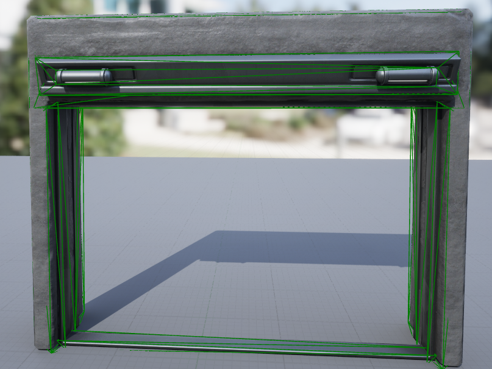

Hull Count 를 높이니 정밀도가 높아져 스태틱 메시의 모양과 같이 Collision 을 자동으로 잘 생성해주었다.

::: info Hull, Verts(Vertices)

(컴퓨터 그래픽스 관련)

Hull

- 메시를 감싸는 간단한 볼륨(Convex Hull) 기반으로 충돌을 표시
- 메시의 외곽을 따라가면서 "최소한의 단순한 형태"로 충돌 영역을 만들어내는 방식
- 정밀도는 떨어지지만 성능이 훨씬 좋아 대부분의 경우 Hull 기반 충돌을 권장

Verts(Vertices)

- 메시의 버텍스(정점) 기반으로 충돌을 표시
- 즉, 메시의 실제 지오메트리(삼각형 면을 이루는 점들)를 그대로 충돌 영역으로 사용하고 있다는 뜻
- 정밀하지만 계산량이 많아서 성능에 부담이 될 수 있다. (특히 복잡한 메시일 경우)

| 옵션               | 의미                | 낮은 값 효과      | 높은 값 효과        |
| ------------------ | ------------------- | ----------------- | ------------------- |
| **Hull Count**     | Hull 개수           | 단순, 빠름        | 정밀, 무거움        |
| **Max Hull Verts** | Hull당 최대 정점 수 | 단순 Hull, 성능 ↑ | 복잡 Hull, 정확도 ↑ |
| **Hull Precision** | Voxel 해상도        | 빠름, 단순        | 느림, 정밀          |

:::

## 환경 디자인

게임의 전반적인 분위기와 플레이어의 몰입감을 결정짓는 핵심 요소이다.

환경 디자인은 단순한 배경 제작을 넘어, 내러티브와 감성을 전달하는 강력한 도구이다.

클라이언트 개발자가 직접 디자인을 하진 않지만, 환경 디자인 분야에서 디자인을 한 작업물을 받아와 구현을 해야하기 때문에 어느정도의 지식과 구현력이 있어야한다.

### 환경 디자인의 역할

감성 전달

- 조명, 색감, 분위기 연출을 통해 플레이어에게 정서적 경험을 선사한다.

내러티브 강화

- 배경 자체가 스토리의 한 요소가 되어, 게임의 세계관을 자연스럽게 표현한다.

플레이어 몰입

- 세심하게 구성된 환경은 플레이어가 게임 세계에 빠져들게 만드는 중요한 역할을 한다.

### 핵심 구성 요소

조명과 컬러 팔레트

- 시간대, 기후, 감정 상태 등을 반영하는 요소로, 환경의 전체적인 느낌을 좌우한다.

구조와 배치

- 건물, 길, 자연 요소의 배치는 게임 내 탐험의 흐름과 상호작용을 결정짓는다.

디테일링

- 소품, 잔디, 바위, 나무 등 작은 디테일이 모여 현실감을 부여하며, 게임의 완성도를 높인다.

### 랜드스케이프

랜드 스케이프 모드는 언리얼 엔진에서 거대한 자연 지형을 손쉽게 만들어주는 도구이다.

#### 주요 기능 및 활용법

지형 조각

- 산, 계곡, 평지를 자유롭게 조정할 수 있다.

텍스쳐 페인팅

- 각 지형에 어울리는 재질을 적용하여 사실감을 더한다.

대규모 환경 구성

- 한 번에 넓은 영역의 지형을 생성하고 편집할 수 있어, 오픈 월드 게임 제작에 최적이다.

### 간단 예시

새로운 레벨을 만들어준다.

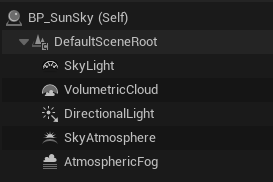

레벨을 처음 만들었을때 검은 화면만 나오는데 빛을 추가해주기 위해 BP_SunSky 를 만들고 이미지처럼 컴포넌트들을 추가해준다.
DirectionalLight → Contact Shadow Casting Intensity 의 값을 1로 변경해서 후순위로 사용될 수 있도록 해준다. (예비로 사용)

상단 패널에 `Selection Mode` 라고 되어있는걸 누르고 `Landscape Mode` 로 변경해준다.

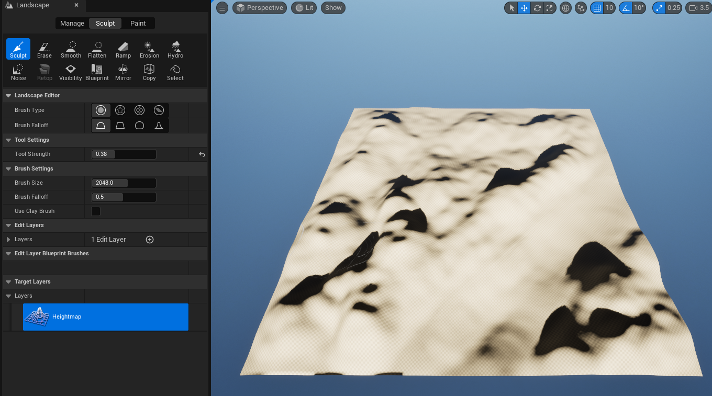

좌측에 Landscape 패널이 생기는데 Section Size, Number of Components 등의 옵션을 지정하고 Create를 해준다.
그러면 땅이 생성이 된다. Sculpt의 기능들을 이용해 지형을 꾸밀 수 있다.

### 폴리지

Foilage Mode 란 자연스러운 식생 및 소규모 오브젝트를 대량 배치할 수 있게 해주는 강력한 도구다.

#### 핵심 기능

대량 배치

- 수많은 오브젝트를 자동으로 분포시켜 자연스러운 환경을 조성한다

세부 조절

- 밀도, 크기, 회전, 기울기 등 다양한 옵션을 통해 각 요소의 배치를 정교하게 조절할 수 있다.

퍼포먼스 최적화

- 효율적인 배치 방식으로 게임의 퍼포먼스를 유지할 수 있다.

::: note 애셋부터 다운로드
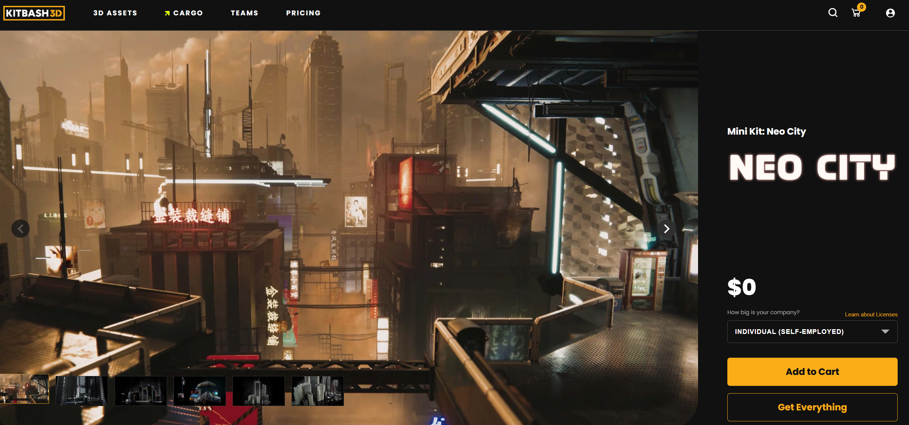

[Kitbsah3D](https://kitbash3d.com) 사이트에서 3d 애셋을 다운로드 받을 수 있다. (강의에 있는 .zip파일을 다운로드했다.)

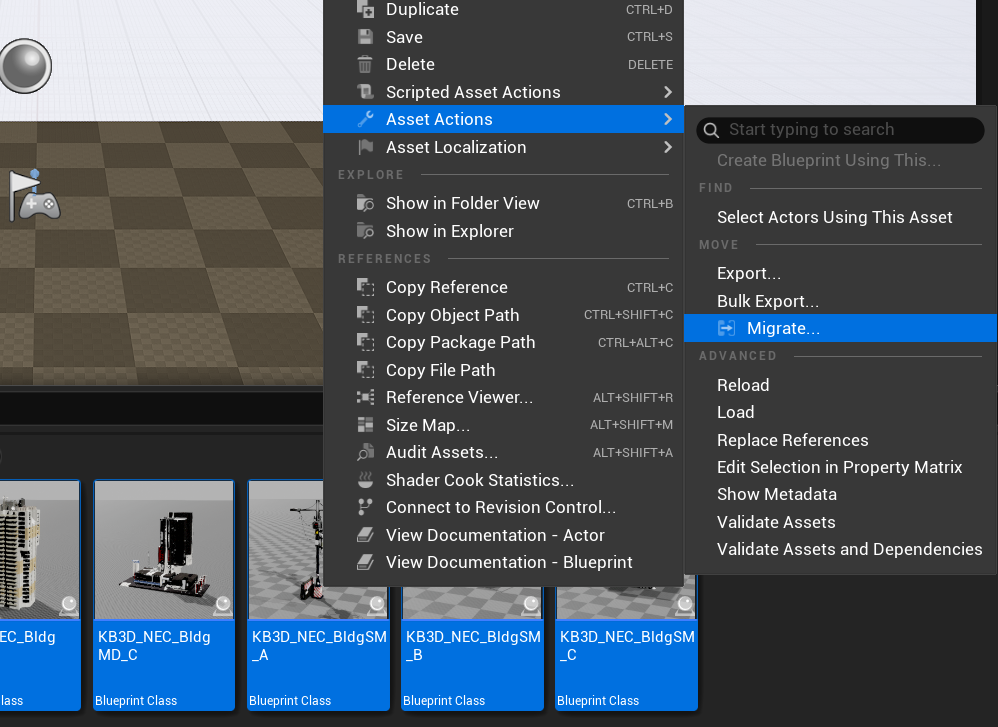
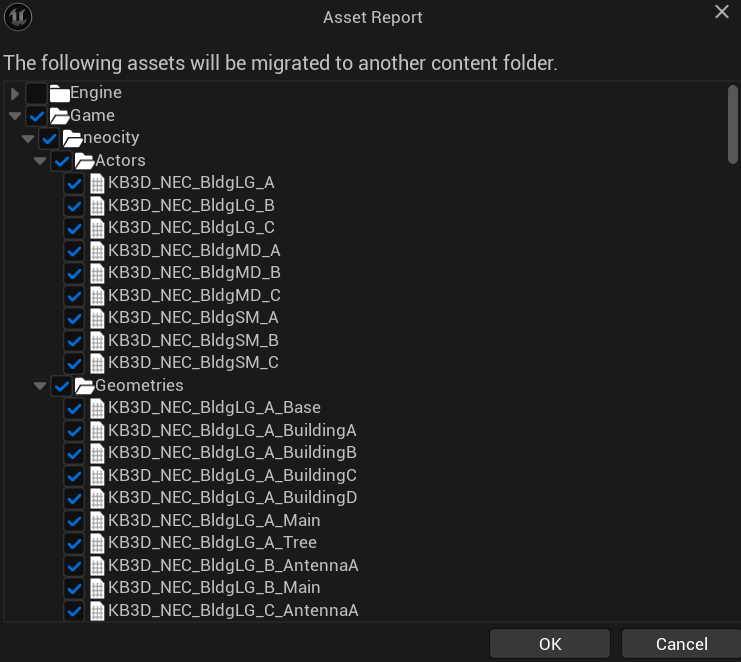
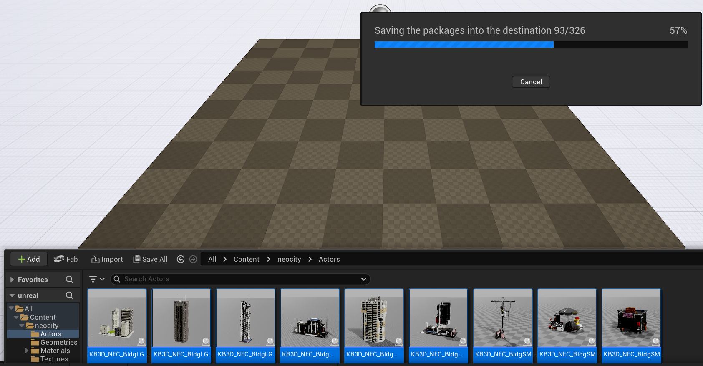

다운로드한 폴더에서 .uproject 를 실행해주고, 이미지처럼 애셋들을 선택하고 우클릭 → Asset Actions → Migrate 를 눌러서 아까 프로젝트의 Content 폴더를 선택해주면 된다.

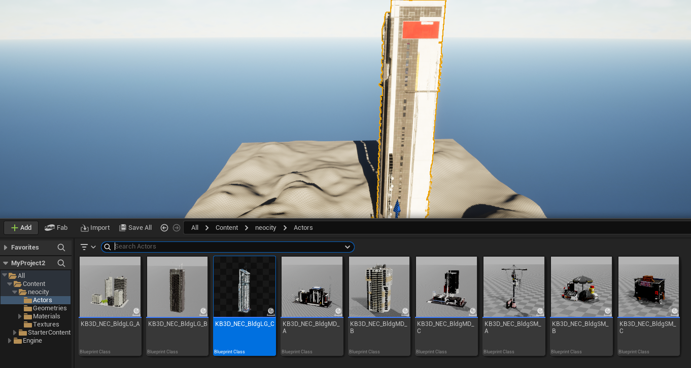

정상적으로 Migrate 된 것을 확인할 수 있다.
:::

#### Actor Foliage

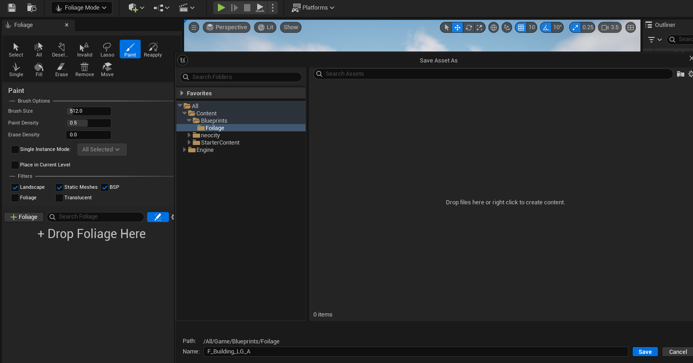

이제, 폴리지 모드를 통해 건물을 배치해보자.

상단의 Selection Mode를 이번에는 Foilage 모드로 변경한다.

좌측 Foilage 패널의 **+ Foilage** → Actor Foilage → 경로 지정 및 네이밍 후 생성

위의 방법으로 Migrate한 애셋 6개에 지정할 폴리지를 6개 만들어준다.

F_Building_LG_A 부터 C, F_Building_MD_A 부터 C 까지 생성한다.

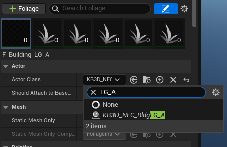

만든 폴리지와 애셋들을 세팅시켜준다.

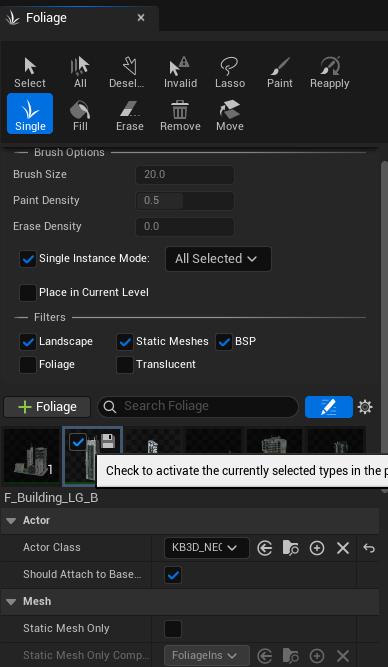

폴리지를 선택(체크)해주고 레벨에서 원하는 곳에 클릭하면 폴리지가 배치된다.
Placement → Align to Normal 을 체크하면 배치되는 폴리지의 방향을 지면의 노멀 백터에 맞춰 정렬된다.
바위, 풀, 잔디처럼 표면에 자연스럽게 붙어야 하는 오브젝트일때 체크해주면 되고, 나무나 빌딩같이 항상 똑바로 서 있어야 하는 오브젝트라면 체크를 해지해준다.

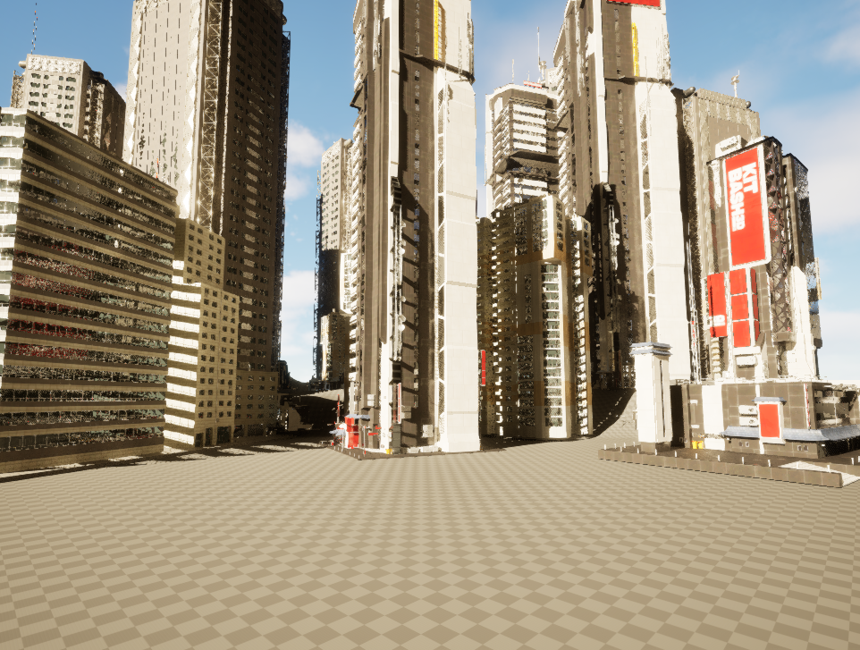

이렇게 다양하게 폴리지를 레벨에 배치할 수 있다.

다음으로 풀, 잔디 폴리지를 배치하자

Fab에서 Landscape Pro 2.0 Auto-Generated Material 를 검색하고 프로젝트에 추가한다.

::: important
Fab에서 애셋을 실제 프로젝트에 다이렉트로 추가하는 것은 좋지 않다.
용량이 크기 때문에 프로젝트가 그만큼 커지게 된다.
그래서 다른 프로젝트에서 작업을 완료하고, 그 해당 작업을 완료한 것만 따로 Migrate 해서 사용하는 것이 가장 좋다.
그렇게 하기 힘든 상황이라면, 사용하지 않는 애셋들은 삭제를 해서 프로젝트를 최대한 압축시켜줘야한다.
:::

#### Static Mesh Foilage

액터 폴리지를 만들었던 것과 같다. Static Mesh Foilage로 폴리지를 만들어주면 된다.

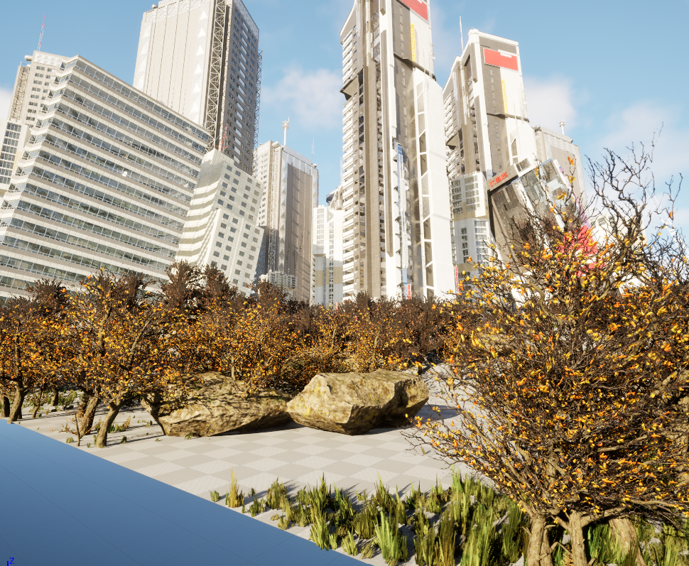

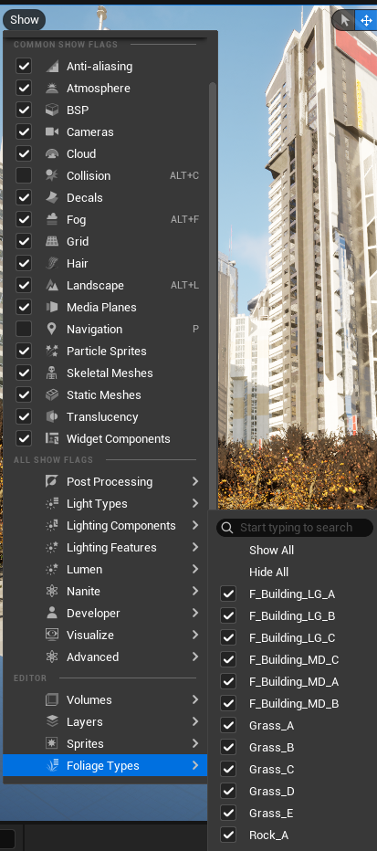

프로젝트에서 사용한 폴리지들을 확인할 수 있다.

### Material

머티리얼은 게임 오브젝트의 표면 특성을 결정하는 중요한 요소이다.
눈으로 보는 모든 3D 모델의 외관은 머티리얼에 의해 만들어지며, 이는 텍스쳐, 색상, 반사, 굴절 등 다양한 시각적 효과를 구현하는 기반이 된다.

#### 머티리얼의 역할

표면 표현

- 금속, 유리, 나무, 플라스틱 등 다양한 재질을 사실적으로 표현할 수 있다.

빛의 상호 작용

- 조명에 따른 반사, 굴절, 그림자 효과를 통해 현실감을 부여한다.

효과 구현

- 노멀 맵, 스페큘러, 메탈릭 등 세밀한 속성을 통해 복잡한 시각 효과를 구현한다.

머티리얼 에디터를 사용하면 다양한 노드를 연결하여 복잡한 머티리얼 효과를 손쉽게 구현할 수 있다.

#### 커스텀 머티리얼

랜드스케이프를 색칠하기 위한 커스텀 머티리얼을 생성하기 위해 Construction Gravel, Grass And Rubble, Striped Asphalt 애셋 세 개를 다운로드했다.

콘텐츠 드로어에서 Materal 을 생성해주고, Grass And Rubble 폴더에 들어가 텍스쳐 파일 3개를 올린다.

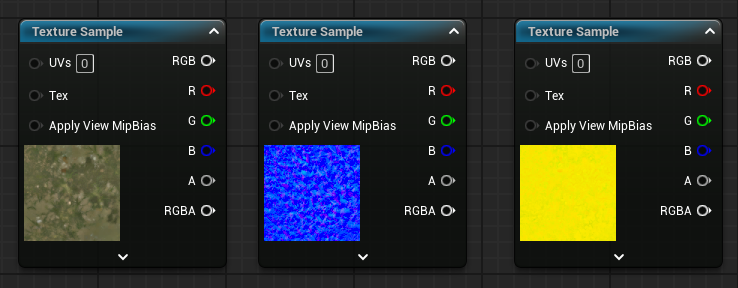

왼쪽부터 설명하면, 첫번째는 베이스 컬러 텍스처 라고 하며 물체의 색상 정보가 들어있다. 조명이나 그람자 등의 영향을 전혀 받지 않는 단순한 색상 정보가 들어가 있는 텍스쳐이다.
두번째는 라이팅 정보가 들어있는 텍스쳐이다. 조명을 받았을때 밝고 어두운 부분들에 대한 것들이 표현되어 있다.
세번째는 패킹 텍스처이다. 실제로 거친 정도, 메탈릭한 정도, 앰비언트 오쿨루전에 대한 정보들이 들어있다.
`앰비언트 오쿨루전(Ambient Occlusion)`이란 빛의 방향만으로 텍스처를 나타내는게 아닌, 빛이 닿고 퍼지는 반사광 같은 것들을 현실적으로 어떻게 반영이 되냐를 체크해주는 시스템이다.

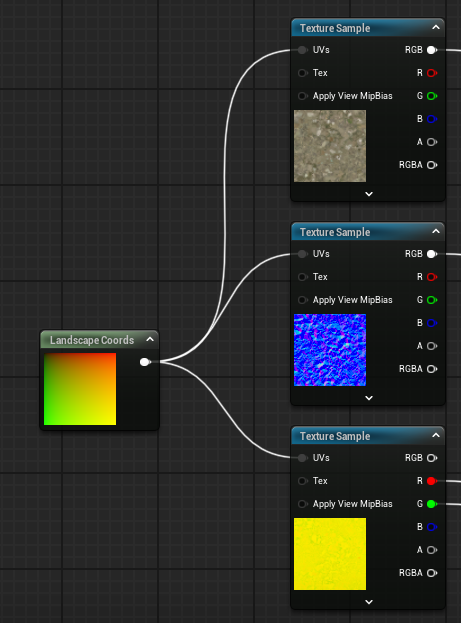

`Landscape Coords` 노드를 생성해 각 텍스처들의 UVs에 연결해준다. Construction Gravel, Grass And Rubble, Striped Asphalt 모두 연결해 총 3개의 Landscape Coords가 있어야한다.

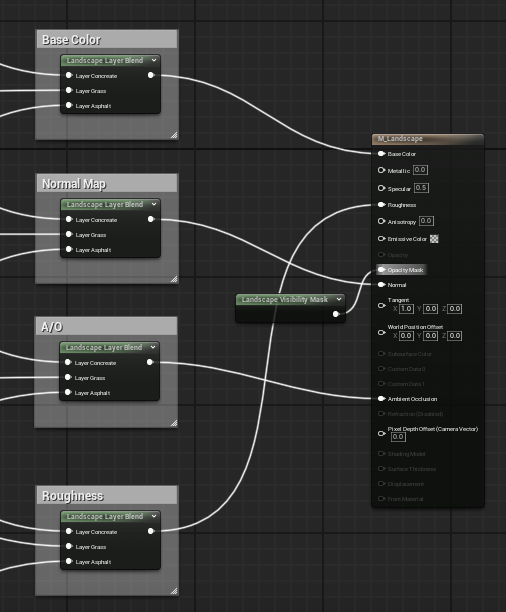

`Landscape Layer Blend` 노드를 하나 만들어 디테일 패널에서 인덱스를 3개 만들어준다.
각각 Concreate, Grass, Asphalt 라고 이름지어주고, 4개까지 복제해준다. 이미지처럼 각각 주석을 달아준다.
각 애셋들의 베이스 컬러 텍스쳐의 RGB값은 Base Color에 각각 매칭해주고 라이팅 정보 텍스쳐의 RGB를 Normal Map에 매칭, 패킹 텍스쳐의 R은 A/O, G는 Roughness에 연결해주고 M_Landscape 노드에 각 이름별로 매칭해준다.
`Landscape Visibility Mask` 노드를 만들어 Opacity Mask 에 연결해준다. 랜드스케이프만 가지고 있을 수 있는 특징이 있는데, 전체의 투명도를 관리할 수 있게 해주는 노드이다.

#### 머티리얼 적용

Landscape Mode 에서 폴리지들을 Hide All 처리해주고, 뷰포트나 아웃라이너에서 랜드스케이프를 선택한다.
Landscape → Landscape Material 에서 방금 만든 M_Landscape 를 선택해준다.

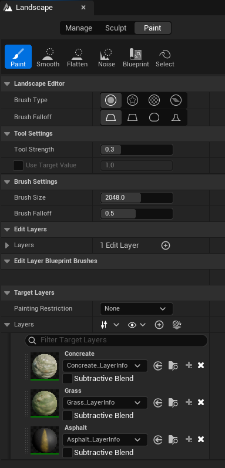

Landscape패널 Paint → Target Layers → Layers → Create Layers From Assigned Materials 버튼을 눌러 레이어를 나누어준다.
Concreate, Grass, Asphalt가 보이는데, 하나씩 + 버튼을 눌러 저장해준다.

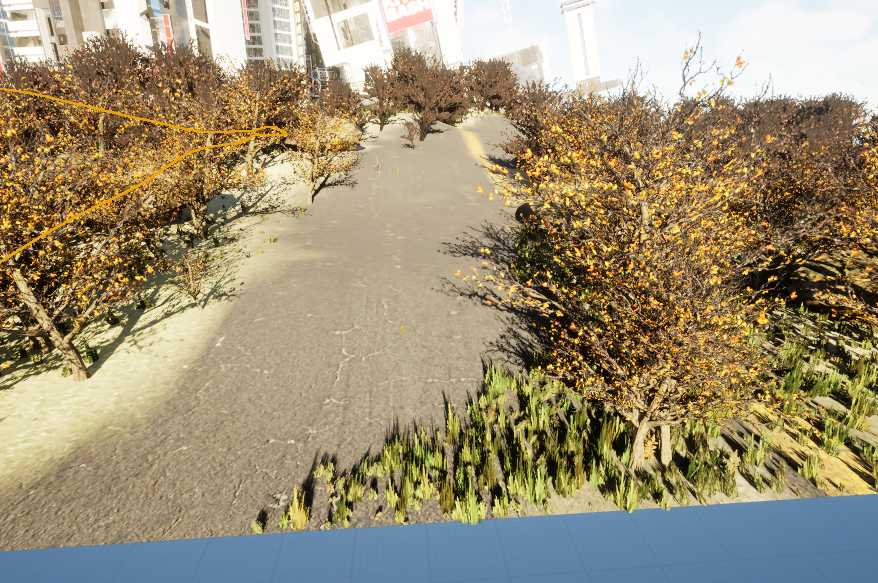

Landscape Coords의 Mapping Scale, Ratation 등의 값을 조절해 레벨에 머티리얼을 다양하게 적용해서 환경 디자인을 할 수 있다.

### 라이팅

라이팅은 게임의 분위기를 결정짓는 핵심 요소이다.
라이팅은 보통 마무리 작업에서 진행한다. 후보정을 하기 위해 `포스트 프로세스 볼륨` 이라고하는 액터가 필요하다.
디렉셔널 라이트, 포인트 라이트, 스포트 라이트 등 다양한 조명 옵션을 활용한다.

#### Post Process Volume

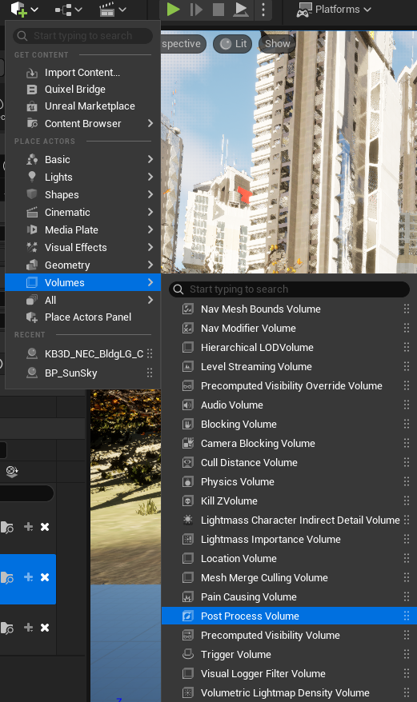

포스트 프로세스 볼륨은 플레이어의 카메라에 여러가지 효과를 줄 수 있는 매우 효율적인 툴이다. 주로 시네마틱 카메라와 함께 사용한다.
상단 패널에서 포스트 프로세스 볼륨을 생성해준다. 포스트 프로세스 볼륨을 선택하고 디테일 패널에서 `Infinite Extent (Unbound)` 를 체크해준다.
크기가 있던 액터를 크기가 없이 무제한으로 모든 맵에 적용이 되게끔 세팅을 해준다.

##### Metering Mode

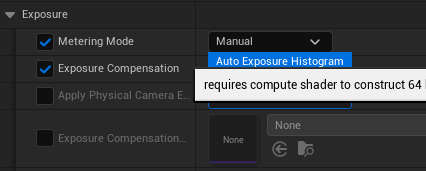

Exposure → Metering Mode 가 Auto로 되어있으면 위치마다 빛을 계산해서 전체적인 빛의 양을 자동으로 계산해준다. 캐릭터가 있는 위치마다 빛의 양이 달라져 다른 형태로 볼 수가 있기에 이런 것을 방지하기 위해 Manual로 설정을 해준다. Manual은 Exposure Compensation 의 값만큼 빛을 고정시켜준다는 것이다.

##### Lens Flares

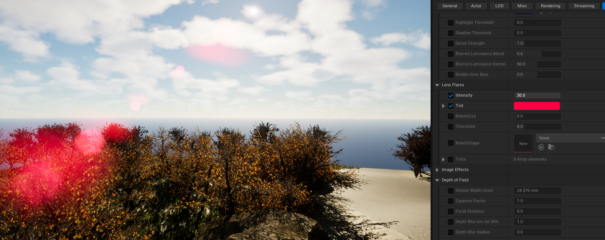

빛을 바라보았을때의 빛의 산란을 표현해준다. 대부분 시네마틱을 위한 기능이라 사용할 경우 성능저하 문제가 발생할 수 있다.

##### Bloom

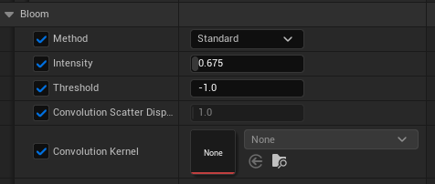

창문같은데서 빛이 퍼지면서 들어오는 효과를 만들어 낼 때 블룸을 사용한다.

이러한 값들은 시네마틱 영상을 촬영할때 많이 사용한다. 이런 것들을 플레이환경에서 많이 사용하면 최적화가 잘 되지 않는다.

#### Directional Light

BP_SunSky 에서 만들었던 Directional Light의 Rotataion 값을 수정하면, 해의 위치를 변경해 낮, 밤 등을 표현할 수 있다.

::: tip Nanite(나나이트)

라이팅을 바꾸다가 나나이트 관련 오류가 발생한다고 나올 수가 있다.
나나이트는 언리얼 엔진에서 사용하는 가상화된 지오메트리 시스템이다. 수십억 개의 폴리곤을 실시간으로 자동 최적화하여 높은 디테일을 유지하면서 성능을 극대화하는 최신 기술이다.
스태틱 메시에서 나나이트를 사용하지 않아서 성능적으로 이슈가 발생할 가능성이 높다는 경고다.

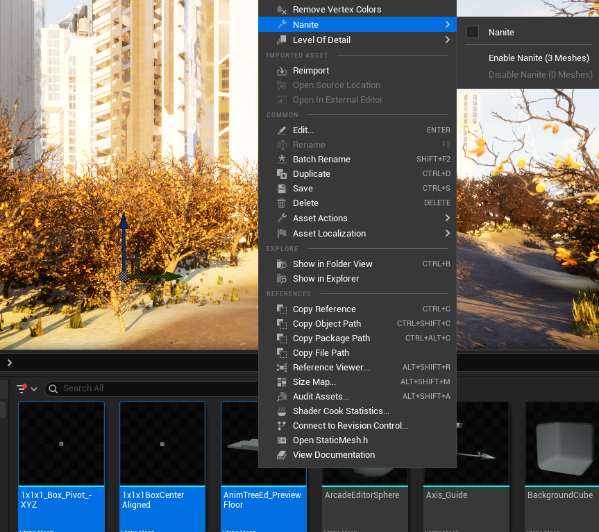
스태틱 메시에 우클릭 → Nanite → Nanite 활성화

:::

#### SkyLight

스카이 라이트의 월드 영향, 간접광 강도 옵션을 조절하여 전체적인 라이팅 양과 분위기 변경이 가능하다.

#### Expontential Height Fog

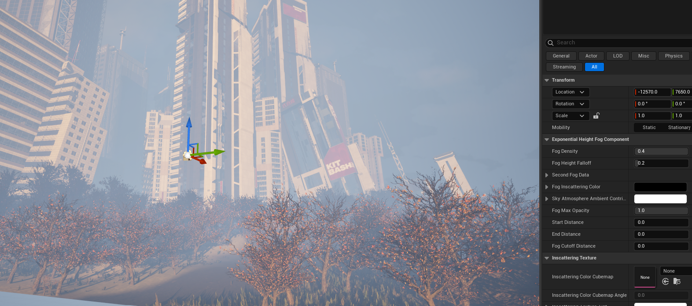

Expontential Height Fog 액터는 안개를 조절한다.

### 머티리얼 애니메이션

블루프린트 뿐만 아니라 머티리얼만을 활용해서 애니메이션을 만들 수 있다.

#### 사인 그래프

사인 그래프를 활용하여 머티리얼에 반짞이는 효과를 줄 수 있다.
기본적으로 y = sin(x) 형태를 어떻게 변형하느냐가 핵심이다.
사인그래프는 주기적으로 반복되는 특성 덕분에 움직임에 생동감을 부여하기 좋다.
`상수를 더하거나 곱하는 연산`을 통해 그래프를 변형하면, 반짝이는 방식이나 강도를 세밀하게 조절할 수 있다.

[데스모스](https://www.desmos.com/calculator?lang=ko) 사이트에서 테스트를 할 수 있다.

`y = sin(x + a)` → a를 더해주면, 사인파가 좌우로 수평 이동하는데, 언제 진동이 시작될 지를 바꿀 수 있다.
머티리얼에 적용하면, 여러 메시에 서로 다른 a값을 주면, 전부 동시에 빛나지 않고 순차적으로 빛나거나 일정한 차이를 두고 깜빡이게 만들 수 있다.

`y = sin(x) + b` → b를 더해주면, 이미 켜져있는 상태에서 밝기를 키우고 줄여주어 빛의 세기를 조절할 수 있다.

`y = A * sin(x)` → A가 커질수록 빛의 세기가 더 큰 범위에서 진동한다. 값을 크게주면 반짝임이 극적으로 바뀌고, 작게주면 미세하게 깜빡이게하여 잔잔한 빛의 변화를 줄 수 있다.

`y = sin(B * x)` → B가 커질수록 짧은 주기로 빠르게 깜빡이고, 작아질수록 주기가 길어진다. 조명 깜빡임 처럼 빠른 변화를 원하면 값을 크게, 서서히 변하게 하고싶으면 B를 작게 조정한다.

#### 머티리얼 생성

새로운 머티리얼을 만들어준다.

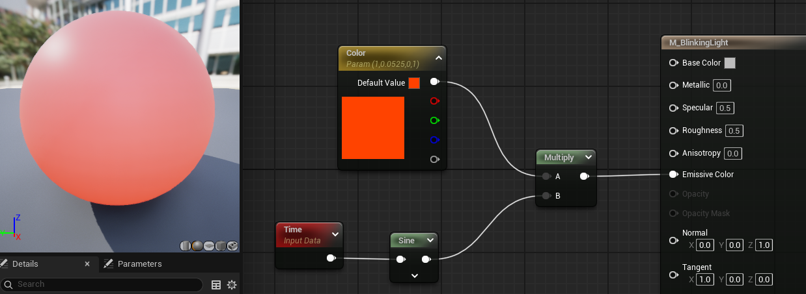

Time → Sine, VectorParamter(RGB) ⇒ Multiply → M_BlinkingLight의 Emissive Color 에 순차적으로 연결해준다.
좌측의 프리뷰 화면에서 바로 깜빡이는 것을 확인할 수 있다.

#### sin(x + a)

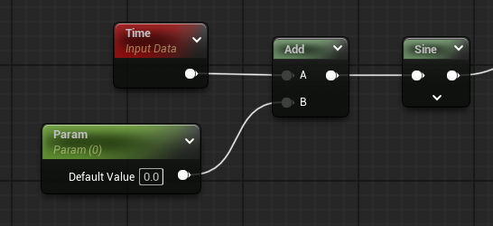

키보드 1을 누른채로 마우스 좌클릭을 하면 상수 노드가 만들어지는데, 상수 노드 우클릭을 하고 파라미터로 변경해준다.
Add 노드를 추가해주고 이미지처럼 이어준다. 이 형태는 sin(x + a) 의 형태이다.

#### sin(B \* x)

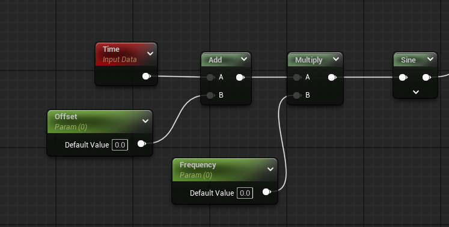

동일하게 파라미터 노드를 만들어주고 Multiply에 이어주면 이 형태는 sin(B \* x) 가 된다.

Offset은 시작 위치를 세팅 해주고, Frequency는 빈도수를 세팅해준다.

#### Ceil

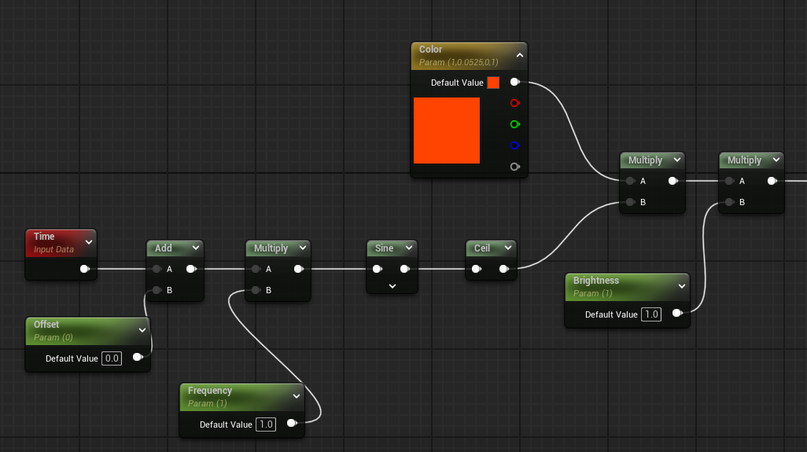

Ceil 노드를 사용해 일정하게 진행되는 값들을 0과 1로 변경하여 빛을 명확하게 구분할 수 있도록 한다.
Brightness 값을 추가하고 이를 한번 더 곱하여 전체 밝기를 조절할 수 있다.

#### 광원

빛을 발산할때는 광원을 기준으로 점차 옅어지면서 퍼져나간다.
자연스럽게 중앙이 가장 빛나게 되는데, 이걸 구현하기 위해선 Fresnel(프레넬), OneMinus, Power 의 세 가지가 필요하다.

##### Fresnel

화면상에서 법선 벡터와 카메라 간의 각도 차를 바탕으로, 표면 가장자리 부분이 두드러지도록 값을 계산해준다.
0~1 범위에서, 시야각에 따라 가장자리 부분에서 값이 높아지는 형태의 마스크가 만들어진다.

##### OneMinus

Fresnel 값을 반전시켜 가장자리가 어두워지고 중심부가 밝아지게 된다.

##### Power + Falloff(번수)

하이라이트(밝아지는 영역)의 경계를 더 날카롭게 혹은 부드럽게 조정한다.
OneMinus로 반전된 마스크가 점점 더 강한 대비를 갖게 된다.

Falloff

- `Exponent`로 들어가는 파라미터로, 숫자가 클수록 하이라이트가 좀 더 가파르고 날카롭게 형성된다.
- 숫자가 작으면, 가장자리 밝기가 좀 더 부드럽고 넓게 퍼지게 된다.

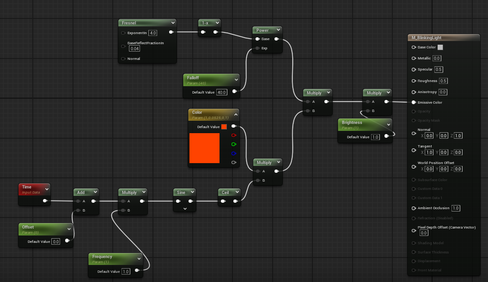

#### 머티리얼 적용

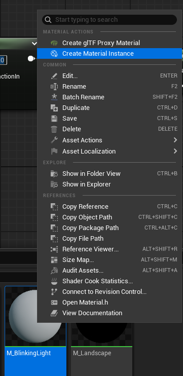

원본 머티리얼을 사용한, 실제 사용할 인스턴스를 생성한다.

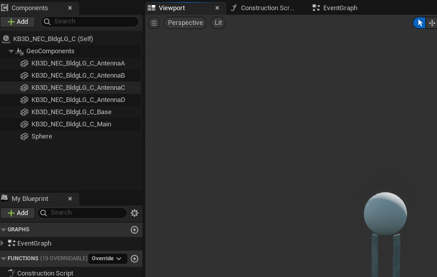

빌딩 블루프린트에 들어가 Sphere를 만들어주고, 안테나 위에 올려놓는다.
Sphere의 Materials를 방금 만든 머티리얼 인스턴스로 변경한다.

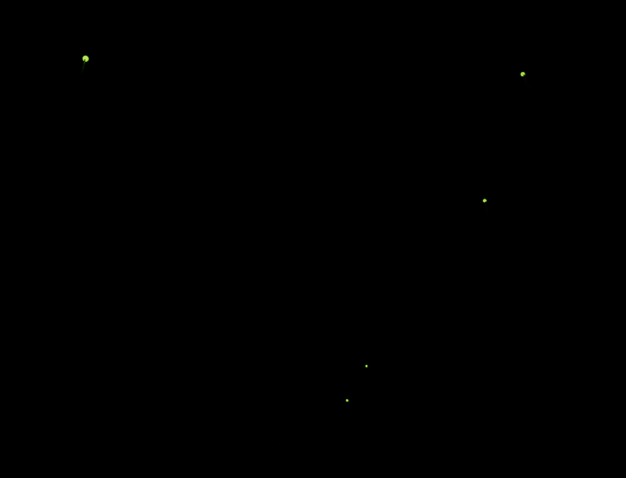

BP_SunSky를 끄고 확인하면, 빌딩 위 안테나에서 머티리얼이 반짝거리는 것을 확인할 수 있다.
