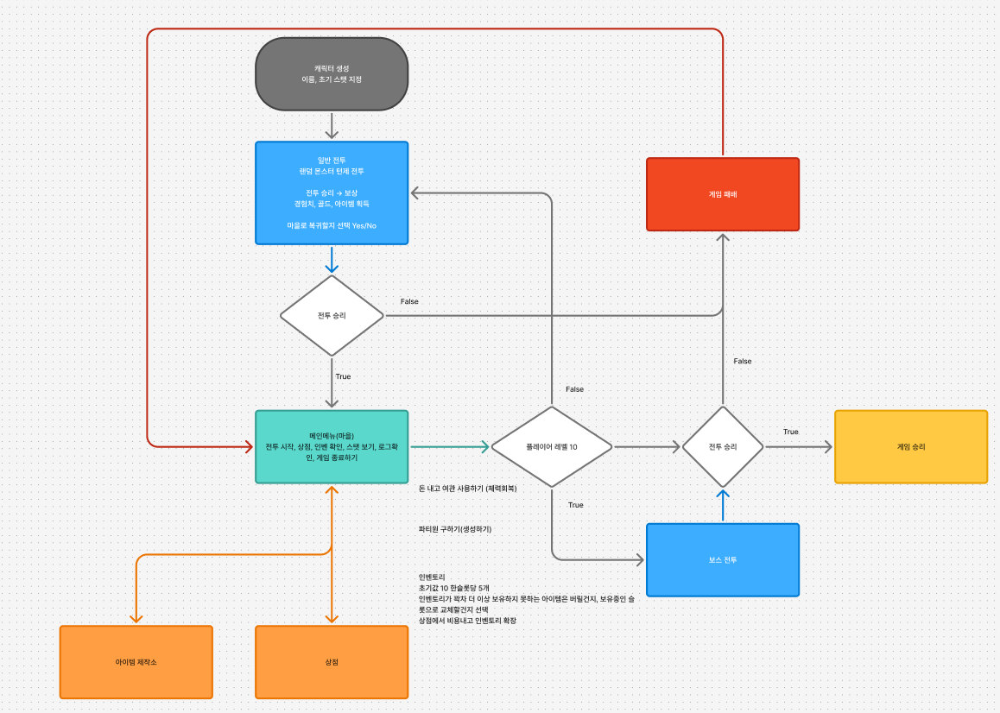

# 캠프 24일차

## 프로그래머스 코테 연습

<programmers-coding :test-id="12903">

::: tabs

@tab size() + substr()

size()로 길이를 구하고, substr()으로 문자열을 잘라내었다.

```cpp
#include <string>

using namespace std;

string solution(string s)
{
    string answer = "";
    if (s.size() % 2 == 1)
    {
        answer = s.substr(s.size() / 2, 1);
    }
    else
    {
        answer = s.substr(s.size() / 2 - 1, 2);
    }
    return answer;
}
```

@tab 더 간결하게

```cpp
#include <string>

using namespace std;

string solution(string s)
{
    int len = s.size() % 2 == 0 ? 2 : 1;
    return s.substr((s.size() - 1) / 2, len);
}
```

:::

</programmers-coding>

오늘은 어제 만들었던 RpgLogger의 임시 코드를 제거하고 실제 Monster의 EMontserID를 연결해주었다. 단순 연결이라 달리 할 건 없었다.

이후 회의를 하여 전체적인 흐름도를 만들었다.



나는 도전 기능인 상점을 추가로 담당하기로 했다. 자세한 설계, 구현은 내일!
