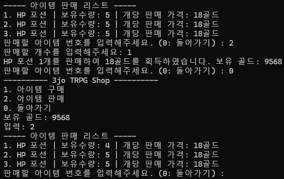

# 캠프 25일차

## 프로그래머스 코테 연습

<programmers-coding :test-id="12922">

::: tabs

@tab 반복문

```cpp
#include <string>

using namespace std;

string solution(int n) {
    string answer = "";
    for (int i = 1; i <= n; i ++) {
        if(i % 2 == 1) {
            answer += "수";
        } else {
            answer += "박";
        }
    }
    return answer;
}
```

@tab 더 간결하게

수박을 배열에 담아 if문없이 인덱스로 추가

```cpp
#include <string>

using namespace std;

string solution(int n) {
    string answer = "";
    string pattern[2] = {"수", "박"};
    for (int i = 0; i < n; i++) {
        answer += pattern[i % 2];
    }
    return answer;
}
```

:::

</programmers-coding>

## TRPG

상점(구매/판매) 기능을 구현했다.
구매는 "구매 가능한 아이템 리스트 출력 → 보유 골드 출력 → 아이템 선택 → 골드가 충분하면 차감 후 인벤토리에 추가"
판매는 "내 인벤토리 리스트 출력 → 판매할 아이템/개수 선택 → 아이템 가격의 60%만큼 골드 획득, 인벤토리에서 차감"

```cpp
// ShopManager.h
#pragma once
#include <vector>

#include "Inventory.h"
#include "RpgLogger.h"

extern Inventory* inventory;
extern RpgLogger rpgLogger;

class ShopManager
{
   public:
    // 유저에게 아이템 구매 할건지 판매 할건지
    // 구매 -> 구매 가능한 리스트 출력 -> 내가 보유중인 골드 출력
    // -> 어떤 아이템을 구매할지 선택 -> 충분한 골드가 있다면 골드 차감 후 인벤토리에 추가
    // 판매 -> 내 인벤토리 리스트 출력 -> 어떤 것을 판매할 것 인지 선택 -> 몇 개 판매할 것인지 선택
    // 아이템 가격의 60%만큼 플레이어 골드 추가, 인벤토리에서 차감

    // 구매 가능한 리스트 출력
    void ShowBuyableList() const;
    // 구매 가능한 아이템 ID 목록 (ShowBuyableList와 동일한 순서)
    std::vector<EItemID> GetBuyableItemIDs() const;
    // 아이템 구매
    void BuyItem(const ItemData& item, int count) const;
    // 판매 가능한 리스트 출력
    void ShowSellableList() const;
    // 판매 가능한 아이템 ID 목록 (ShowSellableList와 동일한 순서)
    std::vector<EItemID> GetSellableItemIDs() const;
    // 아이템 판매
    void SellItem(const ItemData& item, int count) const;

   private:
};
```

### 리스트 출력과 ID 목록

`ShowBuyableList()`는 화면에 "1. 포션 2. 검 ..."처럼 번호를 매겨 보여주기만 하고, `GetBuyableItemIDs()`는 그 화면과 **정확히 같은 순서**로 실제 `EItemID` 목록을 돌려준다. 둘을 분리한 이유는, 유저는 화면에 뜬 "1번, 2번" 같은 번호로 입력하지만 내부적으로 아이템을 식별하는 건 `EItemID`이기 때문이다. 그래서 유저가 고른 번호(`itemChoice`)를 `GetBuyableItemIDs().at(itemChoice - 1)`처럼 인덱스로 다시 찾아서 실제 아이템 ID로 변환해야 한다. 두 함수가 같은 순서로 순회한다는 전제가 깨지면 엉뚱한 아이템이 선택되거나 에러가 발생할 수 있기 때문에, "화면 순서 = ID 목록 순서" 규칙을 지키는 것을 핵심으로 두었다.

```cpp
// ShopManager.cpp
#include "ShopManager.h"

#include <iostream>
#include <iterator>
#include <sstream>

#include "Item.h"

void ShopManager::ShowBuyableList() const
{
    std::cout << "-------- 구매 가능한 아이템 --------" << std::endl;
    int count = 1;
    for (auto& item : ITEM_TABLE)
    {
        std::cout << count << ". " << item.second.name << std::endl;
        count++;
    }
}

std::vector<EItemID> ShopManager::GetBuyableItemIDs() const
{
    std::vector<EItemID> ids;
    for (auto& item : ITEM_TABLE)
    {
        ids.push_back(item.first);
    }
    return ids;
}

void ShopManager::BuyItem(const ItemData& item, int count) const
{
    // 총 비용
    int totalPrice = item.purchasePrice * count;

    // 골드가 부족할 때
    if (inventory->GetGold() < totalPrice)
    {
        std::cout << "골드가 부족합니다." << std::endl;
        return;
    }

    int remainingCount = inventory->AddItem(item.id, count);

    // 인벤토리 부족
    if (remainingCount == count)
    {
        std::cout << "인벤토리가 가득 차서 구매하지 못하였습니다." << std::endl;
        return;
    }

    // 실제 구매된 수량, 금액 (10개 사려는데 슬롯이 부족할 수도 있어 9개 구매)
    int purchasedCount = count - remainingCount;
    int purchasedPrice = item.purchasePrice * purchasedCount;

    inventory->AddGold(-purchasedPrice);

    // 로거 저장 및 출력
    std::ostringstream oss;
    if (remainingCount > 0)
    {
        std::cout << "인벤토리에 추가 가능한 만큼 자동 조절되어 구매합니다." << std::endl;
    }
    oss << purchasedPrice << "골드를 지불하여 " << item.name
        << "을(를) " << purchasedCount << "개 구매하였습니다. "
        << "남은 골드: " << inventory->GetGold();
    rpgLogger.AddLog(oss.str());
}
```

### BuyItem - 인벤토리가 가득 찼을 때 부분 구매 처리

`BuyItem`에서 신경 쓴 부분은 "10개 사려는데 인벤토리 슬롯이 9개만 남아있는" 경우다. `inventory->AddItem(item.id, count)`는 실제로 넣지 못한 개수(`remainingCount`)를 돌려주도록 만들어서, 이 값으로 세 가지를 구분한다.

- `remainingCount == count`: 하나도 못 넣음 → 구매 자체를 취소하고 골드도 안 깎는다.
- `0 < remainingCount < count`: 일부만 들어감 → 실제로 들어간 개수(`purchasedCount = count - remainingCount`)만큼만 골드를 깎는다.
- `remainingCount == 0`: 요청한 개수 전부 들어감 → 그대로 처리.

처음에 count로 골드 차감을 해서 구입한 수량보다 더 골드가 많이 나가서 왜 그런가 했더니, 골드 차감을 `count`가 아니라 `purchasedCount` 기준으로 하고있지 않았다. 인벤토리에 안 들어간 아이템 값까지 골드가 빠져나가는 버그가 생긴 것이라, `purchasedCount`로 변경하였다.

```cpp
void ShopManager::ShowSellableList() const
{
    std::cout << "----- 아이템 판매 리스트 -----" << std::endl;
    // 모든 아이템과 개수 가져오기
    std::map<EItemID, int> itemList = inventory->GetItemCounts();
    if (itemList.size() == 0)
    {
        std::cout << "** 판매 가능한 아이템이 없습니다. **" << std::endl;
    }
    else
    {
        int count = 1;
        for (auto& it : itemList)
        {
            const ItemData& item = ITEM_TABLE.at(it.first);
            std::cout << count << ". " << item.name << " | 보유수량: " << it.second << "개 | 개당 판매 가격: " << item.purchasePrice << "골드" << std::endl;
            count++;
        }
    }
}

std::vector<EItemID> ShopManager::GetSellableItemIDs() const
{
    std::vector<EItemID> ids;
    for (auto& item : inventory->GetItemCounts())
    {
        ids.push_back(item.first);
    }
    return ids;
}

void ShopManager::SellItem(const ItemData& item, int count) const
{
    // 아이템 소모(판매)
    bool isConsumed = inventory->ConsumeItem(item.id, count);
    // 선택 슬롯보다 큰 수를 입력했을 때 판매불가 메시지
    if (!isConsumed)
    {
        std::cout << "판매 수량이 보유 수량보다 많습니다." << std::endl;
        return;
    }

    // 가격의 60% * 판매개수
    int sellPrice = static_cast<int>(item.purchasePrice * 0.6) * count;

    // 총 판매 가격만큼 골드 추가
    inventory->AddGold(sellPrice);

    // 로거 저장 및 출력
    std::ostringstream oss;
    oss << item.name << " " << count << "개를 판매하여 "
        << sellPrice << "골드를 획득하였습니다."
        << " 보유 골드: " << inventory->GetGold();
    rpgLogger.AddLog(oss.str());
}
```

### SellItem - ConsumeItem의 bool 반환값으로 판매 가능 여부 판단

`SellItem`은 먼저 `inventory->ConsumeItem(item.id, count)`를 호출해서 아이템을 실제로 소모(제거)하는데, 이 함수가 `bool`을 돌려준다. 보유 수량보다 많이 팔려고 하면 `false`가 오고, 그러면 인벤토리에서 아무것도 빼지 않은 채 바로 리턴한다. `ConsumeItem`이 성공했을 때만 그 아래 골드 계산으로 넘어가는 구조라서, "먼저 확인하고 나중에 처리"가 아니라 "처리를 시도해보고 결과로 판단"하는 방식이다.

판매가는 구매가의 60%(`item.purchasePrice * 0.6`)로 고정했다. `double` 곱셈 결과를 `static_cast<int>`로 잘라내는데, 소수점을 버림 처리해서 판매가가 구매가의 60%를 넘지 않게 했다.

```cpp
// main.cpp

void Shop()
{
    ShopManager shop;
    std::cout << "---------- TEAM_3 TRPG SHOP ----------" << std::endl;
    std::cout << "1. 아이템 구매" << std::endl;
    std::cout << "2. 아이템 판매" << std::endl;
    std::cout << "0. 돌아가기" << std::endl;
    std::cout << "보유 골드: " << inventory->GetGold() << std::endl;
    std::cout << "선택해주세요: ";
    int select = 0;
    std::cin >> select;

    if (select >= 0 && select <= 2)
    {
        switch (select)
        {
            case 1:
            {
                // 구매 가능한 아이템 리스트 출력
                shop.ShowBuyableList();
                // 구매 가능한 아이템 ID값 가져오기 (ShowBuyableList와 Mapping을 위한 같은 순서)
                std::vector<EItemID> buyItemIDs = shop.GetBuyableItemIDs();

                int itemChoice, buyCount;
                while (true)
                {
                    std::cout << "구매할 아이템의 번호를 입력해주세요. (0: 돌아가기) : ";
                    std::cin >> itemChoice;
                    // 아이템 구매
                    if (itemChoice >= 1 && itemChoice <= buyItemIDs.size())
                    {
                        std::cout << "구매할 개수를 입력해주세요: ";
                        std::cin >> buyCount;
                        // 유저가 선택한 choice의 id값, 아이템 정보 찾기
                        EItemID id = buyItemIDs.at(itemChoice - 1);
                        const ItemData& itemTarget = ITEM_TABLE.at(id);
                        if (buyCount > 0)
                        {
                            shop.BuyItem(itemTarget, buyCount);
                        }
                        else
                        {
                            std::cout << "잘못 입력하셨습니다." << std::endl;
                        }
                    }
                    else if (itemChoice == 0)
                    {
                        return;
                    }
                    else
                    {
                        std::cout << "잘못 입력하셨습니다." << std::endl;
                    }
                }
                break;
            }
            case 2:
            {
                while (true)
                {
                    // 판매 가능한 리스트 출력
                    shop.ShowSellableList();
                    // 화면에 출력된 순서와 동일한 아이템 ID 목록
                    std::vector<EItemID> itemIDs = shop.GetSellableItemIDs();

                    int choice = 0;
                    std::cout << "판매할 아이템 번호를 입력해주세요. (0: 돌아가기) : ";
                    std::cin >> choice;
                    if (choice == 0)
                    {
                        return;
                    }

                    // 유저 입력이 0보다 작거나 판매 리스트의 사이즈 보다 클때
                    if (choice < 0 || choice > itemIDs.size())
                    {
                        std::cout << "존재하지 않는 슬롯입니다." << std::endl;
                        continue;
                    }

                    int sellCount = 0;
                    std::cout << "판매할 개수를 입력해주세요: ";
                    std::cin >> sellCount;
                    // 판매할 개수를 0이하로 입력했을때
                    if (sellCount <= 0)
                    {
                        std::cout << "잘못 입력하셨습니다." << std::endl;
                        continue;
                    }

                    // 유저가 choice한 아이템의 ID값, 아이템 정보 찾기
                    EItemID id = itemIDs.at(choice - 1);
                    const ItemData& item = ITEM_TABLE.at(id);

                    shop.SellItem(item, sellCount);
                }
                break;
            }
            case 0:
                // 메인 메뉴로 돌아가기
                SwitchState(EGameState::MAIN_MEMU);
                break;
            default:
                break;
        }
    }
}

```

### Shop() - 화면 번호를 실제 아이템으로 되돌리는 지점

`Shop()`에서 실질적으로 하는 일은 결국 "유저가 입력한 번호 → `.at(choice - 1)`로 인덱스 변환 → 그 인덱스로 ID 목록 조회 → ID로 `ITEM_TABLE`에서 실제 아이템 정보 조회"의 반복이다. 앞서 `ShowBuyableList`/`GetBuyableItemIDs`를 분리해둔 게 여기서 그대로 쓰이는 셈이다. 화면에 뜬 번호는 1부터 시작하는데 `vector` 인덱스는 0부터라서 `choice - 1`로 항상 맞춰줘야 하고, 범위를 벗어난 입력(`choice < 0 || choice > itemIDs.size()`)은 따로 걸러서 잘못된 인덱스로 `.at()`을 호출해 예외가 터지는 걸 막게 했다.

구매/판매 둘 다 `while(true)` 루프 안에서 계속 재입력을 받다가, 0을 입력하면 `return`으로 `Shop()` 자체를 빠져나가는 구조로 통일했다.

### 마치며

팀원분이 만들어주신 `Inventory` 클래스의 멤버 함수 하나하나가 어떤 의도로 만들어졌는지 파악하고, 이걸 상점 기능에 어떻게 조합해서 쓸지 고민을 많이 했다.



처음에는 예시 이미지처럼 인벤토리의 슬롯을 하나씩 선택해서 슬롯 단위로 판매하는 방식을 생각했다. 그런데 `Inventory`에는 슬롯 단위로 아이템을 증감시키는 함수가 없었다. 담당자분과 얘기해보니, 슬롯 단위로 판매하면 같은 아이템을 여러 슬롯에 나눠 갖고 있을 때 슬롯마다 반복해서 판매해야 해서 사용자 입장에서 번거로울 수 있다는 의견을 주셨다. 그래서 아이템 종류별로 보유 수량 전체를 한 번에 보여주고, 그중 원하는 개수만큼만 차감하는 방식으로 구현을 변경했다.
