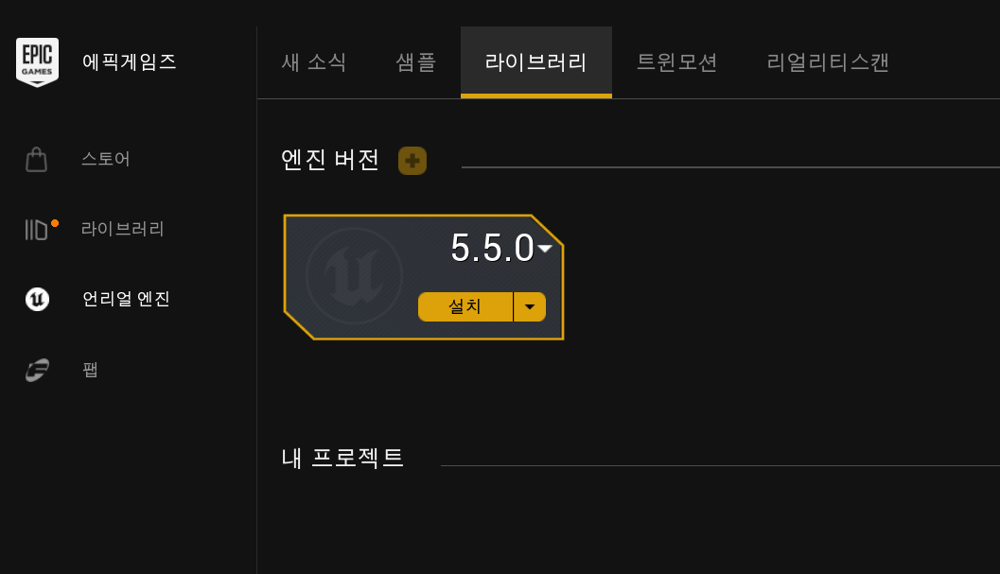
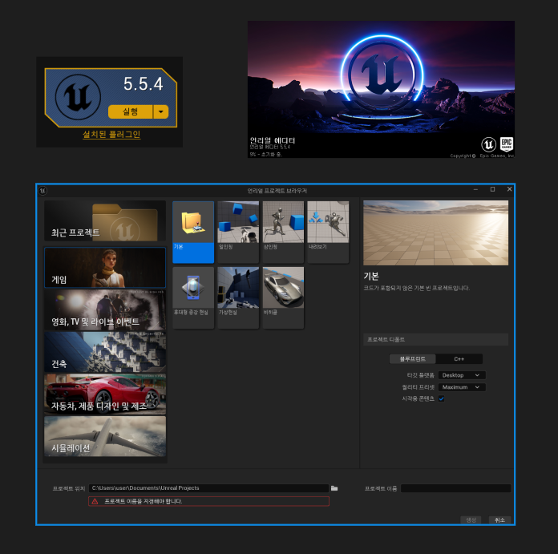
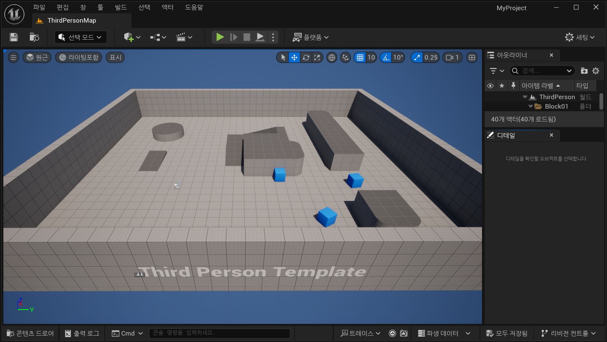
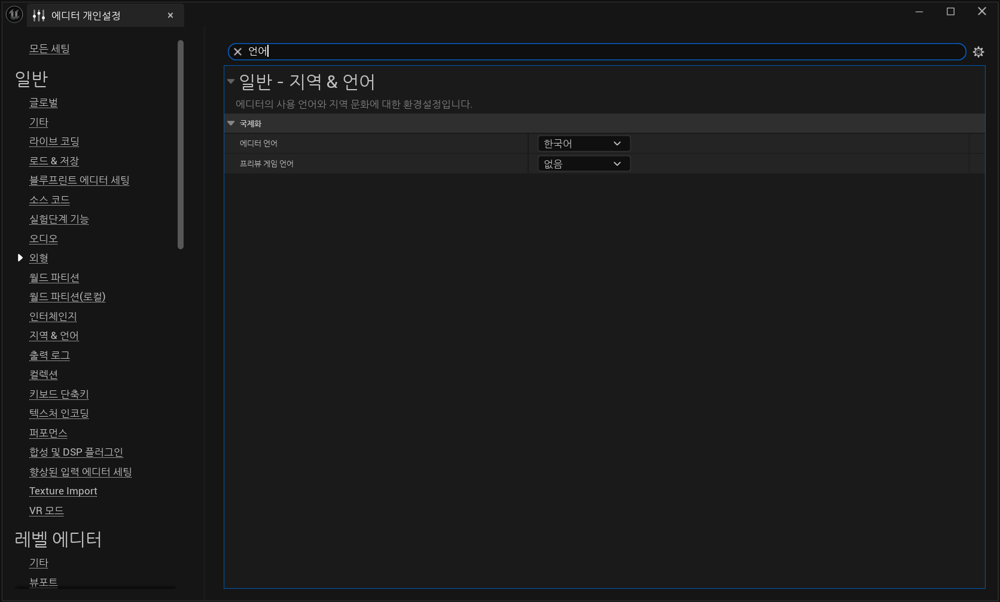
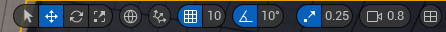
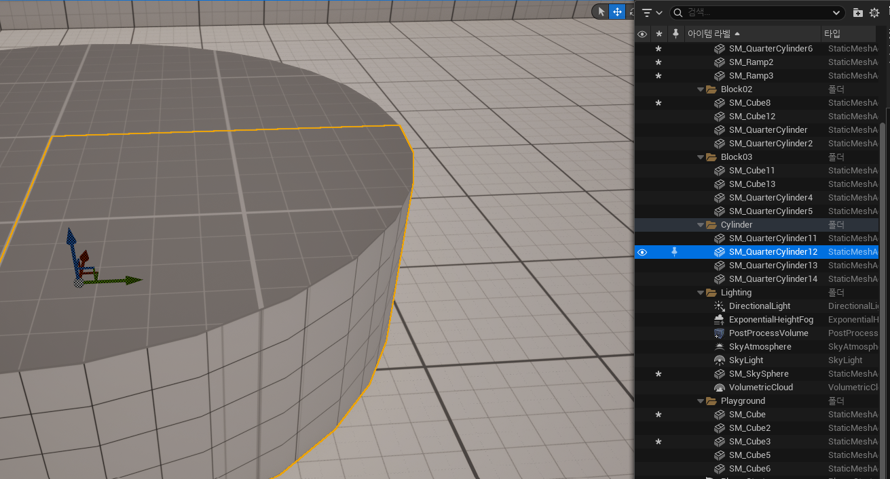

# 베이스캠프 2일차 (마지막..)

`Unreal 기초 학습 자료 모음집`과 `Unreal 게임개발종합반` 강의를 같이 정리함

## 서버

### 웹 서버

주로 텍스트나 이미지와 같은 정적진 콘텐츠를 전송한다. (동적 컨텐츠도 처리가능)
빠르고 간단한 데이터 처리로 다수의 사용자에게 정보를 쉽게 제공하는 것이 목적

### 게임 서버

웹 서버와는 다르게 실시간 상호작용과 복잡한 데이터를 다룬다.
사용자가 게임에서 움직일 때 다른 사용자에게도 즉시 그 움직임이 반영되어야한다.
이러한 상호작용을 원활하게 하기 위해 게임 서버는 많은 사용자의 상태와 게임 데이터를 동시에 처리해야 한다.
여러 명이 동시에 접속하고 위치, 아이템, 캐릭터 상태 등 복잡한 데이터를 빠른 속도로 처리하기 위해 서버 성능이 중요하며 일반적으로 웹 서버보다 복잡한 시스템을 갖추고 있다.

- 게임의 핵심 로직(점수 계산, 상태 저장, 멀티플레이 동기화 등)을 담당
- 여러 명의 플레이어가 동시에 접속해도 공정하고 일관성 있게 게임을 진행시키기 위해 필요
- 공격을 받았는지, 아이템을 먹었는지 등의 최종 판단

### P2P

- 중앙 서버 없이 플레이어끼리 직접 연결해서 게임 데이터를 주고받는 방식
- 서버 비용은 적지만, 해킹 방어나 속도 문제가 발생하기 쉽다.

### 하이브리드

- 부분적으로는 서버가, 부분적으로는 플레이어끼리 통신 하는 형태
- 다양한 온라인 게임이 상황에 따라 혼합해 사용하기도 한다.

## 클라이언트

### 웹 클라이언트

네이버, 크롬, 웨일같은 브라우저를 `웹 클라이언트`라 한다.

### 게임 클라이언트

exe파일로 되어있는 파일을 `게임 클라이언트`라 한다.

게임 클라이언트를 만들기 위한 대표적인 툴은 `언리얼 엔진`, `유니티 엔진`이 있다.

실제로 화면에 게임을 보여주고 사용자의 키보드/마우스/터치 입력을 받아 서버로 전달
서버에서 받은 결과를 화면에 그래픽이나 사운드로 표시
'캐릭터 이동, 아이템 사용' 버튼을 누르면 정보를 서버에게 보내고 결과를 받아 처리한다.

::: note 프로토콜

컴퓨터나 전자 기기 간에 정보를 교환할 때 따르는 규칙의 집합
==통신 규약== 이라고도 불리며, 컴퓨터 간의 원활한 통신을 위해 지켜지는 약속
클라이언트와 서버가 통신하려면 반드시 프로토콜이라는 약속이 필요하다.

`HTTP/HTTPS`

- 주로 웹에서 사용되며 요청/응답 구조가 명확하여 REST API 등을 통해 데이터 전송

`TCP/UDP`

- 게임에서는 실시간성이 중요한 경우 UDP를 사용하기도 한다.
- 안정성이 중요한 경우에는 TCP를 사용한다.

:::

## 게임 서버의 구조

### 단일 서버

- 말 그대로 한 대의 서버가 게임의 모든 기능을 책임지는 구조
- 모든 데이터를 한곳에서 처리하고, 모든 사용자가 이 한 서버에 접속하는 방식
- 사용자 수가 적을 때는 효율적이지만 사용자 수가 많아질수록 느려지고 서버에 과부하가 걸린다.

### 분산 서버

- 여러 서버가 각각 역할을 나누어 처리하는 방식
- 로그인, 채팅, 전투 기능 등 서버가 맡은 역할이 각각 나뉘어져 있어 분산된 구조로 운영된다.
- 역할을 나눠 효율적으로 운영할 수 있어 대규모 온라인 게임에 적합하다.

::: note 서버 확장 방식

수직적 확장(Scale Up)

- 하나의 서버를 더 강력하게 만드는 방식
- CPU, 메모리 등을 업그레이드해 성능을 높인다.

수평적 확장(Scale Out)

- 같은 서버를 여러 대로 나누어 부하를 분산하는 방식

:::

## 게임 개발 직군

### 의사결정권자

3개의 파트에서 의논을 하여 게임의 전체적인 방향성을 정한다. (장르 선택)

#### PD

- Project Director의 약자
- 한 팀의 헤드 역할을 하며 게임 전반의 방향성을 결정
- 방송의 PD와 비슷한 역할

#### TD

- Technical Director의 약자
- 서버팀, 클라이언ㅇ트팀 등 모든 기술팀의 헤드 역할
- 전체적인 기술의 흐름 및 방향성을 결정
- 회사마다 부르는 이름이 다른 경우가 있다. (TL)

#### AD

Art Director의 약자
아트팀의 모든 방향성을 결정
3D 그래픽, 2D 컨셉 등 가능성 여부 결정

### 기획자

의사결정권자가 전체적인 방향성을 정하면 기획자가 게임을 기획하게된다.

스토리 & 레벨 디자인

- 플레이어가 위험한 던전을 탐험하며 강력한 보스와 대결하는 MMORPG
- 던전의 구조, 보스 패턴, 획득 아이템 등이 어떻게 구성될지 세세하게 작성한다.

규칙 & 재미 요소 설계

- 게임 시스템(전투, 이동, 스킬, 성장 등)부터 세부 난이도까지 일관되고 재밌게 설정
- 밸런스 패치가 중요한 이유도 기획이 게임의 재미를 결정짓는 핵심이기 때문

협업

- 기획서대로 아티스트와 프로그래머가 작업할 수 있도록 설명하고, 방향성을 공유한다.

### 아트팀

- 배경, UI, 원화, 모델러, 애니메이터, VFX 등 가장 많은 직군이 존재
- 게임 전체의 분위기와 톤앤매너를 결정하며, 고퀄리티 게임의 핵심직군이다.

### 프로그래머

- 대표적으로 클라이언트, 서버 프로그래머로 나뉜다.
- 클라이언트에서는 다양한 게임 콘텐츠, 그래픽 구현 및 퍼포먼스 최적화 작업을 한다.
- 서버에서는 게임 컨텐츠 개발 및 서버 안정성에 가장 큰 기여를 하며, 데이터 공정성 유지, 치트 방어와 같은 작업들도 진행한다.

::: info

위와 같이 다양한 직군들이 협업하여 `기획 - 디자인 - 개발 - QA` 의 과정을 거쳐 게임이 만들어진다.

:::

## 언리얼 엔진 소개 및 설치

::: note `엔진`이라 불리는 이유

언리얼 엔진은 단순한 프로그램이 아니라 '게임 제작을 위한 전반적인 인프라' 라고 볼 수 있다.
자동차의 엔진이 차량을 움직이는 핵심이듯이 게임에서 언리얼 엔진은 `그래픽 렌더링부터 물리 연산, 사운드, 네트워킹, AI` 등 종합적인 기능을 담당한다.
언리얼 엔진은 게임용으로 가장 유명하지만, 최근에는 영화, 건축, 자동차 디자인, 시각화 프로젝트 등에서도 많이 사용된다.

그래픽 렌더링: 사실적인 라이팅과 섬세한 쉐이더 표현으로 몰입도를 높인다.

물리 엔진: 캐릭터 점프, 오브젝트 충돌, 중력 등 실제처럼 보이는 물리 효과 제공

오디오 엔진: 배경 음악부터 디테일한 효과음까지 유연하게 제어한다.

네트워킹: 멀티플레이 게임 구현에 필요한 서버 통신을 지원한다.

AI: 적의 행동이나 NPC의 의사결정 루틴 등 인공지능 요소를 쉽게 적용한다.

:::

### 에픽 게임즈 런처 & 언리얼 엔진 설치

[에픽 게임즈 런처 다운로드 링크](https://store.epicgames.com/download?lang=ko)

에픽 게임즈 런처를 다운로드를 받아준다.

프로그램이 실행되면 언리얼 엔진 -> 라이브러리 -> 엔진버전 + 버튼 -> 5.5 버전을 설치해준다. (강의에서 5.5버전 사용)

정말정말 오래 걸렸다.. 검증단계에서 넘어가질 않았다..

검증단계까지 완료되면 실행버튼이 생기는데, 실행버튼을 누르면 위 이미지처럼 '언리얼 프로젝트 브라우저' 창이 열린다.

### 뷰포트

언리얼 프로젝트 브라우저 창에서 게임 -> 3인칭 -> 프로젝트 이름 적고 생성 버튼 클릭 후 다시 기다리기..

위의 이미지에서 보이는 전체를 에디터 환경이라고 한다.
에디터 환경 안에 보이는 3D 화면을 `뷰포트` 라고 부른다.
전체적인 것은 `레벨`, 구조물들을 `액터` 라고 부른다.

혹여나 한국어가 아닌 다른 언어로 되어있다면 상단에 편집 -> 에디터 개인설정 -> 검색에 언어 검색 후 언어 변경을 해주면 된다.
하지만 영어로 하는게 좋다고한다.

액터를 클릭했을때 나오는 화살표 3개가 있는데 이걸 `기즈모(Gizmo)` 라고 부른다. 각각의 방향을 가르키며 빨-x, 초-y, 파-z 축이다.
왼쪽 4개는 qwer 버튼을 이용하여 액터의 크기, 각도, 회전, 이동 등을 할 수 있다.
지구본 모양을 누르면 좌표계의 기준을 로컬로 할 것인지, 월드로 할 것인지 선택할 수 있다.
나머지들은 각 기능에 따른 단위를 지정하거나 기능을 on/off 할 수 있다.

### 아웃라이너

화면 전체가 레벨이라고 했을때 이 레벨에 배치된 모든 액터들에 대한 정보가 있는 곳이다.

아웃라이너에서 하나의 액터를 선택하고 F를 누르면 해당 액터가 있는 곳으로 화면이 이동된다.
눈동자 모양을 눌러 하나의 액터만 보이지 않게 할 수도 있고, 폴더 내부의 액터들을 모두 안보이게 할 수도 있다.
액터를 클릭하면 디테일 패널에서 각 액터들이 가지고 있는 모든 속성 정보들을 확인하고 수정할 수 있다.
해당 패널은 에디터환경 상단의 창(Windows) -> 디테일 에서 독립적인 창으로도 볼 수 있다.

### 콘텐츠 드로어와 임포트

레벨에 보이는 액터들은 해당 월드에 존재하는 것이고, 하단 왼편에 콘텐츠 드로어를 누르면(ctrl+space) 여러개의 파일들이 있는데 여기서 존재하는 파일들과 뷰포트에 존재하는 것들은 다르다. 콘텐츠 드로어에 있는 외부 파일을 언리얼 엔진의 내부 파일로 변환하는 작업을 ==임포트== 라고 한다. 드래그를 하여 뷰포트에 넣으면 임포트가 되며 일부 파일은 임포트의 옵션을 선택해주어야 한다.
파일로 존재하는 것들을 새로 배치할때는 해당 파일로 하여금 새롭게 생성된 것이다. 이렇게 새롭게 생성된 것들을 `인스턴스` 라고 부른다.
원본의 값은 고유하고 원본의 값을 통해서 생성된 액터의 인스턴스이다.
화면의 존재하는 액터를 수정하여도 콘텐츠 드로어에 있는 파일들은 변하지 않는다.

### 월드 세팅과 게임모드

World Settings는 현재 레벨 전체의 규칙을 설정하는 곳이다.
레벨마다 World Settings가 별도로 존재하고, 여기서 `GameMode`를 지정한다.

GameMode는 `이 게임의 규칙을 누가 정하는가` 를 정하는 클래스이다.
현재 레벨에서 게임이 어떻게 진행되는지를 관리한다.
