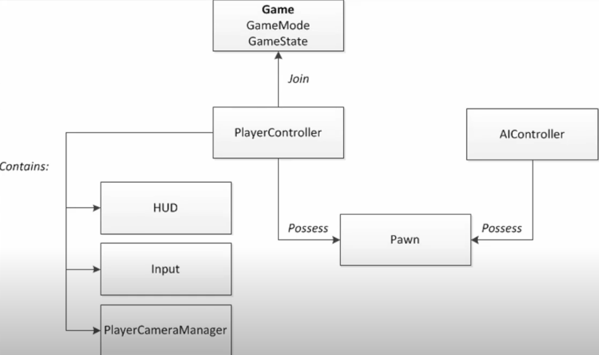

# 캠프 1일차

## 캠프 OT

### 출석관리

0시간 ~ 5시간 59분 - 결석처리
6시간 ~ 11시간 59분 - 지각/조퇴/외출
12시간 이상 - 출석

지각/조퇴/외출 3회 시 결석 처리
본인 부주의로 인한 미입실/미퇴실은 인증 불가

hrd.net 어플의 QR코드 인증으로 입실 및 퇴실 처리

QR에서 문제가 생긴다면 `출결 기록하기` 페이지를 들어가 관리 가능

#### 필수 증빙 자료

카메라를 켜 본인 얼굴이 보이게 한 ZEP 캡처 이미지와 QR 오류 녹화본이나 이미지 제출

개강 후 14일간 수강 신청 정정이 가능
14일 후에는 훈련자 확정이 되며 이후 중도하차 시 내일배움카드 유효기간 만료까지(최대 5년) KDT 교육과정 신청 불가

#### 제적 기준

총 결석 일수가 전체 소정 훈련 일수 20%를 초과, 결석 일수가 단위기간 내 50% 이상일때
훈련을 수강하지 않았음에도 불구하고 거짓 기타 부정한 방법으로 출석
훈련생을 대신하여 출석 확인 행위를 한 수강생

### 훈련장려금 및 훈련참여지원수당

훈련 기관이 단위기간별로 고용센터에 신청하며, 필요 서류는 별도 안내 후 진행
마지막 훈련장려금은 HRD-net 수강평 등록 완료시 신청 가능
단위기간 소정 훈련일수의 80% 이상 수강 시 지급 (내일배움카드 연계 계좌)
실업급여 수급 기간에는 훈련장려금 미지급

### 훈련 장비 지원

노트북(대여) / 웹캠&마이크(지급) / 외 장비를 내일배움캠프 119를 통해 문의

- 정부 자산이어서 훼손 시 본인이 부담해야함

### 학습 공간 대여

- 사전 승인 필요
- 온라인 카드 결제 한정
- 1개월 기준 인당 5만원 지원
- 직접 결제하는 것이 아닌 캠프 매니저분들께 결제 부탁하는 형태

### 공가 인정 사유

- 질병/입원(본인, 자녀)
  - 일반 건강검진, 라식수술 인정 불가
  - 진단서나 소견서 내 기재된 진료일만 인정 가능
- 취업, 훈련 관련 시험
  - 훈련과정과 관련된 자격시험만 가능
  - 대학교 시험 불가
- 입사시험(면접)
  - 서류 합격 안내문, 면접 통지서 불가
  - 반드시 기업의 직인이 포함되어 있어야함
  - 싸인 포함 확인서는 담당자나 대표의 명함까지 함께 첨부 필요

### 자부담금

환불 기간과 기준

- 수강 철회 기간: 7.9 14:00까지
  - 전액 환불되며 7.9 12:00까지 하차 면담 완료 후 14:00까지 구글폼으로 신청
- 훈련 진행 중 & 훈련 기관 사유: 7월 9일 이후부터 수료 전까지
  - 이미 진행된 훈련 일수를 제외하고 일할 계산하여 환불

늦은 합류로 인한 자부담금 할인X
훈련 종료 이후에는 환불X

### 캠프 규칙

- ZEP에 항상 접속하고 카메라 켜고 학습
- 주 60시간을 밀도 있게 학습
- 팀을 우선 순위로 하며 다른 팀과도 도움 나눔
- 매너있게 소통
- 함께하는 팀원과 스스로에게 최선
- 프로필 얼굴이 있는 모습 변경
- 타 수강생과 나를 비교하지 않기
- 질문을 두려워하지 않기
- 절대 포기하지 않기

### 수료 이후

무제한 / 무기한 / 무료 코칭 및 서포트
커리어톤 / 스파르타 커리어 / 바로 인턴 / 꿀알바 모집 / 취업 축하금 등 각종 지원

### 커리큘럼

- 1-2주
  - Unreal Blueprint
- 3-6주
  - 프로그래밍 C++ 문법
- 7-14주
  - Unreal Engine 입문
- 15-21주
  - Unreal Engine 숙련
- 22-24주
  - Unreal Engine 심화
- 25-35주
  - 실전 프로젝트

매 챕터마다 개인/팀 프로젝트가 있으며 조는 챕터마다 변경

## Unreal Blueprint 라이브 세션 기록

파일명과 경로는 잘 구분해서 만들어야한다.

레벨의 이름이 L\_ 로 시작하는 것처럼 나중에 찾기 편하게 네이밍을 해두어야한다.

프로젝트 세팅 -> Maps & Modes 에서 Editor Startup Map은 에디터를 처음 실행했을때 나오는 맵이고 Game Default Map은 실제 게임을 실행했을때 처음 나오는 맵(배급사,로고 등)이다. Game Default Map에는 어떤것을 넣을지 정해져있지는 않다.

Default Game Mode는 레벨마다 게임모드를 세팅하지 않았을때 GameModeBase가 된다.

Game Instance Class 는 중간역할을 해준다.

뷰포트에서 왼쪽클릭 + wasd 와 오른쪽클릭 + wasd 의 차이는 왼쪽클릭은 화면이 고정되어있는 상태이고 오른쪽클릭에서는 시야전환이 가능하다.
카메라 속도 조절은 마우스 왼or오 클릭하고 휠을 돌리면 된다.
아웃라이너에서 액터를 누르고 F를 누르면 해당 액터의 위치에 포커스가 잡힌다.
아웃라인은 배치되어있는 액터들을 의미한다.
콘텐츠 드로어는 왼쪽하단이나 ctrl+space 로 열 수 있다.
아웃풋 로그는 Alt+`(백틱) 으로 열 수 있다.

Alt + 1/2/3/4 는 꼭 외우기

ctrl+d 로 복제 가능

이외 내용들은 튜터님 화면 따라하기만 했는데 에디터를 처음써봐서 따라가기만해도 벅찼다.


여기까지 어찌저찌 잘 따라하긴 했다.

## C언어 라이브 세션 기록

코딩이란 컴퓨터가 이해 가능한 명령서를 작성하는 과정이다.
사람이 이해 가능한 명령서가 아닌 컴퓨터가 이해 가능한 명령서다.
따라서 컴퓨터가 해석할 수 있게 작성해야한다.
반도체는 켜진 상태(1)와 꺼진 상태(0) 2가지 상태로 모든걸 표현한다.
컴퓨터는 2진법만 이해할 수 있기 때문에 명령서는 2진법으로 작성되어야한다.

옛날 사람들은 기계어로 코드를 작성했다가 이후 `어셈블리어`가 나왔다.
숫자가 아닌 문자이기에 사람에 좀 더 친숙한 언어이다.
기계어와 어셈블리어는 일대일 대응 관계를 가진다.

우리가 사용하는 C언어, C++, Java 등의 언어는 사람에 가깝다는 의미에서 `High-level Language`(고급언어)라고 한다. 반대는 Low-Level.
프로그래머가 고급 언어로 작성한 코드를 `소스코드`라고 한다.
사람이 고급 언어로 명령서를 작성하면 누군가는 번역해서 컴퓨터가 읽기 쉬운 기계어로 바꾸어야하는데 이 과정을 `컴파일` 이라고하며 이런 번역가를 `컴파일러`라고 한다.

main() 함수는 프로그래밍의 시작점이다.

unsigned는 음수를 포기하고 양수의 데이터 범위를 두배 늘려 표현할 수 있다.
signed는 양수와 음수 모두 표현할 수 있다.

```c

#include <stdio.h> // stdio.h 에 있는 기능들을 해당 프로젝트(파일)에서 사용하겠다.

int main(void) {
  int Num = 21; // int 정수자료형, Num 변수, = 값
  unsigned int Num2 = -21; // unsigned는 양수만 저장이 가능한데 음수를 저장하면 오버플로우가 발생한다.
  double PI = 3.141592; // double 실수자료형

  printf("Num = %d\n", Num); // 21
  printf("Num2 = %u\n", Num2); // 4294967275 -> unsigned 최대값
  printf("PI = %f\n", PI); // 3.141592

  return 0;
}


```

## VOD강의 기록 - 개발의 요소

개발의 요소에는 크게 `레벨, 컨트롤러, UI, 액터`가 있다.

### 언리얼 엔진 게임 프레임워크

언리얼 엔진은 `게임 프레임워크` 구조를 갖추고있다.
많은 구성 요소가 복합적으로 작동해 하나의 게임, 인터렉티브 앱을 만든다. 레벨, 컨트롤러, UI, 액터는 게임의 뼈대인 핵심 요소다.

::: info 프레임워크 클래스 관계



GameMode: 현재 게임이 어떤 규칙으로 돌아갈지 정의
PlayController: 플레이어의 입력을 받아 처리
Pawn/Character: 플레이어 혹은 AI가 조종할 수 있는 오브젝트
UI: 게임 화면에 표시되는 인터페이스

위의 요소는 레벨 안에서 함께 동작하고 액터들이 실질적인 오브젝트로 존재하며 UI를 통해 플레이어와 정보를 주고받는다.
유저는 PlayerController 이며 Pawn에 빙의하여 레벨에 존재할 수 있다.
이 전체적인 그림을 이해하는 것이 언리얼 개발 기초이다.

:::

### 레벨의 개념과 구조

`레벨`은 게임이 진행되는 맵, 장면 또는 무대를 말한다.
언리얼에서는 하나의 레벨을 Persistent Level(메인 레벨)로 두고, 필요한 경우 Sub-Level(서브 레벨)을 추가로 불러와 사용한다.
지형, 조명, 인테리어 등 특정 기능적 구분을 위해 레벨을 여러 개로 나눌 수 있다.

### 컨트롤러

#### 플레이어 컨트롤러

플레이어가 입력한 키보드/마우스/패드 신호를 받아 게임 내 행동으로 연결

- 플레이어 뷰, UI조작에도 중요한 역할 수행
- 하나의 플레이어는 일반적으로 하나의 PlayerController를 가짐

#### 컨트롤러

컨트롤러는 Pawn을 소유(possess)하여 직접 제어 가능
플레이어 컨트롤러가 캐릭터를 소유하면, 키보드 입력이 그 캐릭터의 움직임으로 이어짐
소유 상태가 바뀌면 다른 폰을 조종하거나 새로운 캐릭터로 교체 가능

#### AI컨트롤러

NPC나 적 캐릭터의 인공지능 로직을 담는다.
AI 전용 블루프린트나 C++ 클래스를 만들어 Behavior Tree 등을 통해 의사결정 과정을 구현

#### UI 시스템

`Unreal Motion Graphics(UMG)`
UMG는 언리얼 엔진에서 UI를 만드는 전용 툴이자 프레임워크다.
블루프린트로 UI 요소를 시각적으로 설계하고, 버튼, 텍스트, 슬라이더, 이미지 등을 배치할 수 있다.
드래그&드롭 기능이 직관적이라, UI 레이아웃을 쉽게 구성할 수 있다.
(아트팀이 주로 사용하여 클라이언트 개발자에게 전달)

### 액터

액터의 기본 구조와 생명주기
초기화 -> 시작(spawn) -> Tick(프레임마다 업데이트) -> Destory 등의 흐름

`Pawn, Character, 컴포넌트`
개발을 하면서 가장 많이 쓰이게 될 액터는 Pawn과 Character Actor
Actor >> Pawn >> Character 순으로 이루어져 있다.

Pawn

- 액터를 특징을 상속받아 `조종 가능한` 특징이 더해진 클래스

Character

- Pawn의 특징을 상속받아 `걷기, 달리기, 점프` 등의 이동 로직이 포함된 클래스.

컴포넌트

- 액터가 자기 자신에 서브 오브젝트로 어태치 할 수 있는 특수한 타입의 오브젝트이다. 액터의 능력도 가지고있고, 캐릭터의 능력도 가지고있고, 폰의 능력도 가지고 있는 가장 큰 형태의 액터이다.

::: note 첫날을 마무리하며..

오늘 캠프 첫날이라 그런지 정신이 많이 없었다.
노트북 정리와 환경 세팅 정리 하느라 강의를 많이 보진 못했지만 주말포함 다음주부터 열심히 달려보자!
새로운 조에 수강생으로 위장하신 튜터님이 계신 것 같아 좋다.
채팅창만 봐도 많은 도움이 될 정보들을 알려주신다. 많이 여쭤봐야지 ㅎㅎ
ex) 대규모 유닛 조종에 필요한 최적화는 pool이며 IT전반에서 많이 사용된다! 알아두면 좋다~~

:::
