# 캠프 2일차

## Blueprint 라이브세션 2회차

### 기초 세팅

BP_Character → Auto Posses Player → Player 0 설정

Mesh Detail

- Lotation, Rotation,은 원하는대로 자유롭게 설정
- Animation Mode → Use Animation Asset
- Anim to Play → FP_Rifle_Idle

### Socket

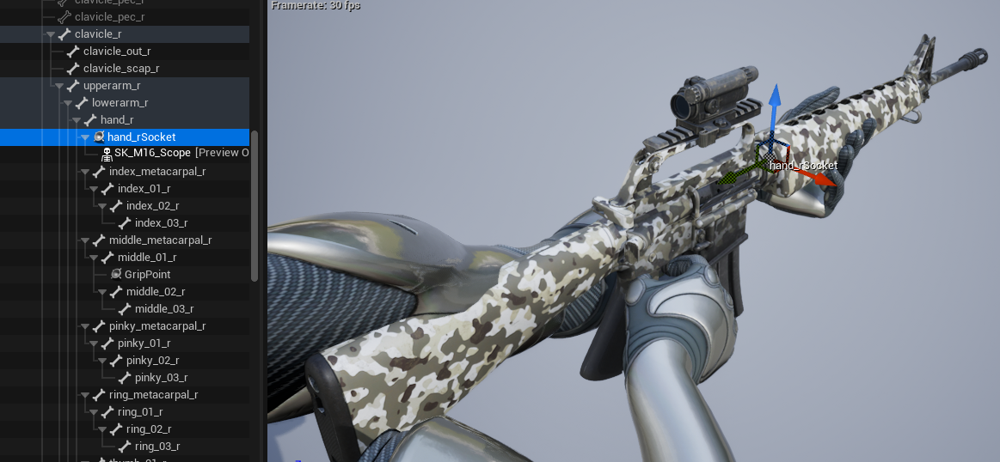

Mesh Component → Detail 패널의 Mesh → Skeletal Mesh Asset 의 이미지를 더블클릭
우측 상단의 뼈대 모양을 눌러 hand_r을 찾아 우클릭, `Add Socket`으로 소켓을 추가해준다.
hand_rSocket을 우클릭해 Add Preview Asset → SK_M16_Scope 를 하고 손모양과 맞춰 총의 위치와 각도를 설정해준다.

### Functions

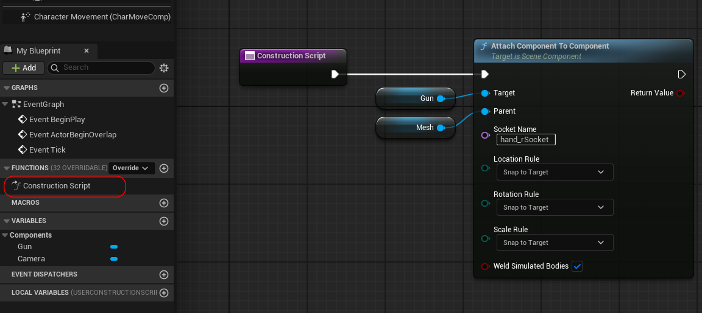

Functions에 들어가서 Gun/Mesh Component를 가져와 `Attach Component To Component` 로 종속 관계를 지정해주고 Socket Name에 아까 만든 `hand_rSocket` 을 지정해준다.

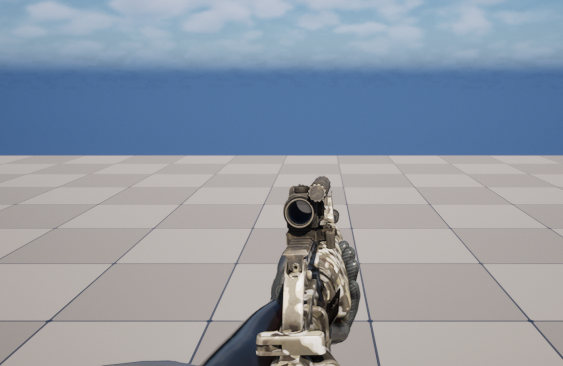

컴파일 및 저장을 하고 실행하면 손에 총이 잘 들어있는 것을 확인할 수 있다.

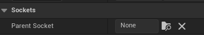

Functions로 지정해주는 방법 외에도 Gun Component의 디테일 패널에서 Parent Socket을 지정해주면 된다.

### Muzzle Flash

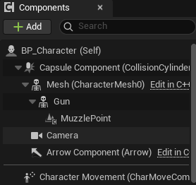

이제 총이 캐릭터를 따라가야하기 때문에 Gun을 Mesh의 하위로 옮겨준다.

Gun 하위에 Scene Component(MuzzlePoint)를 추가해준다.

Mesh Component 디테일 패널 → Advanced → Pause Animation 체크

MuzzlePoint의 위치를 정확하게 맞춰준다.

### 변수 설정

Health → Float 타입, 기본값 100
MaxHealth → Float 타입, 기본값 100
CurrentAmmo → Integer 타입, 기본값 30
MaxAmmo → Integer 타입, 기본값 30
BaseDamage → Float 타입, 기본값 20
IsFiring → Boolean 타입, 기본값 False
FireInterval → Float 타입, 기본값 0.15
CanFire → Boolean 타입, 기본값 True

::: tip

변수의 기본값은 컴파일을 해야 설정 가능하다.

:::

### WASD 이동

콘텐츠 드로어에 content 폴더 하위에 `Inputs` 폴더 생성
Input Action 생성

- `IA_Move`, `IA_Look`

Input Mapping Context 생성

- `IMC_FPS`

`IA_Move`

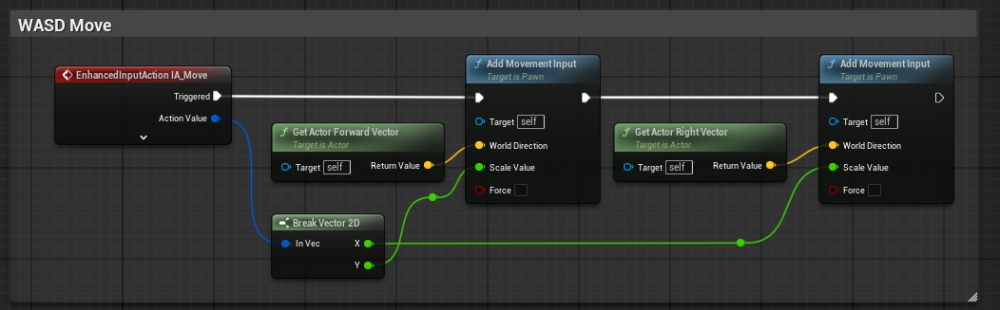

- IA_Move 더블클릭 → Action → Value Type → Axis2D
- IMC_FPS 더블클릭 → Mappings → IA_Move 추가 → `W, A, S, D` 각각 추가
  - VOD 강의에서는 다음과 같이 했지만 튜터님께서는 X축과 Y축을 반전시켜주셨다.
    - W → 기본값
    - S → Modifiers → Negate 추가
    - A → Modifiers → Swizzle Input Axis Values, Negate 추가
    - D → Modifiers → Swizzle Input Axis Values 추가
  - 튜터님의 방식
    - W → Modifiers → Swizzle Input Axis Values 추가
    - S → Modifiers → Swizzle Input Axis Values, Negate 추가
    - A → Modifiers → Negate 추가
    - D → 기본값

### 마우스 회전

`IA_Look`

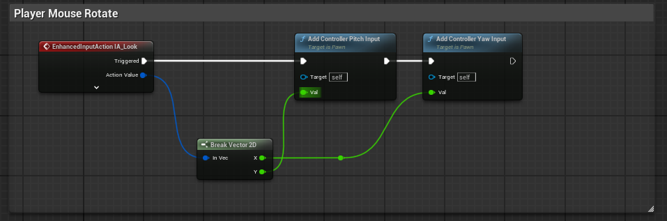

- IA_Move 더블클릭 → Action → Value Type → Axis2D
- IMC_FPS → Mappings → IA_Look 추가 → `Mouse XY 2D-Axis` 추가

Camera가 마우스를 움직이는게 아니고 플레이어가 움직이는 것이기 때문에 다음과 같이 설정

- Camera → Use Pawn Control Rotation → False로 변경
- BP_Character → Use Pawn Rotation Pitch → True로 변경

### 결과물

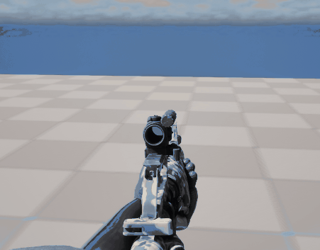

::: tip 쉽게 외우는 Pitch, Yaw, Roll

Pitch볼 할래요? (상하 회전 - X축 기준)
위아래 끄덕끄덕

공부할래Yaw? (좌우 회전 - Z축 기준)
아니요 도리도리

Roll 잘해요? (좌우 기울기 - Y축 기준)
글쎄요...

:::

::: tip 조원분의 꿀팁

위 방법처럼 하였을때 시선이 위/아래로 향하였을때 전진과 후진이 원활화게 되지 않는다.
`Get Actor Forward Vector`는 사이드뷰 게임 처럼 시선이 고정된 곳이면 사용해도 되지만 시선이 회전하는 경우는 `Get Control Rotation`와 `Get Forward Vector`를 조합해서 사용한다.
`Get Control Rotation` 는 우리가 보고 있는 회전 값을 사용한다. XY 평면에서의 회전은 Z축이 담당하기에 Yaw 값인 Z축을 가져와 전진 후진에 대한 방향 벡터를 결정한다.

:::

### Aiming

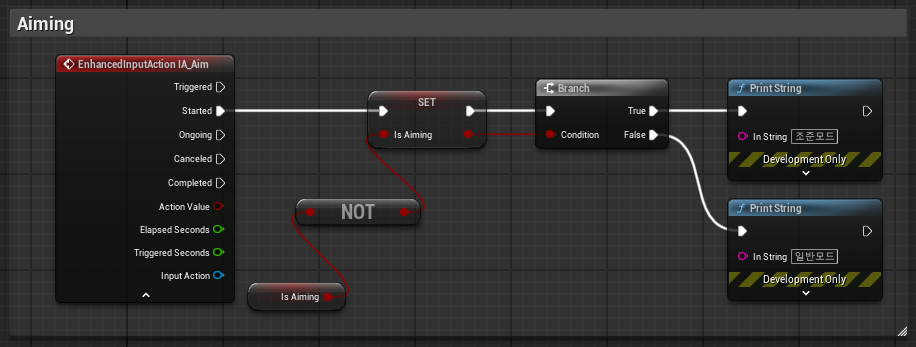

- isAiming 변수 추가 (Boolean 타입)
- 콘텐츠 드로어 Inputs 폴더 → Input Action `IA_Aim` 추가
- IMC_FPS → Mappings → IA_Aim 추가 → Right Mouse Button 설정


## C언어 라이브세션 2회차

### 연산자 (Operator)

5 + 2 가 있을때, 5와 2는 `피연산자`이고 + 는 `연산자` 이다.

#### 산술 연산자

덧셈 뺄셈 곱셈 나눗셈 나머지
나눗셈은 몫을 구하는 연산자이고, 나머지 연산자는 말 그대로 나눗셈의 나머지를 구하는 연산자이다.

#### 정수 피연산자와 실수 피연산자

int 자료형끼리의 나눗셈은 그 결과도 int이다.
flaot 자료형끼리의 나눗셈은 그 결과도 float임에 주의해야한다.
C언어에서는 float 자료형의 나머지 연산은 불가능하다.

#### 복합 대입 연산자

산술 연산과 대입 연산이 함께 계산되는 연산자

`mul *= 1;`

#### 증감 연산자

증가/감소의 줄임말

++Num 처럼 전위 증가인 경우, 먼저 값을 1 증가시킨 뒤 그 증가된 값을 사용한다.
Num++ 처럼 후위 증가인 경우, 먼저 현재 값을 사용한 뒤 그 다음에 값을 증가시킨다.

#### 논리 연산자

0 이외의 모든 값은 true로 평가된다.
피연산자를 참/거짓으로 변환한 뒤 논리 연산을 수행한다.
계산된 결과값도 참/거짓이다.

And (&&)

- 두 조건이 모두 참일때 true

OR (||)

- 두 조건 중 하나라도 참일때 true

NOT (!)

- 조건을 반대로 뒤집는다.

XOR (^)

- 둘 중 하나만 True일때 true

Short-circui

- &&와 ||는 앞 조건만 보고 뒤 조건을 생략할 수 있다.

(x != 0) && (10/x > 1) → x가 0이면 뒤 계산을 아예 안 해서 에러 방지

#### 삼항 연산자

피연산자로 세 개의 항을 갖는 연산자
조건문 if-else의 대용으로 가능하다.

::: note 절차지향 언어

C언어는 절차지향 언어이다.
실행 순서가 아주 중요한 언어이다.

:::

### 조건문

if-else

```c
if (조건식)
{
    명령어1;
    명령어2;

    if(조건식3) // 중첩 if문
    {
        명령어5;
    }
    else
    {
        명령어6;
    }
}
else if (조건식2)
{
    명령어3;
}
else
{
    명령어4;
}

```

switch-case

- if-else로 가능하지만 가독성이 조금 더 좋다.

```c

switch(변수)
{
    case 값1:
        명령어1;
        break;

    case 값2: // 또는
    case 값3:
        명령어2;
        break;

    default:
        명령어3;
        break;
}

```

### 반복문

while

```c
while (조건식)
{
    명령어1;
}

```

for

```c
for (초기식; 조건식; 증감식)
{
    명령어1;
}

```

do-while (잘안씀)

```c
do
{
    명령어1;
}
while (조건문1);

```

### 무한 반복문

for 보다는 while문으로 구현되는 경우가 많다.
종료 조건이 없거나, 조건이 항상 참인 상태로 반복문이 계속 실행되는 구조이다.

무한으로 반복하는 것은 위험하다. 프로그램이 멈추지 않아 프로그램이 멈추거나 강제 종료해야 하는 상황이 발생한다.
항상 break가 함께 쓰여야한다.

### continue

반복문에서 continue 구문을 만나면 해당 회차는 건너뛰고 다음 회차를 진행한다.

### 이중 반복문

```c
for (초기식; 조건식; 증감식)
{
    for (초기식; 조건식; 증감식)
    {
        명령어1;
    }
}

```

## Unreal 게임개발종합반 VOD - 블루프린트 연산

### Logging

흔히 Logging은 코드 실행 중 발생하는 이벤트로, 함수 호출, 변수 값 등을 기록하여 디버깅과 분석에 활용하는 시스템이다.
블루프린트에서의 Logging은 노드 기반으로 메시지를 출력하는 방식이다. 주로 디버깅과 실행 흐름 확인에 활용된다.

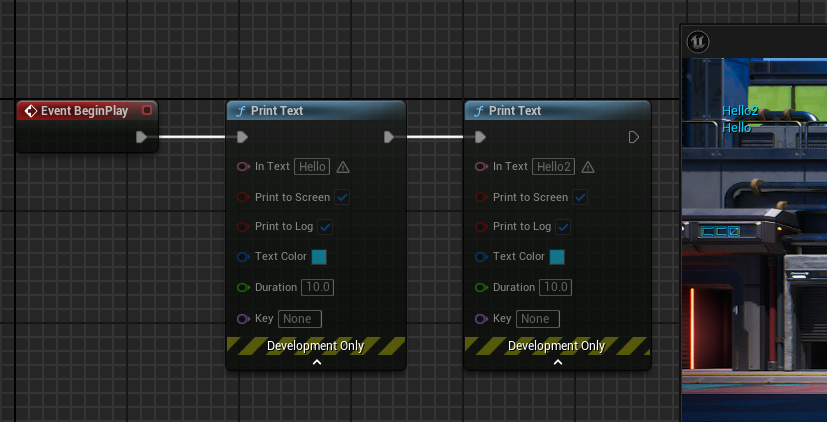

Print Text

- `FText` 타입을 출력한다.
- Print to Screen → 화면에 출력되고 Print to Log → Output Log에 기록된다.
- 다국어 지원에 적합하다.
  - Print to Screen → 화면 출력 여부
  - Print to Log → 로그 창 기록 여부
  - Duration → 화면에 표시되는 시간

Print String

- 기본적으로 Print Text와 비슷하며 `FString` 타입을 출력하고, 단순하고 빠르며 디버깅에 적합하다.

Output Log

- 에디터 환경 → Windows → Output Log 에서 확인이 가능하다.

### 변수

언리얼 엔진의 변수 타입은 아주 많이 정의되어 있다. 그 중에서 주로 사용되는 타입에 대한 설명이다.

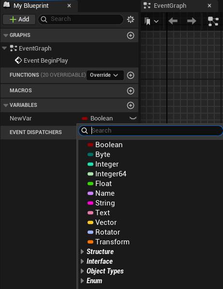

Boolean

- True & False 두 가지 옵션만 가진다.
- 흑백논리로 되는 값을 따질때 사용된다.

Byte

- 1Byte를 말하며 컴퓨터의 최소 단위다
- 1Byte는 8비트이다.
- 0부터 255까지의 숫자를 넣을 수 있다.

Integer

- 32비트, 4바이트 만큼의 숫자를 가질 수 있다.
- 음수와 양수 모두 가지는 정수이다.
- -21억부터 +21억까지 가질 수 있다.

Integer64

- Integer의 64비트이다.
- 아주 큰 숫자를 가질 수 있다.

Float

- 소수점을 가진 숫자

Name

- 엔진 내부에서 식별자(Identifier)로 쓰이는 타입
- 게임 내의 요소들의 이름을 넣어주고 그 이름을 식별할 때 사용된다.
- 문자열 비교보다 효율적으로 빠른 비교가 가능하다.
- 메모리 사용이 적고 성능 최적화에 유리하다.

String

- 자유롭게 문자열을 다룰 수 있다.
- 문자열 연산(붙이기, 자르기)에 적합하다.
- 비교 시 비용이 크므로 대량 비교에는 비효율적이다.

Text

- 사용자에게 보여지는 텍스트를 다루는 타입이다.
- UI, 대사, HUD 메시지 등 게임 내 표시용 텍스트에 적합하다.
- 내부적으로는 `FString`과 유사하지만, 번역 테이블과 연결 가능하다.

Vector

- XYZ 3차원의 방향을 가지고 있고 계산하기 편하게 값이 변경되어 있다.

Rotator

- XYZ 의 방향값이다.

Transform

- 위치, 회전, 스케일 값들이 들어있다.

### Get & Set

Get

- 번수의 기본 값을 가지고 온다.

Set

- 변수의 값을 변경 시켜준다.

그냥 드래그를 하면 Get과 Set을 선택할 수 있고, Ctrl 드래그는 Get, Alt 드래그는 Set으로 빠르게 접근할 수 있다.

### 연산

#### 사칙연산

덧셈

- Add

뺄셈

- Subtract

곱셈

- Multiply

나눗셈

- Divide

#### 비교연산

Equal

- 두 값이 같은지 비교

Not Equal

- 두 값이 다른지 비교

Less

- 왼쪽 값이 오른쪽 값보다 작은지 비교

Less Equal

- 왼쪽 값이 오른쪽 값보다 작거나 같은지 비교

Greater

- 왼쪽 값이 오른쪽 값보다 큰지 비교

Greater Equal

- 왼쪽 값이 오른쪽 값보다 크거나 같은지 비교

#### 논리연산

And

- 두 조건이 모두 참일 때만 true 반환

OR

- 두 조건 중 하나라도 참이면 true 반환

NOT

- 조건을 반전 → 참이면 거짓, 거짓이면 참

XOR

- 두 조건 중 하나만 참일때 true 반환

### 흐름 제어 (Flow Control)

#### Branch

컨디션의 Boolean 값에 따라 참이면 true의 노드 실행, 거짓이면 false의 노드 실행

- if 문과 동일

#### Sequence

입력 실행 핀을 받아서 여러 출력 핀을 순서대로 실행

- 한 이벤트에서 여러 동작을 차례대로 실행

#### Flip Flop

실행될 때마다 A → B → A → B 순으로 번갈아 실행

- 토글 기능 구현에 적합

#### 반복문

While Loop

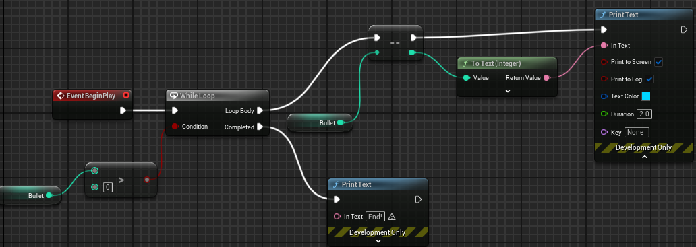

- Condition 의 값이 false가 될 때 까지 반복한다.
- 무한 루프에 빠질 수 있으니 주의해야한다.

For Loop

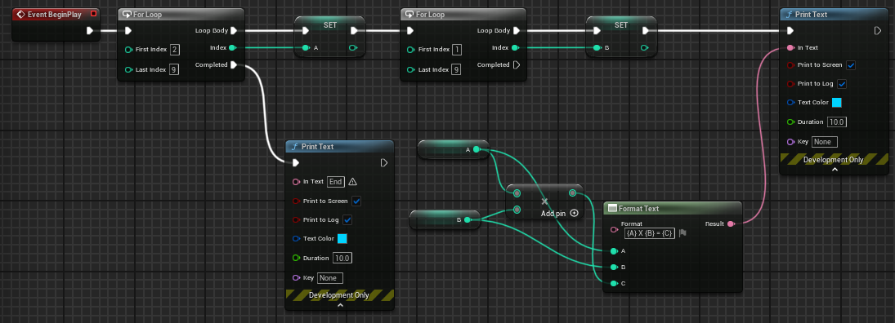

- 인덱스가 시작하고 인덱스가 끝날 때 까지 반복한다.

### Enum

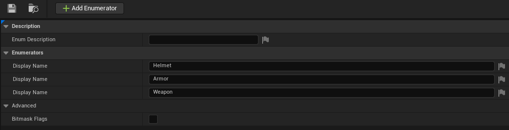

- 콘텐츠 드로어 → Blueprint → Enumeration 생성
- 더블클릭 → Add Enumerator → Enum 생성

Enum 타입을 사용하는 이유는 Helmet은 1인데, 깜빡하고 다른 곳에 2로 들어가는 등의 휴먼 에러를 방지하기 위함이다.

#### Swtich On 노드

열거형을 사용할때 많이 사용된다.
조건을 나눠서 실행을 시킬때 사용된다.

### 발사 & 재장전 버그 수정

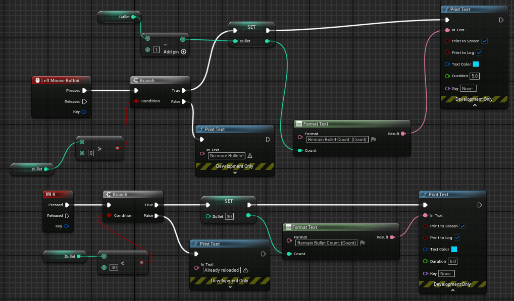

1. Bullet이 0 이하일때 발사 불가능하게
   - 마우스 왼쪽 버튼을 누를때 Branch 를 이용하여 총알이 0발 이상인지 먼저 확인한다.
   - 0발 이상이라면 총알이 하나씩 빠지고, 0 미만이라면 더 이상 총알이 없다고 표시된다.
2. 이미 Bullet이 30발이면 재장전이 안되게
   - 키보드 R 을 입력할 때 Branch 를 이용하여 총알이 30발 이하인지 확인한다.
   - 30발 이하라면 재장전이 되고, 아니라면 이미 장전 되어있다고 표시된다.


- 튜터님의 풀이와 같았다.

### While Loop로 구구단 구현

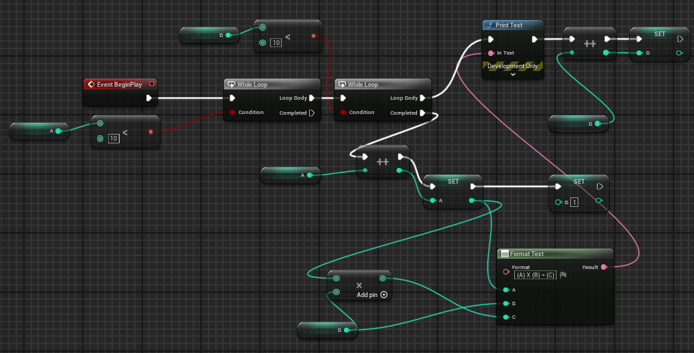

- 어렵지는 않았지만 노드들이 다소 지저분한 것 같다.
- 튜터님의 풀이와 크게 다르지는 않았다.

## Unreal 게임개발종합반 VOD - 액터 움직이기

콘텐츠 드로어 → blueprints 폴더 → BP_MovingActor 생성 → StaticMesh 컴포넌트 생성 → `SM_Modules_Floor` Static Mesh 적용

캐릭터를 움직이게 해주는 Character Movement 기본 컴포넌트가 있다면, 액터들을 움직이게 해주는 `Interp to Movement`가 있다.

### Interp to Movement

지정된 포인트 사이를 정해진 속도나 보간 방식으로 움직여주는 컴포넌트이다.

- Interp to Movement의 디테일 패널 → Control → Control Points + 버튼으로 두개의 포인트 지점을 생성해준다.
  - 첫번째 포인트 지점의 Z 값에 100을 넣어준다.
- Behaviour → Behaviour Type은 Ping Pong 으로 왔다 갔다 할수 있게 설정해준다.

레벨로 돌아와 플레이를 하면 액터를 상속받은 `BP_MovingActor` 가 Z축을 기준으로 위아래로 왔다갔다 하는 것을 볼 수 있다.

### Floating Pawn Movement

폰 클래스를 움직여주는 컴포넌트이다.

- 폰 클래스를 상속받은 BP_Car 생성 → `Floating Pawn Movement` 컴포넌트 추가 → EventGraph → EventTick에 Add Movement Input - World Direction Y 1.0을 설정해주고 실행하면 차가 앞으로 나가는 모습을 확인할 수 있다.

### Interp to Movement 대신 EventGraph로 구현하기

- BP_MovingActor 를 복제 → Interp To Movement 컴포넌트 삭제
- 변수 3개 추가
  - StartLocation - Vector
  - Velocity - Vector
  - MoveDistance - Float
- EventGraph → BeginPlay의 출력핀에 `Set StartLocation` 연결
- Set StartLocation의 Vector 값에는 `Get Actor Location` 노드 연결

::: info Delta Seconds

Tick은 매 프레임마다 발생하는 이벤트다.

어떤 사람은 컴퓨터 사양이 좋아 1초에 100프레임이 나오고, 누구는 안좋아 1초에 30프레임이 나온다 했을때, Delta Seconds라는 기준점을 가지고 계산을 하게해 다른 프레임 환경에서 같은 결과값을 내기 위해서 사용한다.

:::

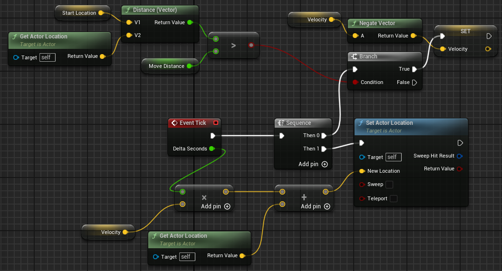

강의를 보고 따라하긴 했지만.. 이해는 잘 안된다..

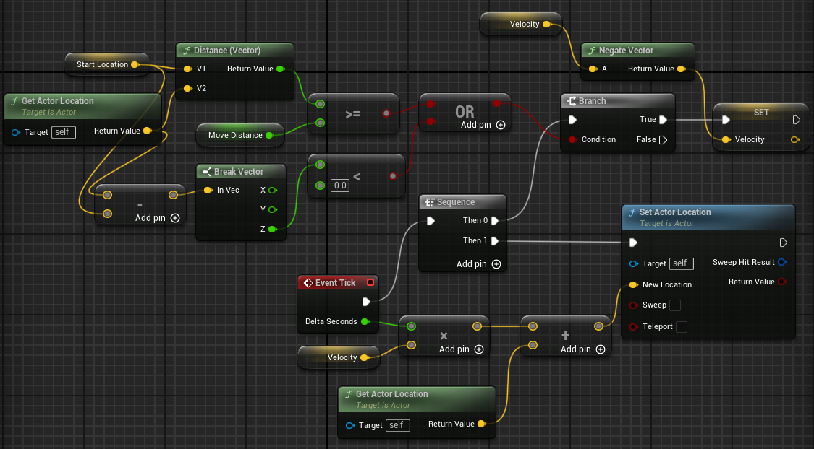

위 아래로 왔다갔다 할때 시작지점 밑으로 내려가는 현상을 막는것을 숙제로 주셨는데...
오.. 오래걸렸다. 우선 `EventGraph로 액터 제어` 이미지에 있는 노드들부터 하나씩 이해하느라 오래걸렸다.
시작지점 밑으로 내려가는 것을 파악하기 위해 Get Actor Location와 StartLocation 값의 차이를 구해 Z 축의 값이 0보다 작을때 Velocity가 Negate하는 노드들을 추가해주었다.


뿌듯해..

### Timeline

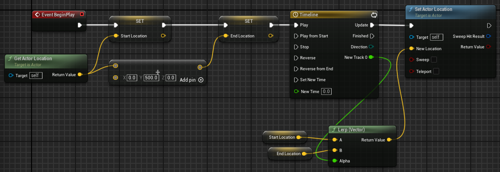

콘텐츠 드로어에서 BP_CAR 를 복제하고 변수에 StartLocation / EndLocation 둘다 Vector 타입으로 지정해준다.

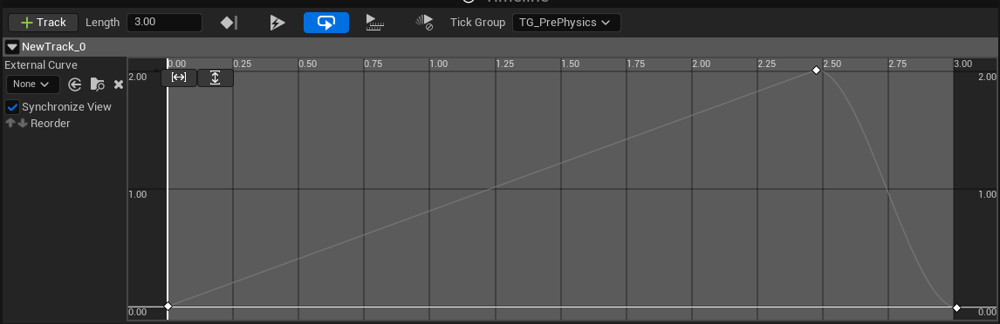

Timeline 노드를 더블클릭하고 트랙을 추가시켜 준 뒤, 그래프에 우클릭하여 3개의 Key를 만들어서 위 이미지처럼 만들어준다.
2.5초에 위치한 Key는 우클릭하여 Auto로 변경해준다.

### Lerp

A 위치로부터 B 위치까지 자연스럽게 이동을 하는 값을 반환을 해달라는 것이다.
Alpha 값에는 Timeline에서 반환해주는 값을 넣어준다.
Timeline과 Lerp는 애니메이션/보간 이동을 구현할 때 거의 항상 같이 쓰이는 기본 조합이다.

### Rotate

- 콘텐츠 드로어에서 Actor 를 상속받은 블루프린트를 만든다.
- StaticMesh 컴포넌트를 만들고 Static Mesh을 `SM_Bottington` 로 설정해준다.
- EventGraph에서 `Add Actor Local Rotation`을 EventTick과 연결하고, Z축의 값을 1로 지정해준다.
- 레벨로 돌아와 레벨에 배치해주고 플레이를 하면 회전하는 것을 확인할 수 있다.

`Add Actor Local Rotation`과 `Add Actor World Rotation` 의 차이

- Local은 실제 본체가 가지고 있는 회전값이고 World는 레벨에 배치된 액터의 회전값이다.
