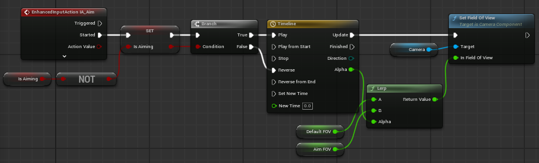

# 캠프 3일차

## Blueprint 라이브세션 3회차

점점 늘거나 줄때, 그 값을 사용하기 위해 `Timeline` 을 사용한다.

조준모드가 될때 카메라 값이 커져야 하기 때문에 Add Float Track을 사용해준다.

Length(시간)은 0.25로 설정

우클릭해서 Add key 2개를 설정, 하나는 Time, Value 0, 다른 하나는 0.25, 1로 설정



Camera 컴포넌트의 Field Of View의 값을 컨트롤해줄 변수 DefaultFOV(Float / 기본값 90), AimFOV(Float / 기본값 50) 생성
EventGraph에서 해당 이미지처럼 노드들을 연결해주면 우클릭시에 조준/일반모드 전환이 가능해진다.

### Animation

Character 하위 폴더 Animation 을 생성해주고 애니메이션 블루프린트를 생성해준다.

AnimGraph에서 FP_Rifle_Fire를 Output Pose에 연결해주고, BP에서 Mesh 컴포넌트의 Animation Mode를 블루프린트로 바꿔주고, Anim Class를 방금 만든 ABP로 변경해준다. 그럼 레벨에서 ABP 와 BP가 연결된것을 확인할 수 있다.

다시 ABP의 AnimGraph로 돌아와 FP_Rifle을 없애주고, `State Machine`을 생성해 연결해준다.

State Machine 안에 들어가 기본 상태인 FP_Rifle_Idle 을 연결해준다. FP_Rifle_Idle 에서 Loop Animation을 체크해준다.

State Machine 에서 FP_Rifle_Idle ⇔ FP_Rifle_Run 을 상호 연결해준다. FP_Rifle_Run 도 Loop를 체크해준다.

---

`처음보는 것들이 너무 많이 나와서 공부하고 나중에 적기`

## C언어 라이브세션 3회차

배열의 크기 구하기

```c
int arr[10]; // 배열의 크기가 10칸
int n = sizeof(arr) / sizeof(arr[0]); // 10칸

```

2차원 배열

```c
int grid[2][3] = {
    {1, 2, 3}, // index → 00, 01, 02
    {4, 5, 6}  // index → 10, 11, 12
};

```

문자열

```c
char name[] = "Claude"; // {'C', 'l', 'a', 'u', 'd', 'e', '\0'}

```

오늘은 라이브세션 들은거 외에는 복습만 했다.

1. WASD 이동
2. 마우스 Rotation
3. 점프
4. 움직임 애니메이션
5. Timeline + Lerp를 이용한 차량 움직이기

등 Unreal 게임개발종합반에서 배운 것들 위주로 계속 반복했다. (무언가의 도움 안받고)
