# 캠프 5일차

::: info 주저리 주저리..

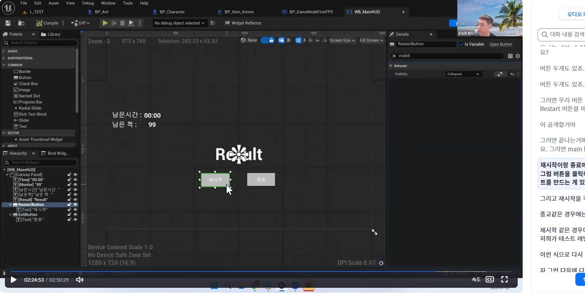

강의 시간에 놓친 부분들은 녹화본을 통해 다시 한 번!

근데 여기 오른쪽에 텍스트 클릭하면 해당 시간으로 영상 돌아가는거 너무 불편...

이틀 전인 화요일부터 라이브세션 내용을 따라가기가 힘들어서 VOD 강의 진도 나가는 것을 멈추고(아직 강의 3개중 하나도 다 못봤다..) 복습만 계속 했다. TIL도 제대로 작성 안했다. TIL까지 작성할 시간이 부족했지만 지금은 잠깐의 여유가 생겼기에 작성하려고 한다~
언리얼 엔진에서 WASD 움직임, 마우스 회전, 간단한 애니메이션(Idle→Walk→Run) 적용하기, 액터 움직이기 등 기초적인 것 위주로, 구현하기에 익숙해질 때 까지 삭제하고 만들고 삭제하고 만들고 무한 반복했다. 익숙해지기 시작하니까 이제 라이브세션도 어느정도 무리없이 잘 따라갔다.

```
1. WASD 이동
2. 마우스 Rotation
3. 점프
4. 움직임 애니메이션
5. Timeline + Lerp를 이용한 차량 움직이기

```

3일차 TIL(회고록..)에 적었던 이 5가지.. 계~속 반복했다. 나름 효과는 좋은듯?

오늘은 지금까지 Blueprint 라이브세션을 들으면서 만들었던 프로젝트 전체 리뷰와, C언어 라이브세션 내용을 담을 것이다.

아마 내일부터는 다시 강의 진도를 나갈 예정!?

:::

## Blueprint!

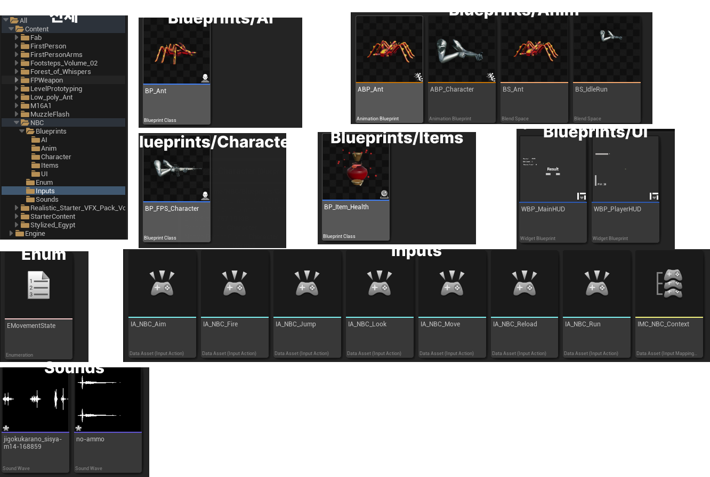

이번 프로젝트를 하면서 만든 폴더와 내용물들이다.
Enum은 설명이 한번 나왔길래 만들어서 적용해봤다.
Sounds는 무료 사운드를 다운로드 받아서 import 했다.

하나씩 만든 것들이 대해 리뷰? 해보겠다.

대략적인 기능

- WASD 움직임
- 달리기
- 점프
- 조준
- 발사
- 발소리
- AI 적 (20초마다 랜덤 위치 스폰)

등

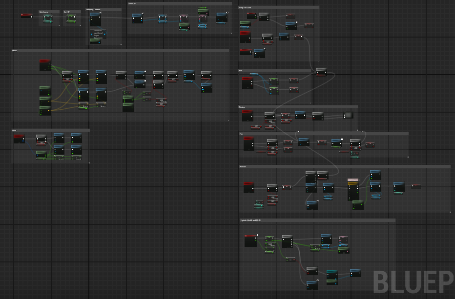

BP_FPS_Character의 블루프린트에는 Move, Run, Look(마우스회전), 조준, Jump&Fall&Land, 총발사, 재장전 등이 작성되어 있다.

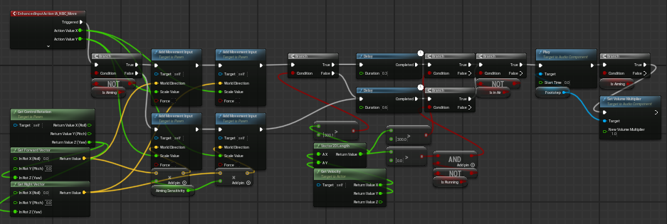

오.. WASD 이동 관련해서 이렇게 노드가 많아질줄은 몰랐다.
특히 Branch를 많이 사용했는데, 조준중일 때, 달리고 있을 때, 공중에 떠있는 상태일 때에 따른 분기처리 때문에 그렇다.
플레이어가 조준 할 때 움직임 속도가 \*0.3 만큼 느려지며 발소리는 \*0.7 만큼 작아지게 하였다.
Run과 이어지는데, 플레이어는 Shift를 누른 Run 상태가 아닐 경우 최대속도 300, Run 할때는 600이 최대 속도이다.
Walk 상태일때는 발소리가 0.6초마다 한번 들리고, Run 상태일때는 발소리가 0.3초마다 들리도록 세팅했다.
여기서, 공중에 떠있는 상태일 때에도 발소리가 나길래 IsInAir라는 변수로 공중에 떠있는 상태일 때에는 사운드가 나지 않도록 처리를 해주었다.

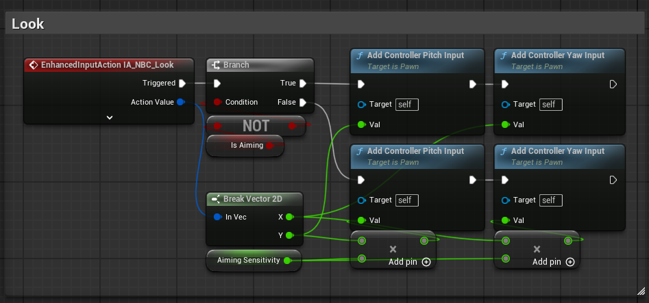

여기서도 조준상태일때 마우스 감도를 조절하기 위해 IsAiming이라는 변수로 분기처리를 해주었다.
마우스 감도를 조절하는 기능이 있는지 몰라 우선은 이렇게 해두었다.
시간이 촉박해 찾아서 하는 것보다, 우선은 동작가능하게만 하고 추후에 찾아서 관련 기능으로 수정하기로 했다.

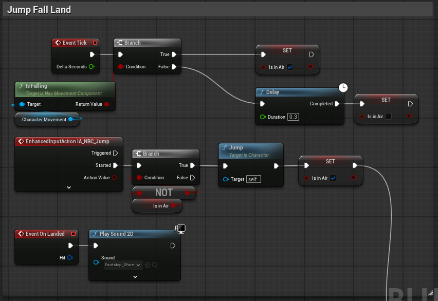

점프는 Input Action → Jump 하나로도 구현이 가능하다.
공중에 떠있는 상태를 담는 IsInAir 변수에 값을 넣기 위해 다음 두 가지 방법을 사용했다.

1. 점프할때 IsInAir → True, IsInAir일때는 더 이상 점프키가 동작하지 않도록 분기처리
2. 캐릭터 무브먼트의 `is Falling`으로 IsInAir → true, 더 이상 떨어지는 상태가 아닐때 Move 에서 발소리 로직이 동작하므로 0.3초 뒤에 IsInAir를 false로 변경해주었다.

근데 점프할때만 IsInAir를 변경해주면 되지 않냐? 라고 할 수 있는데, 점프를 하지 않아도 구조물에서 낙하할 수 있어 공중에 떠 있는 상태이가 되기 때문이다.

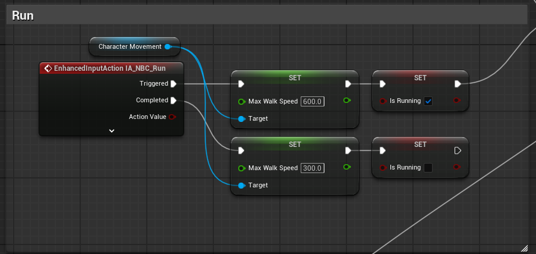

아까 Move 에서 설명했듯이 300까지가 Walk 상태, 600이면 Run이다.

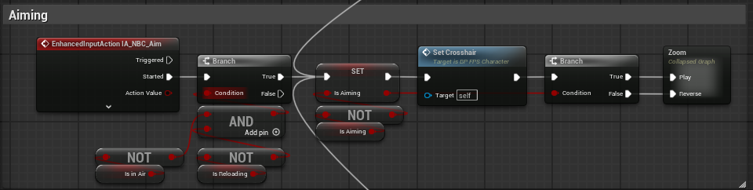

이번 프로젝트 하면서 가장 까다로웠다고 생각하는 부분이다.
어떤 상황에서 조준하면 안된다! 가 하나하나 할때마다 추가되었기 때문이다.
재장전 할때 조준상태가 풀리고 조준상태로 변경될 수 없으며, 조준상태였다가 달리거나 점프하거나 재장전을 하면 조준상태가 풀리고... 등등
조금씩 디테일하게 하려니 하나둘씩 계속 쌓여갔다..
`SetCrosshair` 함수는 함수 테스트 삼아 만들어본 녀석이다. 다른 곳에서 재사용되지는 않지만 기념비삼아 남겨두었다.
내용물로는 조준 상태에 따라 크로스헤어가 나타나고 없어지는 것 밖에 없다. (조준상태일때만 크로스헤어가 보인다)
여기저기 IsAiming 이라는 변수가 들어간다.

저기 끄트머리에 보이는 Zoom 이라는 서브그래프는.. 우선 내용물부터 설명하자면 이것도 아주 단순하다.
Timeline + Lerp 조합으로 카메라 줌을 땡기고 풀어주는 것 밖에 없다. 근데 왜 SubGraph로 집어넣었냐구?...
얘도 프로젝트 초기에 만든애인데, 타임라인은 매크로나 함수로 빼지 못한다고 하는데 SubGraph에는 들어가지길래 호오!! 이건가? 싶었는데 알아보니 SubGraph는 `복잡한 수학 계산식` 을 정리해 넣어두려고 있는 거란다.. 그러니까 용도에 맞지 않다는거지. 하지만 얘도 기념비로 남겨두었다. 남겨두니까 이렇게 또 복습이 되지 않았는가^^

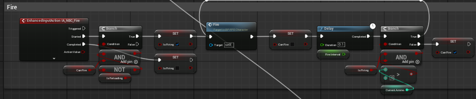

Delay를 이용해 Fire로 재귀하여 마우스 좌클릭을 꾹 누를시 0.1초마다 발사된다.
CanFire 변수로 마우스 좌클릭을 여러번 눌렀을때 루프가 돌고있는 중에 계속 클릭이벤트가 발생하여 총이 마구잡이로 나가는 현상을 제어하였다.

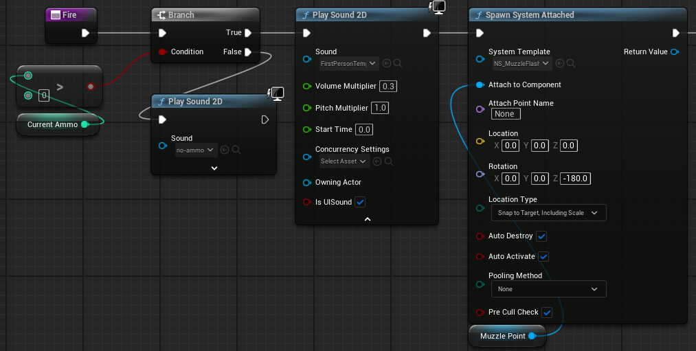

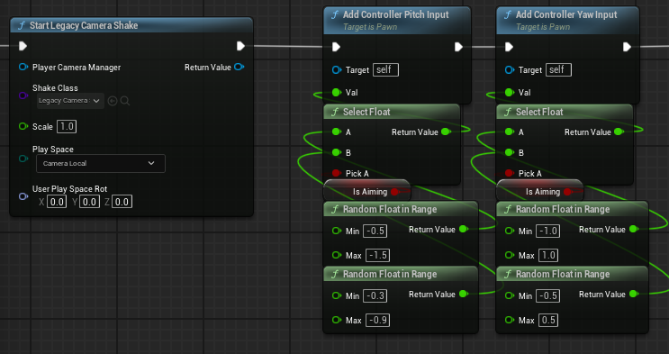

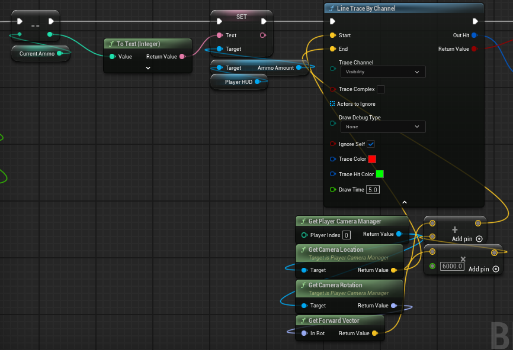

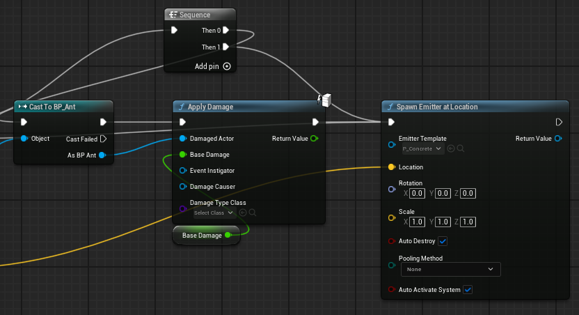

Fire 함수는 너무 길어서 4개의 이미지로 나눴다.
순서는 30발이 있는지 먼저 검증하고, 총알이 없으면 틱틱 거리는 사운드가 재생된다.
총알이 충분하면, 총알 발사음 → MuzzlePoint 생성 → 총쏠때 흔들리는 애니메이션 넣어줌 → 조준상태에서는 반동이 더 커짐 → 라인트레이스로 Ant 를 맞출시 데미지 부여 → 목표물에 총알이 닿으면 히트이펙트가 발생하는 순서로 만들었다.

## C언어 라이브세션 5회차

### 선언과 정의

```c
int add(int a, int b);   // 선언 (프로토타입) — 세미콜론으로 끝남

int add(int a, int b) {  // 정의 — 실제 코드가 있음
    return a + b;
}

```

C언어의 컴파일러는 위에서 아래로 한줄씩 읽는데, 정의가 되기 전에 호출되면 컴파일러가 알 수가 없기 때문에 에러가 발생한다.

```c
int main(void) {
    printf("%d\n", add(3, 5));  // 에러
    return 0;
}

int add(int a, int b) {
    return a + b;
}

```

아직 컴파일러는 add 가 뭔지 모른다. 그러니 에러가 발생한다.
위의 코드를 실행하기 위해선 다음 두 가지 방법이 있다.

```c
// 첫번째 방법
int add(int a, int b); // 선언만 해주면 된다.

int main(void) {
    printf("%d\n", add(3, 5));
    return 0;
}

int add(int a, int b) {
    return a + b;
}

---------------
// 두번째 방법
int add(int a, int b) {
    return a + b;
}

int main(void) {
    printf("%d\n", add(3, 5));  // add 함수보다 뒤에 작성한다.
    return 0;
}

```

함수가 적을때는 두번째 방법이 편하지만, 함수가 점점 늘어남에 따라 순서를 맞추기 힘들어지니 선언은 헤더 파일(.h)에, 정의는 소스 파일(.c)에 분리하는 것이 표준이다.

### 매개변수와 인자

매개변수와 인자는 별 차이 없어보이지만 정확히는 다른 개념이다.

```c
int square(int num) {      // num은 매개변수 (parameter, 형식 매개변수)
    return num * num;
}

int main(void) {
    int result = square(7);  // 7은 인자 (argument, 실인자)
    return 0;
}

```

쉽게 생각하면 받는 쪽은 매개변수, 주는 쪽은 인자 이다.

### return

`return`은 `값을 돌려주는 것`, `함수를 즉시 끝내는 것`. 이 두 가지를 동시에 한다.

```c
int check_age(int age) {
    if (age < 0) {
        return -1;    // age가 0미만으로 값이 들어왔다면 여기서 함수는 종료되고 -1이 반환된다.
    }
    if (age >= 18) { // age가 18이상으로 값이 들어왔다면 여기서 함수는 종료되고 1이 반환된다.
        return 1;
    }
    return 0;   // 둘 모두 해당되지 않으면 (age가 0이상 18미만일때) 함수는 종료되고 0이 반환된다.
}


```

`return`을 만나는 순간 그 다음(아래) 코드는 실행되지 않고 함수는 그대로 종료된다. 그래서 `else`가 없어도 논리적으로 문제가 없다.
반환 타입이 `void`가 아니라면 꼭 `return`을 작성해야한다. 이는 미정의 동작이나 쓰레기 값이 반환됨을 방지한다.

### 원본은 그대로

```c
void try_double(int num) {
    num = num * 2;
    printf("함수 안: %d\n", num);  // 10을 넘겨받았으니 20
}

int main(void) {
    int score = 10;
    try_double(score);
    printf("함수 밖: %d\n", score);  // score는 그대로 10이다.
    return 0;
}

```

원본을 바꾸려면 다음 예시처럼 주소를 넘겨야한다.

```c
void real_double(int *target) {
    *target = *target * 2;
}

int main(void) {
    int score = 10;
    real_double(&score);
    printf("%d\n", score);
    return 0;
}

```

### void

```c
// 1) 반환 타입 void — "이 함수는 값을 돌려주지 않는다"
void greet(const char *name) {
    printf("안녕, %s!\n", name);
}

// 2) 매개변수 void — "이 함수는 인자를 받지 않는다"
int get_zero(void) {
    return 0;
}

// 3) void 포인터 — "어떤 타입이든 가리킬 수 있는 범용 포인터"
void *generic_ptr;

```

빈 괄호 ()와 (void)는 다르다.

```c
int func1();       // 아무거나 넘겨도 컴파일은 가능
int func2(void);  // 인자를 받지 않겠다.

func1(1, 2, 3);    // 컴파일은 가능
func2(1, 2, 3);   // 컴파일 에러 발생

```

인자가 없는 함수를 선언할 때는 항상 `(void)` 를 쓰는 것이 좋다. 컴파일 에러로 어디서 실수가 있었는지 확인 가능하기 때문이다.

### 배열

```c
void print_size(int arr[]) {
    printf("함수 안 sizeof: %lu\n", sizeof(arr));  // 8 — {1, 2, 3, 4, 5}가 오는게 아닌 포인터 크기
}

int main(void) {
    int nums[5] = {1, 2, 3, 4, 5};
    printf("함수 밖 sizeof: %lu\n", sizeof(nums));  // 4 * 5 = 20 — 배열 전체 크기
    print_size(nums);
    return 0;
}

```

배열을 넘길 때는 `항상 크기를 별도 매개변수로 같이 넘기는 것이 관례`다.

```c
void process(int arr[]) {

}

// 위는 배열의 크기를 모르지만 밑은 size까지 같이 받아서 배열의 크기를 알 수 있다.

void process(int arr[], int size) {
    for (int i = 0; i < size; i++) {
        printf("%d ", arr[i]);
    }
}

```

매개변수에서 `int arr[]`과 `int *arr`은 완전히 동일하다. 컴파일러가 `int arr[]`을 `int *arr`로 변환한다.

### 지역 변수

지역 변수는 함수가 끝나면 사라진다.

```c
int* dangerous(void) {
    int local = 42;
    return &local;  // local은 지역변수로 함수가 끝나면 사라진다.
    // 함수 안에서 만든 지역 변수는 그 함수의 스택 프레임에 살고 있다. 함수가 끝나면 스택 프레임이 날아가면서 변수도 같이 사라진다.
    // 따라서 local 그 자체를 넘기거나 함수가 끝나도 사라지지 않는 static 변수를 사용하거나 호출자가 공간을 마련하고 포인터를 넘긴다.
}

int main(void) {
    int *result = dangerous();
    printf("%d\n", *result);  // result가 받은건 local의 주소이다.
    // dangerous의 local이 없어졌으니 주소가 없어져 쓰레기 값이나 에러가 발생한다.
    return 0;
}

```

### 재귀 함수

재귀 함수에서 종료 조건을 빠뜨리거나 잘못 쓰면 무한 호출이 된다. 무한 호출은 스택 메모리를 꽉 차게해 스택 오버플로우가 발생한다.

```c
// ❌ 종료 조건 없음 → 스택 오버플로우
int factorial_bad(int n) {
    return n * factorial_bad(n - 1);  // n이 0이 되어도 계속 호출
}

// ❌ 종료 조건이 도달 불가능
int factorial_wrong(int n) {
    if (n == 0) return 1;
    return n * factorial_wrong(n + 1);  // n이 계속 커짐!
}

// ✅ 올바른 종료 조건
int factorial(int n) {
    if (n <= 1) return 1;              // base case
    return n * factorial(n - 1);       // n이 줄어들면서 base case에 도달
}

```

::: tip 재귀 함수에서는 다음을 꼭 확인

1. base case가 존재하는가?
2. 매 호출마다 base case에 다가가고 있는가?

:::

### 함수 호출 순서와 평가 순서

함수의 인자가 여러 개일 때, 어떤 인자가 먼저 평가되는지는 정해져 있지 않다.

```c
int count = 0;

int next(void) {
    count++;
    return count;
}

int main(void) {
    printf("%d %d %d\n", next(), next(), next());
    // 1 2 3 이 나올까? 3 2 1 이 나올까?
    // → 정답: 모른다. 컴파일러마다 다르다!
    return 0;
}
```

이것은 미정의 동작이 아니라 `미명시 동작(unspecified behavior)` 이다. 프로그램이 깨지진 않지만 결과가 컴파일러에 따라 달라질 수 있다. 이런 코드는 피해야 한다.

```c
int a = next();  // 순서가 명확
int b = next();
int c = next();
printf("%d %d %d\n", a, b, c);  // 항상 1 2 3

// → 이 코드처럼 명시적으로 작성해줘야한다.

```

### 포인터

`int *ptr` 에서 *는 `포인터` 라는 선언 표시다.
`*ptr`= 20; 에서 *는`ptr`이 가리키는 곳의 값에 접근하는 `역참조 연산`이다.
int 나 double 같은 타입에 있는 \*는 선언이고 나머지는 역참조이다.

#### 포인터와 배열

배열 이름이 포인터처럼 동작하는 경우가 많지만 같은 것은 아니다.

```c
int arr[5] = {10, 20, 30, 40, 50};
int *arr_ptr = arr;

// 비슷한 부분
printf("%d\n", arr[2]);        // 30
printf("%d\n", arr_ptr[2]);    // 30
printf("%d\n", *(arr+2));      // 30
printf("%d\n", *(arr_ptr+2));  // 30


// 다른 부분
sizeof(arr);        // 20 (int 4바이트 × 5개)
sizeof(arr_ptr);    // 8  (64비트 시스템 기준, 포인터 크기)

arr = arr_ptr;      // ❌ 컴파일 에러. 배열 이름은 대입 불가능.
arr_ptr = arr;      // ✅ 포인터는 다른 주소를 가리킬 수 있음.
arr++;              // ❌ 배열 이름은 이동 불가능.
arr_ptr++;          // ✅ 포인터는 이동 가능.
```

#### 값 복사, 주소 공유

```c
int score = 10;
int backup = score;    // 값만 복사
backup = 99;
printf("%d\n", score);    // score 는 변경되지 않음

int score = 10;
int *score_ptr = &score;  // 주소 공유. score_ptr은 score를 가리킴.
*score_ptr = 99;
printf("%d\n", score);    // 주소에 있던 값을 바꿔서 99가 된다.

int x = 10;
int *first  = &x;
int *second = &x;
int *third  = first;    // third도 x를 가리킴

*second = 50;
printf("%d %d %d %d\n", x, *first, *second, *third);  // 50 50 50 50 — 전부 같은 곳

```

#### 포인터의 포인터

```c
int val = 42;
int *val_ptr = &val;          // val_ptr은 val의 주소를 저장
int **val_ptr_ptr = &val_ptr; // val_ptr_ptr은 val_ptr의 주소를 저장
```

| 표현            | 의미                                       | 값             |
| --------------- | ------------------------------------------ | -------------- |
| `val`           | 정수 변수                                  | `42`           |
| `val_ptr`       | val을 가리키는 포인터                      | val의 주소     |
| `*val_ptr`      | val_ptr이 가리키는 곳의 값                 | `42`           |
| `val_ptr_ptr`   | val_ptr을 가리키는 포인터                  | val_ptr의 주소 |
| `*val_ptr_ptr`  | val_ptr_ptr이 가리키는 곳 = val_ptr        | val의 주소     |
| `**val_ptr_ptr` | *val_ptr_ptr이 가리키는 곳의 값 = *val_ptr | `42`           |

그렇다면 포인터의 포인터는 언제 사용될까?
함수에서 포인터 자체를 바꾸고 싶을 때 사용된다.

```c

// 포인터가 가리키는 "값"을 바꾸려면 → 포인터를 넘김
void change_value(int *target) {
    *target = 999;
}

// 포인터가 가리키는 "대상"을 바꾸려면 → 포인터의 포인터를 넘김
void change_target(int **target_ptr, int *new_addr) {
    *target_ptr = new_addr;
}

int main(void) {
    int a = 10, b = 20;
    int *current = &a;

    printf("%d\n", *current);       // 10 — a를 가리킴

    change_value(current);
    printf("%d\n", a);              // 999 — a의 값이 바뀜

    change_target(&current, &b);
    printf("%d\n", *current);       // 20 — 이제 b를 가리킴

    return 0;
}
```

#### & 이건 언제 쓰이나

`&`의 원칙은 함수가 포인터를 요구하는데, 넘기려는 것이 포인터가 아니면 `&`를 붙인다.

```c
int num = 10;
int *num_ptr = &num;

scanf("%d", &num);       // num은 int → &를 붙여서 주소를 넘김
scanf("%d", num_ptr);    // num_ptr은 이미 주소 → & 안 붙임

char name[100];
scanf("%s", name);       // name은 배열 이름 = 이미 주소 → & 안 붙임
scanf("%s", &name[0]);   // 이것도 같은 의미
```

| 넘기려는 것    | 이미 주소인가? | `&` 필요?      |
| -------------- | -------------- | -------------- |
| `int num`      | 아니오 (값)    | `&num`         |
| `int *num_ptr` | 예 (주소)      | 그냥 `num_ptr` |
| `int arr[]`    | 예 (배열=주소) | 그냥 `arr`     |
| `char str[]`   | 예 (배열=주소) | 그냥 `str`     |

#### 포인터에 숫자를 더하면?

포인터에 숫자를 더하면 가리키는 타입의 크기만큼 이동이 된다.

```c
int nums[3] = {10, 20, 30};
int *int_ptr = nums;

// int_ptr의 주소가 1000이라고 가정하면
// int_ptr + 1 → 1004 (int = 4바이트이므로)
// int_ptr + 2 → 1008

char str[] = "ABC";
char *char_ptr = str;

// char_ptr의 주소가 2000이라고 가정하면
// char_ptr + 1 → 2001 (char = 1바이트이므로)
// char_ptr + 2 → 2002

double darr[3] = {1.0, 2.0, 3.0};
double *dbl_ptr = darr;

// dbl_ptr의 주소가 3000이라고 가정하면
// dbl_ptr + 1 → 3008 (double = 8바이트이므로)
// dbl_ptr + 2 → 3016
```

이것이 포인터에 타입이 필요한 이유이다. 어떠한 타입의 포인터인지에 따라 +1 의 의미가 달라진다.
