# 캠프 1주차 주말

## Fab (마켓플레이스)

### 애셋 다운로드

[Fab.com](https://www.fab.com/)

Fab 사이트는 언리얼 엔진에서 사용할 수 있는 3D 모델, Materials, 애니메이션, 사운드, 블루프린트 등의 애셋들을 다양한 콘텐츠를 구매하거나 무료로 다운받아 프로젝트에 사용할 수 있다.
호환(지원)되는 버전을 잘 보고 다운로드를 해야한다.
2주에 한번 혹은 한달에 한번 유료 애셋을 무료로 기한 한정으로 배포하니 자주 확인하자

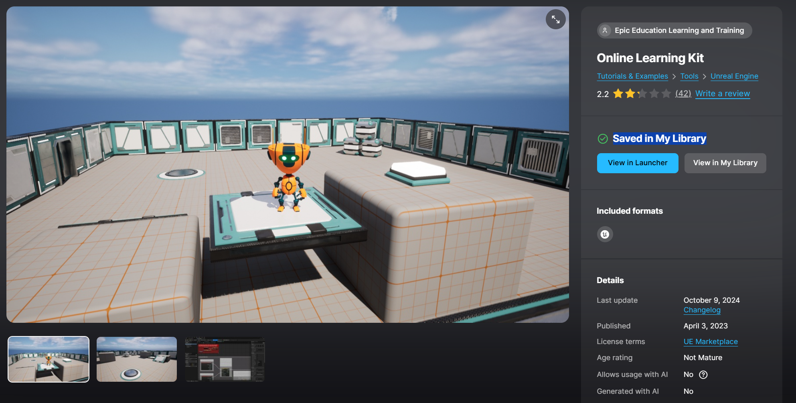  
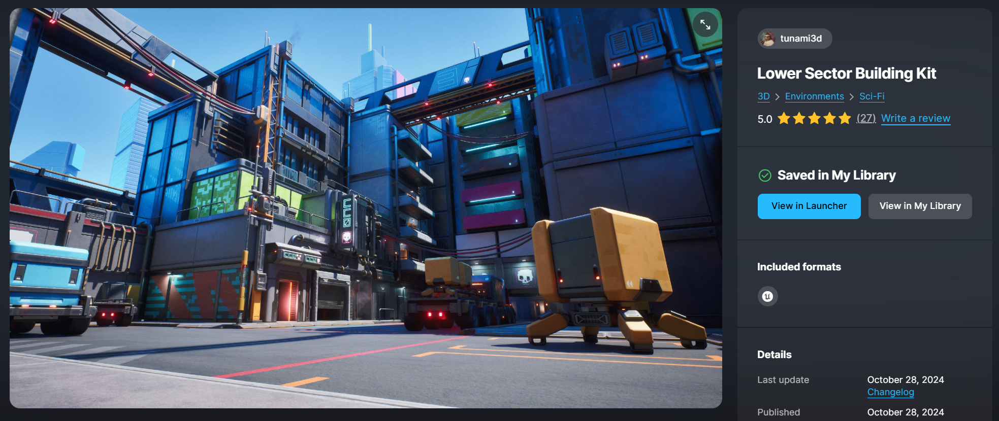

`Online Learning Kit`과 `Lower Sector Building Kit` 을 검색하여 라이브러리에 추가를 해준다.

### 애셋 확인 및 사용

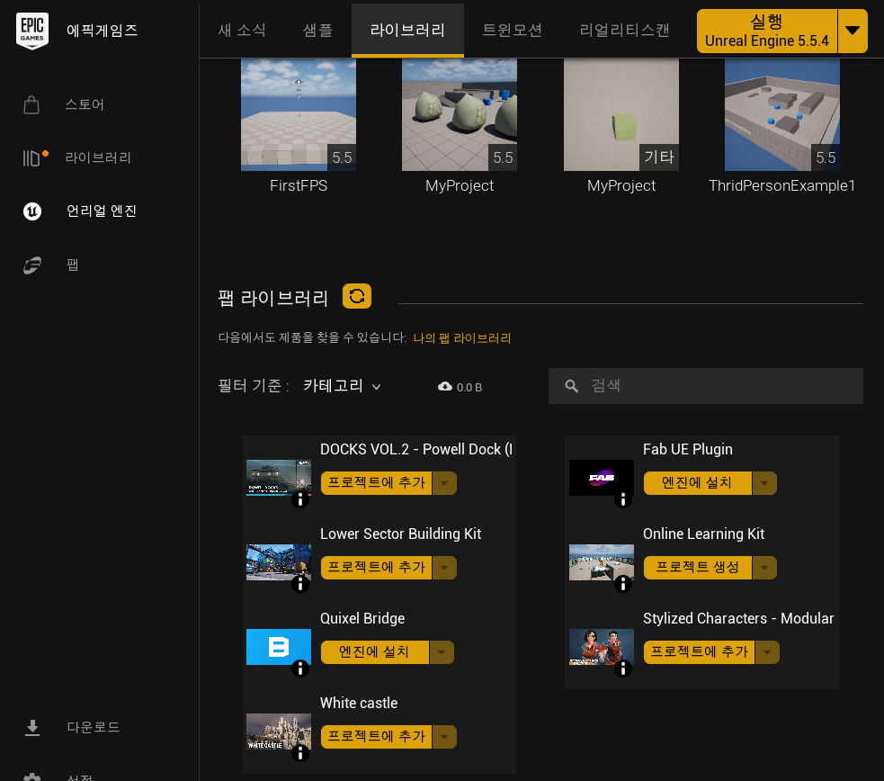

에픽게임즈 런처 → 언리얼 엔진 Fab 라이브러리에서 다운로드 받은 애셋을 확인할 수 있다.

Online Learning Kit 애셋의 경우 5.1버전과 5.2버전만 지원하지만 일단은 신경쓰지않고 폴더 경로를 지정한 후 생성을 한다.

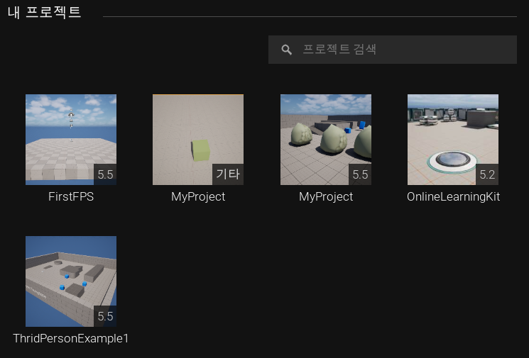

#### 프로젝트 언리얼 엔진 버전 변경

생성된 프로젝트를 실행하면 버전을 변경할 수 있는 창이 나온다. (5.1과 5.2중 실행 가능한 버전이 나에게 모두 없기 때문)

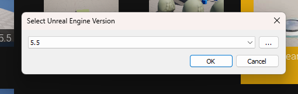

해당 프로젝트가 있는 폴더에서도 `.uproject` 우클릭, `Switch Unreal Engine version` 으로 동일하게 변경할 수 있다.

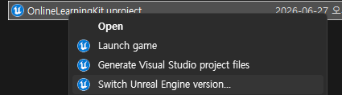

::: important

버전은 낮은 버전에서 높은 버전으로 업그레이드 하는 것은 가능하지만, 반대로 높은 버전에서 낮은 버전으로 다운그레이드 하는 것은 불가능하다.

:::

   

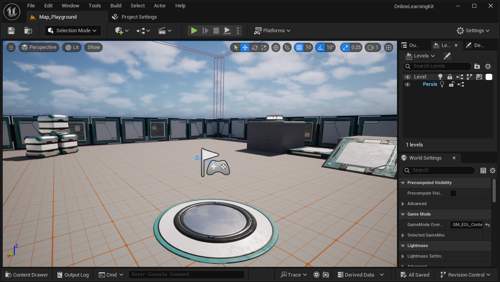

프로젝트가 잘 실행 되었으면, 아까 다운로드 받은 `Lower Sector Building Kit` 을 프로젝트에 추가해야한다.

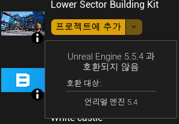

다운로드 받은 애셋이 어떤 언리얼 엔진 버전까지 지원해주는지 확인하려면 위 사진과 같이 마우스를 올리면 지원하는 버전을 확인할 수 있다.

`Lower Sector Building Kit` 은 5.4 버전 하나만 지원하는데, 생성한 프로젝트는 5.5 버전이기에 바로 사용할 수는 없다.

그래서 프로젝트를 언리얼 엔진 5.4 버전으로 다시 생성한 뒤, Lower Sector Building Kit 애셋을 해당 프로젝트에 추가한다.
이후 `.uproject` 파일에서 `Switch Unreal Engine version` 으로 5.5 버전으로 업그레이드를 해주면 된다.

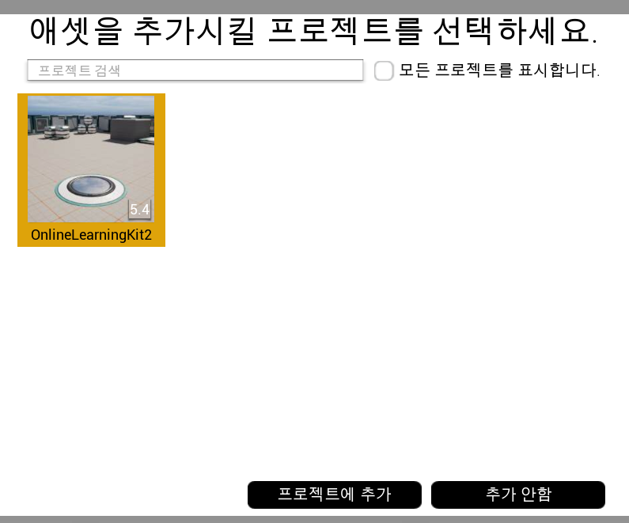

애셋을 추가하고 5.5 버전으로 업그레이드한 뒤 프로젝트를 실행하면, 오른쪽 하단에 `import` 를 할 것인지에 대한 창이 나온다.

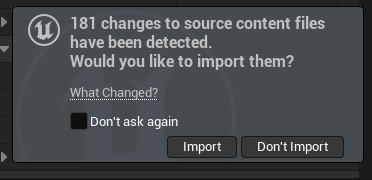

import 가 완료되면 콘텐츠 드로어에서 확인할 수 있다. Content → LowerSector_Mod → Maps 에서 Lower Sector Building Kit 이 추가된 걸 확인할 수 있다.
`LowerSector_Mod`는 애셋의 레벨(맵)의 모습을 확인할 수 있고 `LowerSectorKit` 은 레벨에서 사용중인 전체 애셋에 대한 모습을 확인할 수 있다.
Online Learning Kit 의 레벨은 EOL_Content → Maps 에서 동일하게 확인할 수 있다.
Map_Playground 에서 LowerSectorKit 의 애셋을 불러올 수 있다.

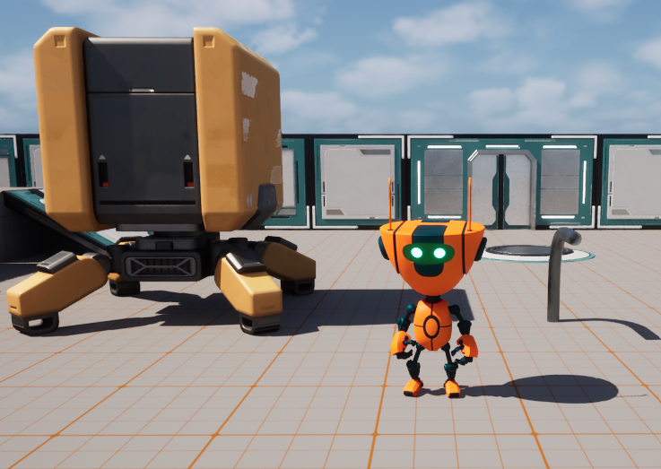

## 액터의 종류와 액터 배치

`액터`란 레벨(맵) 내에 존재하는 모든 오브젝트의 기반 클래스를 의미한다.

바위, 나무, 건물, 캐릭터, 카메라 등 눈에 보이든 안보이든 모든 것들이 액터이다.
액터마다 고유한 컴포넌트들을 지니고 있으며 위치, 회전, 스케일과 같은 변환(Transform) 정보를 가진다.
`게임 세계에서 역할을 하는 존재`는 전부 액터이다.

### 메인 툴바 애셋

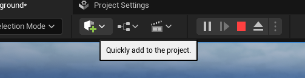

메인툴바의 애셋 추가 버튼으로 빠르게 프로젝트에 액터를 추가할 수 있다.

#### 액터 배치 방법

메인 툴바의 애셋 배치 패널이나 콘텐츠 브라우저에서 액터 애셋을 선택한 뒤 뷰포트로 드래그 & 드롭하여 배치할 수 있다.

배치된 액터는 클릭 후 `Ctrl+C, Ctr+V` 혹은 `Alt + 드래그`로 복제할 수 있으며 Ctrl 키를 이용하여 여러 액터를 동시에 선택한 뒤 다중 복제도 가능하다.

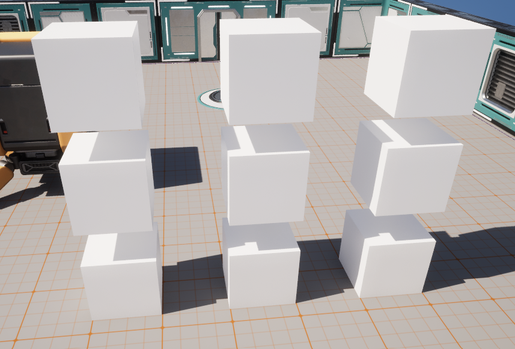

#### Basic

기본 액터라고 아무 용도가 없지는 않다. 트리거나 위치를 지정을 해주는 용도로 사용할 수 있다.
적 AI가 왔다갔다 순찰하는 경우에 A 위치랑 B 위치를 왕복하는 트리거로 사용할 수 있다.

Pawn

- 플레이어나 AI가 조종할 수 있는 액터로, 기본적으로 이동과 같은 인터렉션의 주체가 된다.
- 입력을 받아 움직일 수 있지만 기본적인 이동 로직이나 애니메이션 시스템은 직접 구현해야 한다.

Character

- Pawn을 상속받아 움직임이 기본적으로 포함된 액터이다.
- `Character Movement Component` 가 기본 탑재되어있다. 걷기, 뛰기, 점프, 중력 등이 자동 지원된다.
- Skeletal Mesh와 애니메이션 시스템을 쉽게 연결 할 수 있다.

::: note Pawn과 Character를 언제 쓰면 좋을까?

Pawn을 직접 구현해야 하는 경우

- 드론, 비행기, 탱크처럼 `Character Movement Component`로는 표현하기 어려운 움직임을 직접 구현할 때
- 플레이어가 조종하는 카메라, 체스 말, 로봇 팔처럼 사람형 캐릭터가 아닌 오브젝트일때
  - Character는 Skeletal Mesh와 애니메이션을 전제로 만들어져 있어 불필요한 기능이 붙을 수 있다.

Character를 쓰면 좋은 경우

- 사람형 캐릭터를 만들때, 이미 걷기, 뛰기, 점프, 중력 등의 기본 이동 로직이 포함되어 있어 빠르게 개발이 가능하다.
- Skeletal Mesh와 애니메이션 블루프린트가 기본적으로 맞물려있어 캐릭터 제작이 훨씬 수월하다.
- Character는 네트워크 동기화와 이동 로직이 잘 맞춰져 있어 멀티플레이 환경에서 안정적이다.

:::

#### Lights

조명을 제공하는 액터이다.

Directional Light

- 태양이나 달과 같이 먼 곳에서 오는 빛(자연광)처럼 동작한다.

Sky Light

- 그림자 부분을 자연스럽게 밝히는 것 처럼 주변 라이팅을 캡처해 적용한다.

Point Light

- 전구처럼 한 지점에서 모든 방향으로 빛을 발산한다.

Spot Light

- 손전등처럼 원뿔 형태로 특정 방향만 밝힌다.

Rect Light

- 창문이나 형광등처럼 직사각형 표면에서 빛을 발산한다.

#### Shapes

`Static Mesh`는 실체가 있는 액터이다. 아웃라이너에서 벽돌 아이콘이 있으면 실체가 있는 `스태틱 매쉬 액터`이다 라고 보면된다.
아무 기능이 없이 시각적으로 확인을 위한 액터이지만, 기능(이벤트)을 추가해줄수 있다.

#### Camera

게임 내에서 시점을 결정하는 액터이다. 컷신, 시네마틱, 특정 연출 장면에서 필요한 카메라 위치를 설정할 때 유용하다.

#### Volume

눈에 보이지는 않지만 게임 환경이나 이벤트를 제어하는데 사용된다. 눈에 보이지 않는다고 모두 Volume은 아니다. 공간/영역을 정의하는 액터들만 Volume 이라고 한다.

## Blueprint에서 액터 생성하기

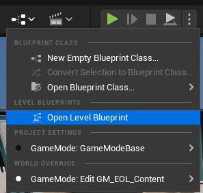

메인 툴바에서 레벨 블루포인트 열기를 통해서 액터를 생성할 수 있다.

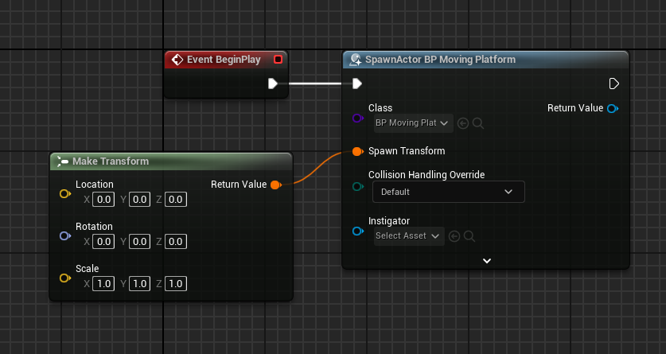

블루프린트에서 우클릭을 하여 `Spawn Actor from Class` 를 만들어주고 Event BeginPlay에 연결하고, Class는 `BP_MovingPlatform`으로 지정해준다.
다시 우클릭을 하여 이번에는 `Make Transform`을 만들어주고 SpawnActor의 Spawn Transform에 연결해준다.
BP_MovingPlatform 이라는 Class를 BeginPlay(게임이 시작하면) Make Transform 의 설정으로 생성한다는 의미이다.

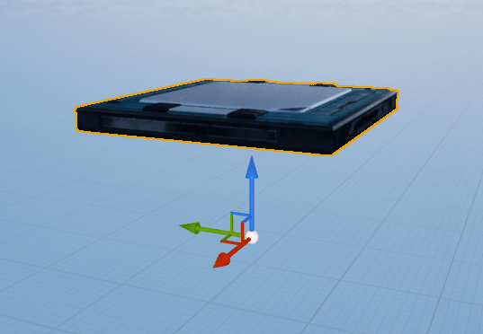

저장을 하고 레벨로 돌아가 실행 버튼을 누르면 아웃라이너에서 `BP_MovingPlatform0`이 생긴 것을 확인할 수 있다.
실행 상태에서 자유롭게 카메라 이동을 하려면 `F8`을 누르면 된다.

## 플레이어 캐릭터 만들기

### 블루프린트로 캐릭터 생성

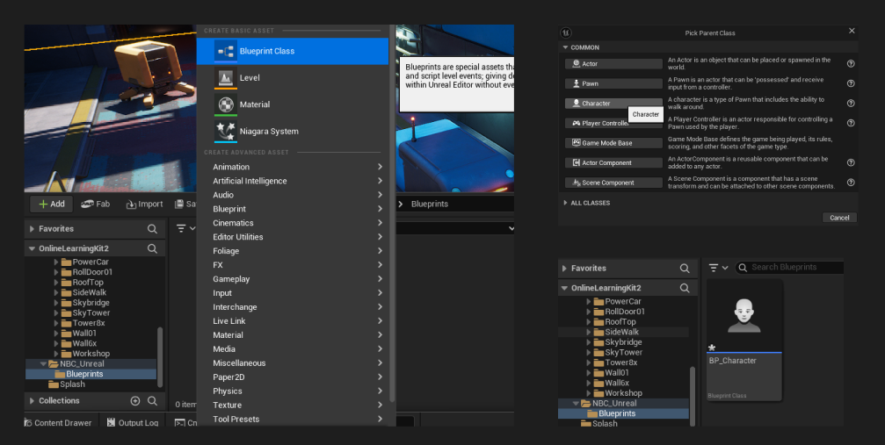

생성한 블루프린트를 더블클릭

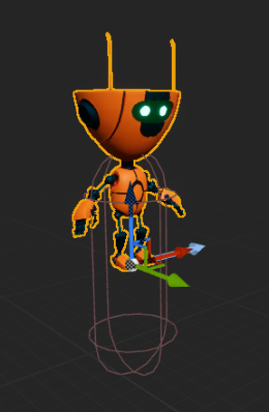

좌측 Component 패널에서 Mesh 를 선택해주고 우측의 Detail 패널의 Mesh에서 Skeletal Mesh Asset을 선택해주면 된다.

### 캐릭터 크기 조절 및 배치

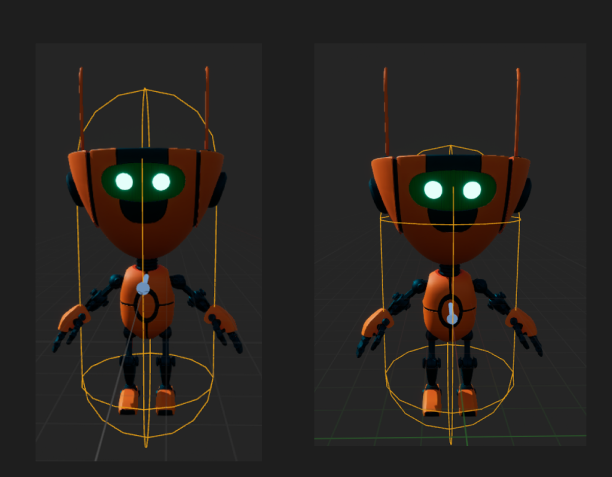

Component 패널에서 Capsule Component 를 클릭하여 Detail 패널의 Shape → Capsule Half Height / Radius 값을 조절하여 캐릭터의 크기를 조절할 수 있다.

::: important

언리얼 엔진에서 캐릭터의 크기를 조절할 때는 Capsule Component의 Capsule Half Height와 Capsule Radius 값이 중요한데, 이 값들이 캐릭터의 충돌 범위와 실제 월드에서 차지하는 공간을 결정한다.

`Capsule Component`

- ACharacter 클래스의 기본 Root Component(최상위 컴포넌트)로, 캐릭터의 충돌 영역을 정의한다.

`Capsule Half Height`

- 캡슐의 세로 반지름(절반 높이)을 지정한다. 전체 높이는 `2 * Half Height` 로 계산된다. 값이 커지면 캐릭터가 키가 커진 것처럼 보이고, 작아지면 키가 작아진다.

`Capsule Radius`

- 캡슐의 가로 반지름을 지정한다. 값이 커지면 캐릭터가 더 넓게 차지한다.

이 방식은 캐릭터의 실제 메시 크기를 바꾸는 것이 아니라 충돌 캡슐 크기를 조절하는 것이라, 메시와 캡슐 크기가 따로 놀 수 있다.
캐릭터의 외형 자체를 키우거나 줄이고 싶으면 메시의 Scale 값을 조절해야 한다.
애니메이션 루트 모션이나 네비게이션 시스템은 캡슐 크기를 기준으로 동작한다. 지나치게 작은 값이나 큰 값을 설정하면 이동이나 경로 탐색에 문제가 생길 수 있다.

→ 캐릭터의 충돌 범위가 변경되기 때문에 월드 내에서 캐릭터가 차지하는 공간과 충돌 판정이 달라진다. 이에 따라 캡슐 크기는 건들였는데, 메시 스케일은 그대로라면 시각적 크기와 충돌 크기가 불일치 할 수 있다.

:::

크기 조절을 했으면 `컴파일 후 저장`을 해준다. 레벨로 돌아와 섹터에 드래그를 하여 배치를 해준다.

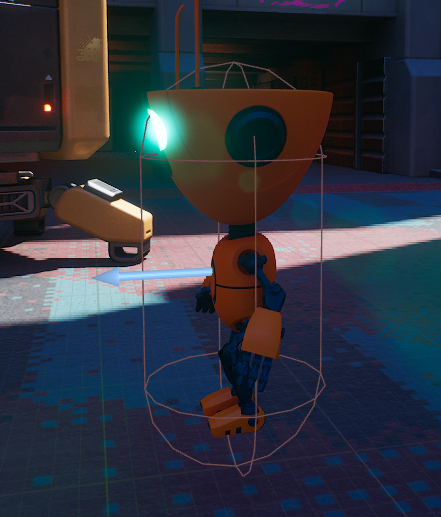

### 카메라 설정

플레이어가 캐릭터를 움직일때 볼 시야를 만들어주기 위해 Component 패널에서 Add 를 눌러 `Spring Arm` 컴포넌트를 생성하고, `Camera` 컴포넌트도 생성해준다.
스프링 암 컴포넌트가 카메라 컴포넌트를 가지고 있는 형태가 만들어진다. 스프링 암은 카메라를 스프링 암의 길이만큼 띄워주는 역할을 한다.
카메라와 캐릭터 사이에 장애물이 있다고 가정했을때 스프링 암이 자동으로 줄어들어서 캐릭터를 방해 없이 볼 수 있도록 만들어준다.

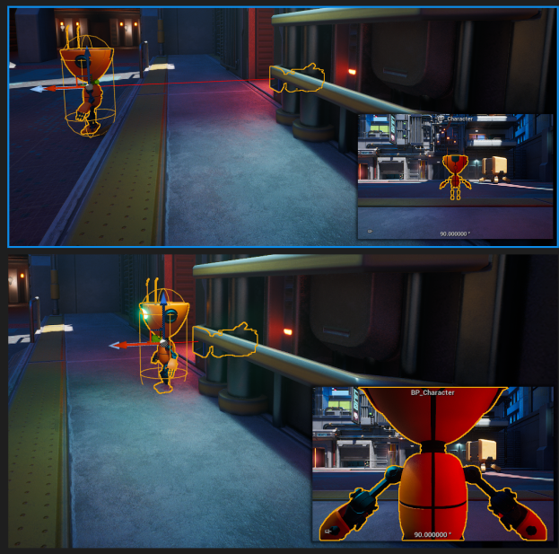

블루프린트에서 SpringArm의 각도와 거리(Camera → Target Arm Length)를 조절해줄 수 있다.

이제, 시작을 하게되면 스프링암으로 설정한 카메라로 캐릭터가 있는 것을 볼 수 있다. 아직은 이외의 기능이 없기 때문에 움직이거나 하는 것은 불가능하다.

## 플레이어 Input 받기

### Input 애셋 생성

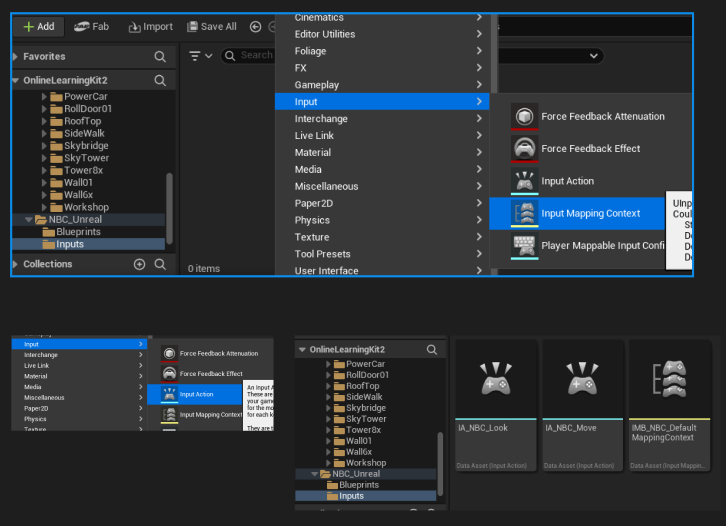

Inputs 폴더를 생성하고 우클릭하여 Input → Input Mapping Context 하나와 Input Action 두개를 만들어준다.

::: note 개념 및 파일명

Input Mapping Context

- 입력 매핑 규칙을 정의하는 애셋으로, 여러 Input Action을 묶어 캐릭터나 시스템에 적용
- IMB_NBC_DefaultMappingContext

Input Action

- 실제 입력 이벤트를 정의하는 애셋으로, 키보드, 마우스, 패드 입력을 어떤 동작과 연결할지 지정한다.
- IA_NBC_Move
- IA_NBC_Look

:::

### Input 애셋 설정

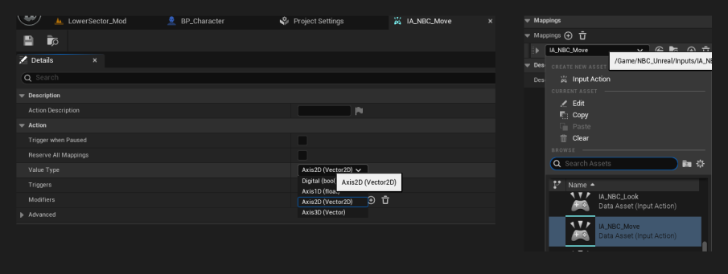

`IA_NBC_Move`

- Axis2D(2차원 값) 타입으로 변경
- DefaultMappingContext에 추가하여 키보드 입력과 연결
- WASD 키 매핑:
  - W → X축 +1 (기본값)
  - S → X축 -1 (Negate Modifier 사용)
  - D → Y축 +1 (Swizzle Input Axis Values Modifier 사용)
  - A → Y축 -1 (Swizzle Input Axis Values + Negate Modifier 사용)

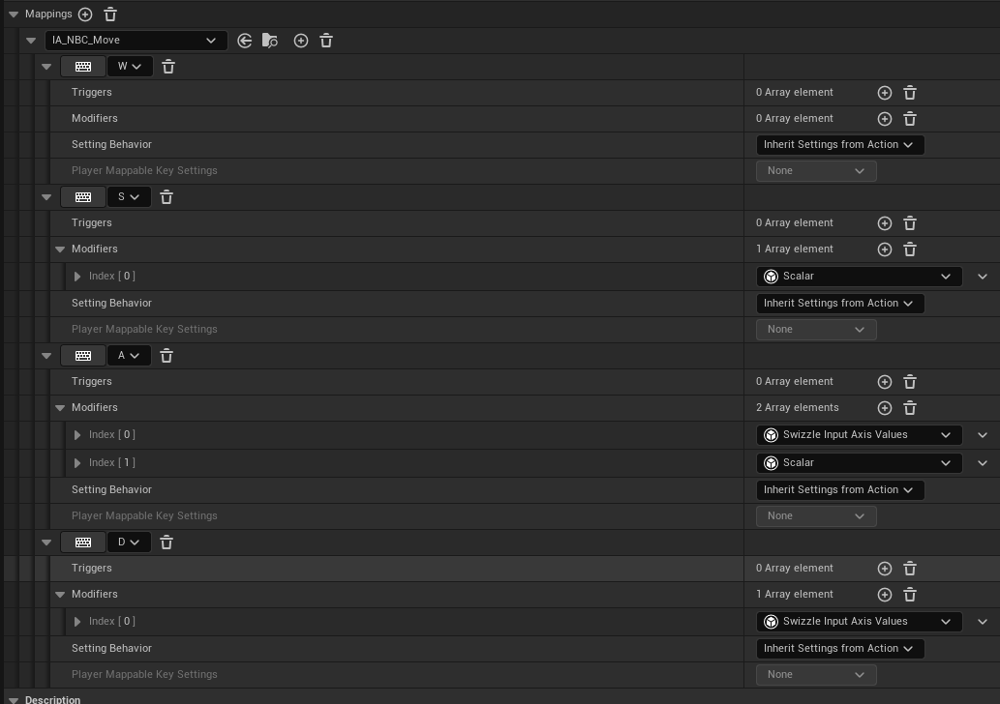

`IA_NBC_Look`

- 타입을 Axis2D로 설정하여 마우스 XY 입력을 받을 수 있도록 구성
- DefaultMappingContext에 추가 후 `Mouse XY 2D-Axis` 매핑을 설정

Input Action에서 받은 2차원 값을 WASD로 나눠서 이런식으로 쓸 것이다 설정하는 것을 인풋 매핑 컨텍스트가 하는 역할이다.

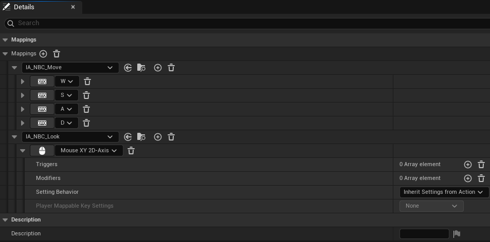

::: info Input Action과 Input Mapping Context의 관계

Input Action (IA)

- Move(2차원 축 입력을 받는 행동), Look(마우스 XY 입력을 받는 행동) 과 같은 행동 단위를 정의하는 애셋이다.
- 단순히 '이 입력은 2D 값이다', '버튼 입력이다' 같은 데이터 타입과 의미만 담는다.

Input Mapping Context

- 여러 Input Action을 실제 키보드/마우스/패드 입력 장치와 연결하는 매핑 규칙을 정의한다.
- '어떤 키를 누르면 어떤 Input Action에 어떤 값이 들어간다'를 설정하는 역할을 한다.

Input Action은 추상화된 입력 이벤트, Input Mapping Context는 구체적인 입력 매핑 규칙이다.

:::

## 블루프린트 노드

캐릭터가 Input Mapping Context에 입력된 값들이 무엇인지 알기 위해 블루프린트 노드를 사용한다.
BP_Character 블루프린트에서 EventGraph를 들어가서 캐릭터가 시작할때, MappingContext의 값들을 사용하게 세팅을 해주어 캐릭터에 입력을 시켜주어야한다.

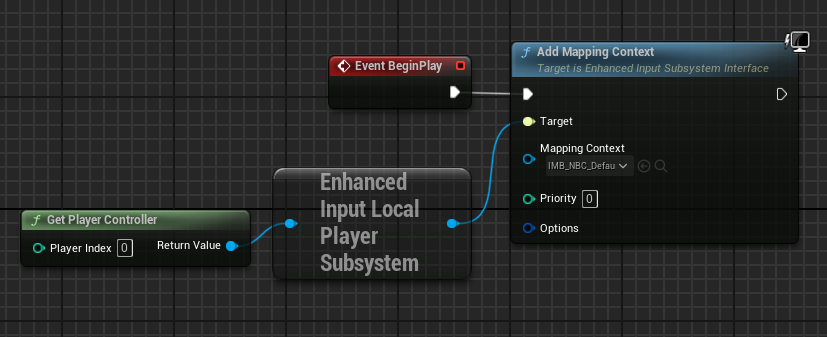

우클릭을 통해 Get Player Controller 노드를 생성하고 출력 핀을 끌어서 Enhanced Input Local Player Subsystem → Add Mapping Context 순으로 Context Sensitive(컨텍스트 기반) 노드를 생성해준다.
Add Mapping Context의 Mapping Context는 IMC_NBC_DefaultMappingContext를 설정해주고 컴파일 및 저장을 한다.
아직은 값을 받아오도록 설정만 했고, 받아서 어떻게 할 것 인지를 캐릭터에 명령을 내리고 있지 않고 있기 때문에 WASD나 마우스를 컨트롤해도 아무 일도 발생하지 않는다.

### 키보드 노드 설정

#### WASD

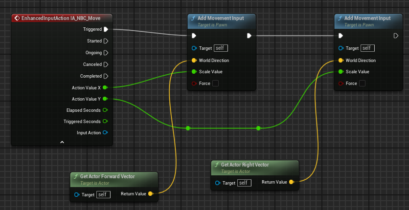

IA_NBC_Move 노드를 생성해주고 Action Value를 우클릭하여 `Split Struct Pin` 을 눌러 분할해준다.

X축(W,S)과 Y축(A,D)을 담당할 `Add Movement Input` 노드를 생성하여 `Triggered` 에 연속적으로 연결해주고, X, Y축 각각 연결해준다.

`Get Actor Forward Vector` 노드를 생성하여 X축을 담당하는 곳에 연결해주고, `Get Actor Right Vector` 노드를 생성하여 Y축을 담당하는 곳에 연결해준다.

컴파일 및 저장을 하고 레벨로 돌아와 시작을 하면 WASD로 움직이는게 가능하다.

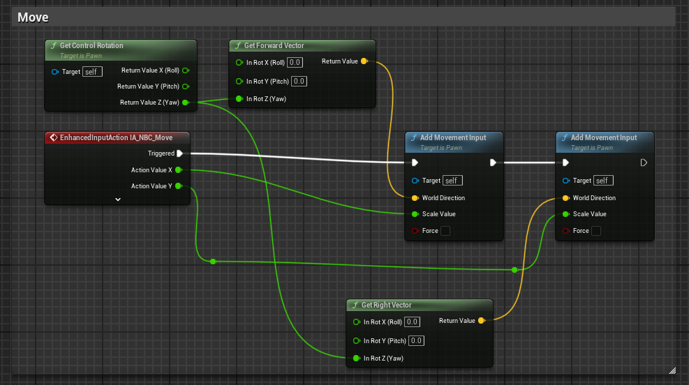

A, D를 누르면 제자리에서 뱅뱅 돌기만 하는데, A를 눌렀을때 좌측으로 쭉 이동하고, D를 눌렀을때 우측으로 쭉 이동하게 하는 방법이다.

기존에 만들었던 Move 그룹은 잠시 링크를 끊어주고, 새로운 Move 그룹을 만들어준다.

IA_NBC_Move를 만들고 Add Movement Input을 두개 만든뒤 연결을 해준다.

Get Control Rotation(구조체에서 값을 Return해준다.) / Get Forward Vector / Get Right Vector 노드를 각각 생성하고 구조체 핀 분할을 하고 위 이미지처럼 노드들을 연결해준다.

이러면 카메라를 바라보고 있는 곳 기준 좌, 우로 A, D 키가 작동이 된다.

#### 점프

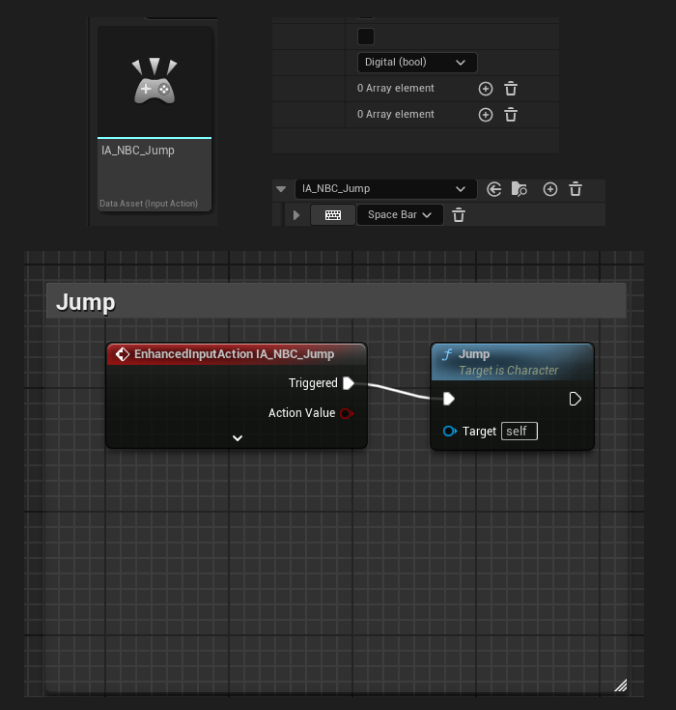

- IA_NBC_JUMP 애셋을 생성
- 더블클릭하여 Digital (버튼 입력) 타입으로 지정
- DefaultMappingContext 에 `Space Bar` 키를 매핑해준다.
- 블루프린트에서 IA_NBC_JUMP 노드를 JUMP 노드에 연결해준다.

#### 연속 점프

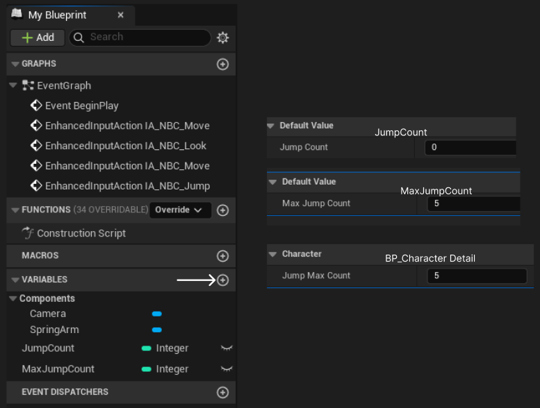

- My Blueprint 패널의 Variables에 JumpCount, MaxJumpCount 변수를 추가
- DefaultValue를 설정해준다.
- BP_Character 컴포넌트의 `Jump Max Count` 값도 설정

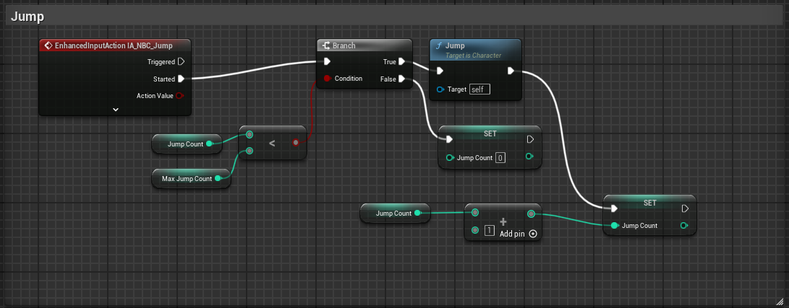

아까 일회성 점프는 아주 간단했지만, 연속적인 점프에서는 추가되는 것들이 많아졌다.
Branch를 통하여 JumpCount가 MaxJumpCount보다 작은 것이 True 일때 점프를 하고, JumpCount에 +1 을 하는 로직
JumpCount가 MaxJumpCount보다 작은 것이 False 일때 JumpCount를 초기화하는 로직

강의에서 점프를 만들어보라고 하셔서 연속 점프까지 만들어봤는데 이게 맞게 한건지는 모르겠지만 동작은 잘 되는듯하다.

### 마우스 노드 설정

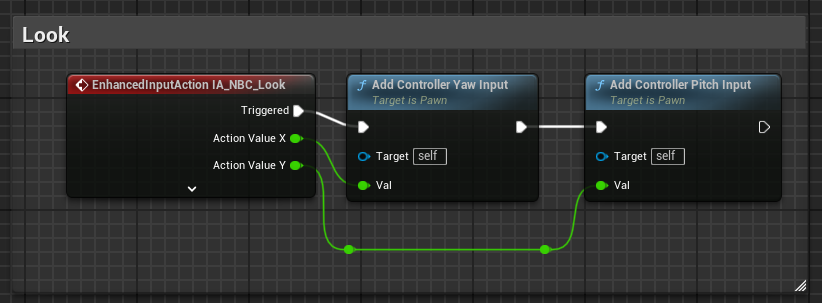

::: tip

노드들을 선택하고 C 키를 누르면 그룹으로 설정할 수 있다.

:::

IA_NBC_Look 노드를 생성하고 IA_NBC_Move처럼 Action Value를 분할해준다.

`Add Controller Yaw Input`과 `Add Controller Pitch Input`을 생성한다.

Triggered는 연속적으로 연결해주고, X축은 Yaw, Y축은 Pitch로 연결해준다.
컴포넌트 패널에서 Character를 누르고 디테일 패널에서 Controller 를 검색하여 Pawn → `Use Controller Rotation Pitch` 를 체크해주고 컴파일 및 저장을 해준다.

이제, 마우스 움직임에 따른 시점 변경이 가능하지만 마우스 움직임에 따라 캐릭터도 같이 돌아가는 현상이 보인다.

::: info Yaw와 Pitch

Yaw

- 수평 회전을 의미
- 캐릭터나 카메라가 좌우로 도는 동작
- 마우스의 X축 이동(좌우 움직임)과 연결되는 경우가 많다.

Pitch

- 수직 회전을 의미
- 카메라가 위아래로 도는 동작
- 마우스의 Y축 이동(상하 움직임)과 연결된다.

Yaw는 360° 회전이 가능하므로 제한을 두지 않는 경우가 많지만 Pitch는 보통 -90° ~ +90° 범위로 제한해서 카메라가 뒤집히지 않도록 한다.
마우스 감도를 곱해 회전 속도를 조절하는 것이 일반적이다.

:::

Pawn → `Use Controller Rotation Pitch` 와 `Use Controller Rotation Raw` 를 모두 해제해준다.

컴포넌트 패널의 `Character Movement` 를 누르고 디테일 패널에서 `Orient Rotation to Movement`를 체크해준다.
가는(보는) 방향으로 캐릭터 메시를 돌려주는 기능이다.
Spring Arm 컴포넌트 디테일 속성에서 `Use Pawn Control Rotation` 을 체크해준다.
메시에 담긴 값을 상속받아서 회전하는 것이 아닌 스프링 암이 직접 받아서 회전을 해준다.

컴파일 및 저장을 하고 레벨에서 시작을 하면 정상적으로 움직이고 회전한다.

::: tip

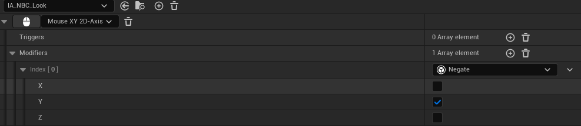

마우스 회전에서 Y축을 반전시키려면 Negate Modifier 설정을 하고, X축과 Z축은 체크를 해제하면 된다.

:::

## 애니메이션 블루프린트

### 기본 애니메이션 적용

콘텐츠 브라우저에서 Animation → Animation Blueprint 를 생성해준다. 애니메이션은 EventGraph와 AnimGraph가 있다.
AnimGraph에서는 어떤 애니메이션을 쓰는지에 대해서 세팅을 해준다.

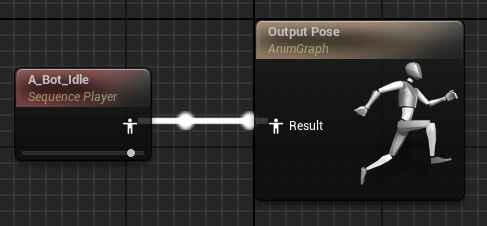

애셋 브라우저에서 A_BOT_IDEL을 가져와 노드 연결을 해주고 컴파일을 하면 프리뷰 화면에 캐릭터 애니메이션이 적용된 것을 확인할 수 있다.
이렇게하면 ABP_Character 블루프린트에만 적용이 되어서, BP_Character 블루프린트에 적용하려면 루트 컴포넌트의 `Anim Class` 속성에 `ABP_Character` 를 선택해준다.

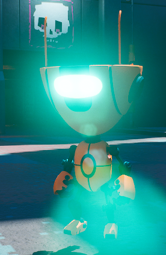

기본적으로 방금 만든 애니메이션이 적용된다. 가장 기본적인, 처음에 하는 애니메이션 세팅이다.

이제부터 상태 관리를 통해서 움직인다 - 달리기 모션, 점프 - 점프 모션 등 세팅을 해야한다.

### 애니메이션 타입

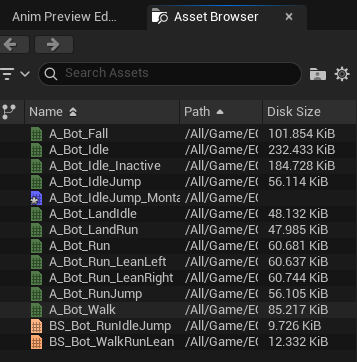

애니메이션 블루프린트의 애셋 브라우저에서 이미 애셋이 여러개 있는걸 확인할 수 있다.
초록색의 경우 애니메이션 시퀀스 타입이고, 주황색은 블렌드 스페이스 타입이다.

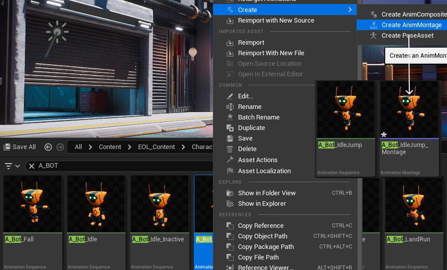

콘텐츠 브라우저에서 A_BOT 검색, 애셋에 우클릭 → Create → Create AnimMontage 를 하게 되면 보라색 파일이 생성이 된다.
시퀀스는 단일 모션이 들어있고 몽타주는 여러 개의 모션이 들어가는 차이점이 있다.
몽타주는 구간별로 노티파이나 편집을 통해 여러가지 애니메이션을 합칠 수 있는 애셋이다.

### 블렌드 스페이스

천천히 움직이거나 빨리 움직이는 것은 블렌드 스페이스로 만든다. 이름 그대로 여러개를 섞는 것이다.

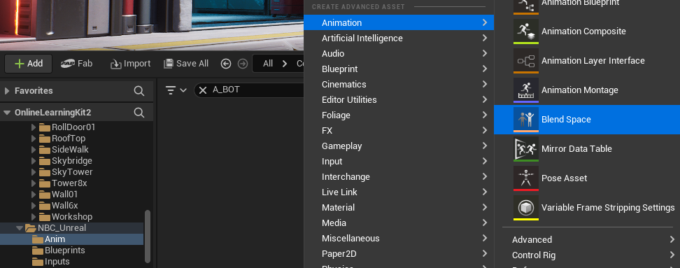

콘텐츠 브라우저에서 별개의 Anim 폴더를 생성하고 BS_RunWalk 블랜드 스페이스 애셋을 생성한다.

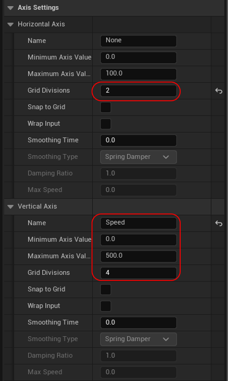

설정하지 않아도 되지만 보기좋게

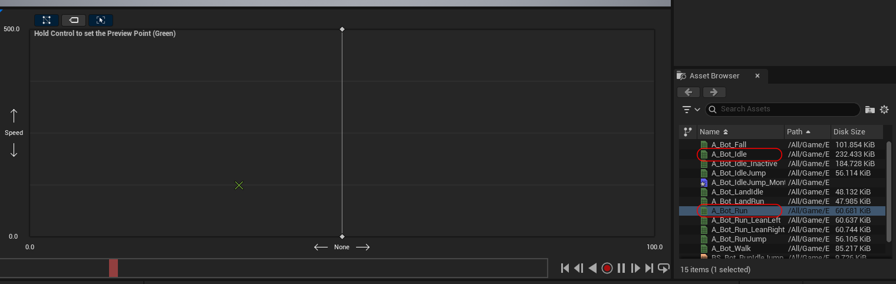

기본 애니메이션 Idle은 그래프의 하단에, 뛰는 애니메이션 Run 은 상단에 드래그해주고 Ctrl + 좌클릭 드래그로 프리뷰가 가능하다.

#### 블렌드 스페이스 적용

애니메이션 블루프린트의 애셋 브라우저에서 BS_RunWalk를 끌고와 사람 모양 노드에 연결해주고 컴파일 및 저장을 한다. 세로축(Speed)에 값이 0으로 되어있기에 값을 추가해주어야한다.

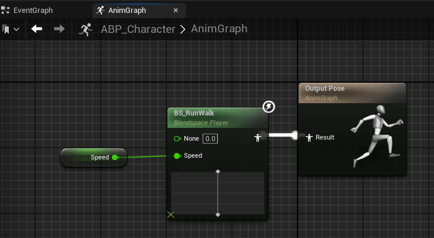

EventGraph에서 float 타입인 Speed 변수를 생성해주고 Speed변수를 BP_RunWalk Speed에 연결해준다.
Speed라는 변수에 값이 담긴다면 블렌드 스페이스의 Speed에서 사용하겠다 라는 의미이다.

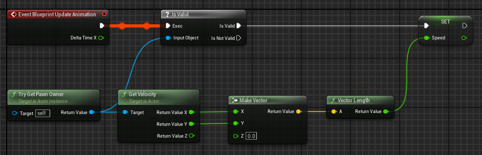

`Get Velocity` 는 X, Y, Z축이 있는데 점프는 X, Y축만 사용하기 때문에 Z축은 제외하여 X와 Y의 벡터값만 사용한다.
X, Y 만을 이용해 새로운 벡터값을 만들어주기 위해 `Make Vector` 노드를 만들고 새로 만든 Vector의 길이를 구하기 위해 `Vector Length` 노드를 연결하여 벡터의 길이(스칼라)를 구해준다.
프로그래밍을 할때 방어 장치가 꼭 필요하다.
에러라든지 예상할 수 없는 상황이 발생할 수 있기 때문에 유효한지에 대한 상황을 체크하려면 `Is Valid` 노드를 먼저 연결해준다.

::: note 벡터와 스칼라

Vector(벡터)
힘의 크기와 방향성을 띄고 있는 속도이다.

Scalar(스칼라)
힘의 크기만 나타내는 것이다.

길이가 벡터의 스칼라 값이다.
벡터가 가지고 있는 힘의 크기, 스칼라 값만 가지고 오기 위해서는 벡터의 길이를 가져오면 된다.
`벡터의 길이 = 스칼라`

:::

레벨에서 플레이를 하면 WASD로 캐릭터가 잘 뛰어다니는 것을 확인할 수 있다.

## 스테이트 머신

### 개념

상태(State) + 기계(Machine)라는 단어가 결합된 말이다.

- 상태는 시스템이 현재 어떤 조건에 놓여 있는지를 뜻한다.
- 기계는 이벤트에 따라 내부적으로 작동하거나 변환이 일어나는 장치이다.
  소프트웨어, 게임 개발 전자 회로 설계 등 다양한 분야에서 '정해진 여러 상태 중 하나에 있으면서 특정 입력이나 사건(Event)에 의해 다른 상태로 전이(Transition)한다' 라는 모델을 가리킬 때 널리 사용된다.

::: tip

간단하게 상태에 따라 행동이 변한다 라고 이해하면 된다.
`신호등`, `자판기`도 스테이트 머신이다.
신호등은 빨간, 초록, 황색 이라는 정해진 상태들이 있고, 시간이 흐르거나 센서가 감지되는 `이벤트`에 의해 다음 상태로 넘어간다.
자판기는 동전 없음, 동전 투입됨, 음료 선택, 거스름돈 지급 같은 일련의 상태들이 있으며, 유저의 선택 버튼이나 동전 투입이라는 입력(이벤트)에 따라 다른 상태로 변경된다.

:::

### 스테이트 에일리어스

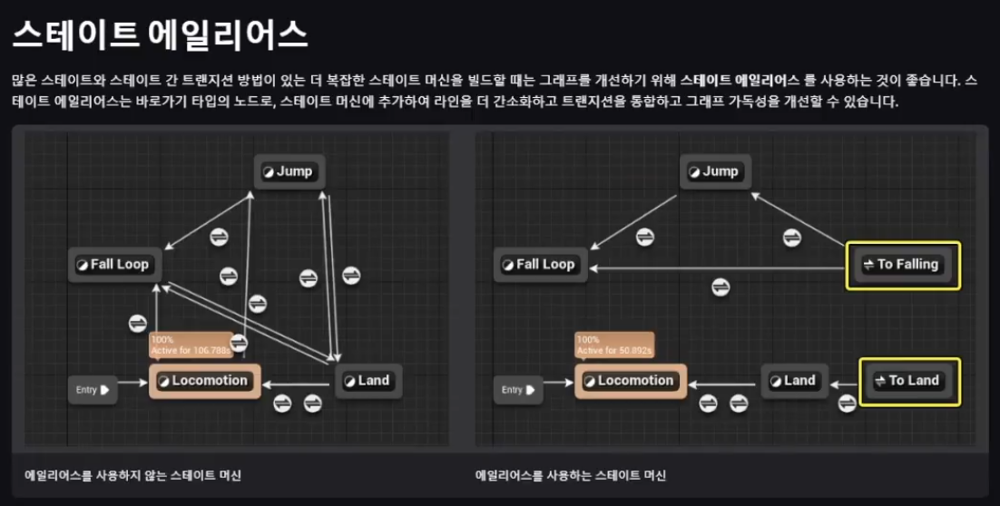

### 예제

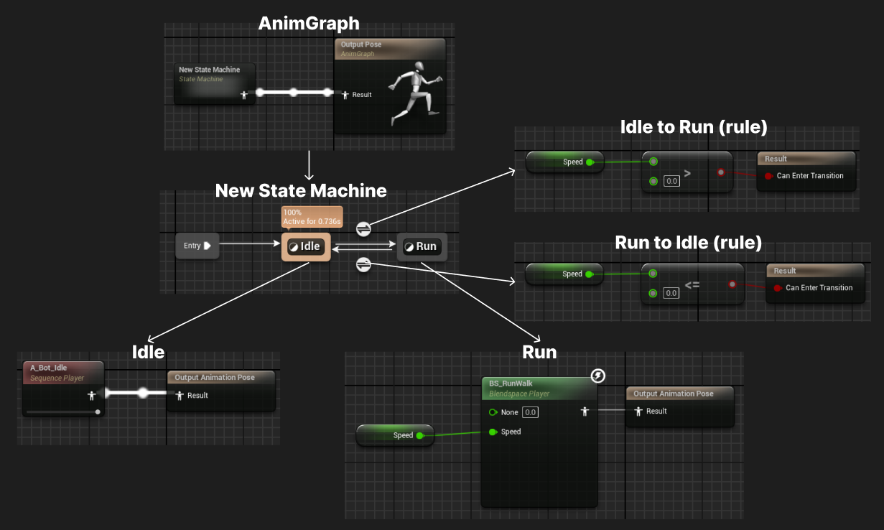

- AnimGraph → State Machine 노드 생성 후 더블클릭
- `New State Machine`의 내부로 들어와 우클릭 → `Add State` 를 두개 만들어 각각 Idle, Run 으로 네이밍해주고 Entry는 기본상태인 Idle에 연결, Idle과 Run은 상호 연결을 해준다.
- Idle을 더블클릭해 내부로 들어와 애셋 브라우저에서 `A_BOT_Idle` (기본상태)를 가져와 `Output Animation Pose`에 연결시켜준다. 빈 공간을 더블클릭하면 상위 노드로 옮겨진다.
- Run을 더블클릭해 내부로 들어와 애셋 브라우저에서 `A_BOT_Run` 을 가져와 연결시켜주고 `Output Animation Pose`에 연결시켜주고, Speed 변수도 연결한다.
- Idle과 Run을 상호 연결해 만들어진 Idle to Run(Transition Rule)을 더블클릭해 `Greater` 노드와 Speed 변수를 연겷한다.
- Run to Idle은 `Less Equal` 노드와 Speed 변수를 연결한다.

컴파일 후 실행시키면, 이전과 결과가 같은 것을 확인할 수 있다.

### 점프에 애니메이션 추가하기

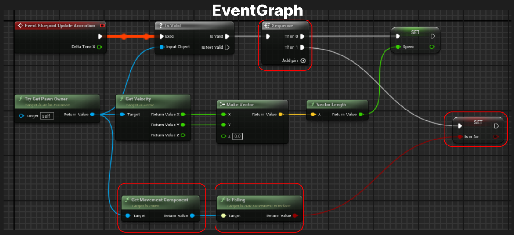

`IsInAir` 변수를 하나 추가해주고 위의 이미지처럼 새로운 노드들을 추가해서 연결해준다.

::: tip Sequence

시퀀스 노드는 하나의 실행 핀(Exec)을 받아서 여러 개의 실행 핀으로 순차적으로 흘려보내는 역할을 한다.

:::

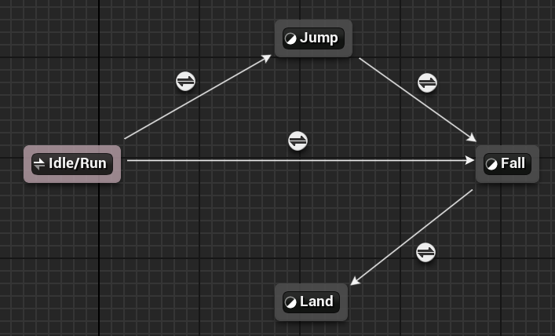

Idle/Run 상태일때는 Jump와 Fall로 이어질 수있다.
Jump는 Fall로만 이어지고 Fall 상태일때는 Land 상태로만 상태전환이 가능하다.

::: note

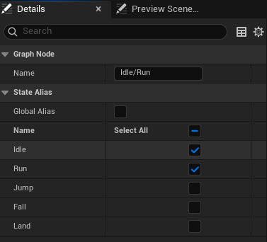

Add State Alias

- 스테이트 머신 안에서 이미 존재하는 다른 상태(State)를 참조하여 재사용할 수 있게 해주는 기능이다.
- AnimGraph 안에서 노드로 추가되지만, 어떤 애니메이션을 재생할지, 어떤 변수를 참조할지 같은 값들은 디테일 패널에서 설장한다.
- 아까 만든 Idle과 Run을 참조한다.

:::

::: tip

A_Bot_Fall 의 경우 클릭하여 `Animation Roof`를 선택해 떨어지는게 반복되면서 떨어지게 설정해주어야 한다.

:::

Jump 경우 무한정 점프하는게 아니라 점프한 순간 내려와야하기 때문에 Jump to Fall Transition Rule을 한번만 클릭해 디테일 패널에서 `Automatic Rule Based on Sequence Player in State` 를 체크해준다.
애니메이션이 끝나면 자동으로 Fall로 넘어가게 해주는 것이다.
Land 도 마찬가지로 똑같이 체크해준다. Land가 되면 더 이상 아무런 상태가 없기 때문에 Idle 기본 상태로 이어주면 된다.

::: note Jump/Fall/Land State 설정

Jump

- A_Bot_IdleJump

Fall

- A_Bot_Fall

Land

- A_Bot_IdleLand

각 State들은 상황에 맞는 애셋들과 연결해주면 된다.

:::

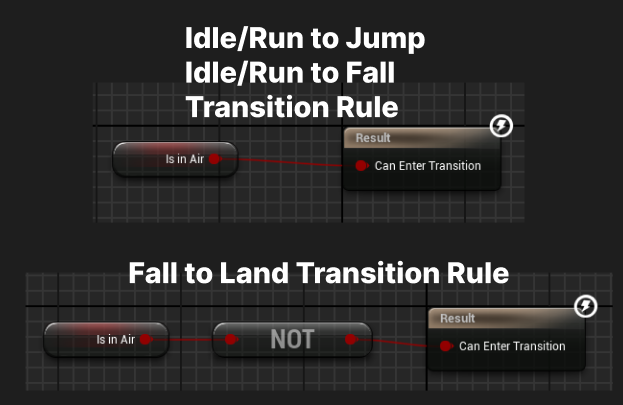

- Idle/Run to Jump 와 Idle/Run to Fall 의 Transition Rule은 Is In Air로 연결
- Fall to Land Transition Rule은 Is in Air를 NOT Boolean 노드와 연결시켜준다.

